<!-- README.md is generated from README.Rmd. Please edit that file -->

[](https://mc-stan.org/)

# mvgam

> **M**ulti**V**ariate (Dynamic) **G**eneralized **A**dditive **M**odels

[](https://github.com/nicholasjclark/mvgam/actions/)
[](https://app.codecov.io/gh/nicholasjclark/mvgam)
[](https://nicholasjclark.github.io/mvgam/)
[](https://doi.org/10.1111/2041-210X.13974)
[](https://cran.r-project.org/package=mvgam)
[](https://cran.r-project.org/package=mvgam)

The `mvgam` 📦 fits Bayesian Dynamic Generalized Additive Models (DGAMs)
that can include highly flexible nonlinear predictor effects, latent
variables and multivariate time series models. The package does this by
relying on functionalities from the impressive
<a href="https://paulbuerkner.com/brms/"
target="_blank"><code>brms</code></a> and
<a href="https://cran.r-project.org/package=mgcv"
target="_blank"><code>mgcv</code></a> packages. Parameters are estimated
using the probabilistic programming language
[`Stan`](https://mc-stan.org/), giving users access to the most advanced
Bayesian inference algorithms available. This allows `mvgam` to fit a
very wide range of models, including:

- <a href="https://nicholasjclark.github.io/mvgam/reference/mvgam.html"
  target="_blank">Multivariate state space time series models</a>
- <a href="https://nicholasjclark.github.io/mvgam/reference/RW.html"
  target="_blank">Continuous time autoregressive time series models</a>
- <a
  href="https://nicholasjclark.github.io/mvgam/reference/residual_cor.html"
  target="_blank">Dynamic factor models</a>
- <a href="https://nicholasjclark.github.io/mvgam/reference/nmix.html"
  target="_blank">Hierarchical N mixture models</a>
- <a href="https://www.youtube.com/watch?v=2POK_FVwCHk"
  target="_blank">Hierarchical generalized additive models</a>
- <a href="https://nicholasjclark.github.io/mvgam/reference/jsdgam.html"
  target="_blank">Joint species distribution models</a>

## Installation

You can install the stable package version from `CRAN` using:
`install.packages('mvgam')`, or install the latest development version
using: `devtools::install_github("nicholasjclark/mvgam")`. You will also
need a working version of `Stan` installed (along with either `rstan`
and/or `cmdstanr`). Please refer to installation links for `Stan` with
`rstan` <a href="https://mc-stan.org/users/interfaces/rstan"
target="_blank">here</a>, or for `Stan` with `cmdstandr`
<a href="https://mc-stan.org/cmdstanr/" target="_blank">here</a>.

## Cheatsheet

[](https://github.com/nicholasjclark/mvgam/raw/master/misc/mvgam_cheatsheet.pdf)

## A simple example

We can explore the package’s primary functions using one of its built-in
datasets. The `portal_data` from
<a href="https://portal.weecology.org/" target="_blank">the Portal
Project</a> carries counts of baited captures for four desert rodent
species over time (see `?portal_data`). Use `mvgam_data()` to verify
that the data layout suits a proposed observation family and to inspect
the series before fitting.

``` r
data(portal_data)
mvgam_data(portal_data, y = "captures", family = poisson())
#> ✔ Data check passed for family 'poisson (link = log)'.
#> • series: 4 level(s)
#> • time: 1 to 80
#> • n obs: 320 (68 NA)
```

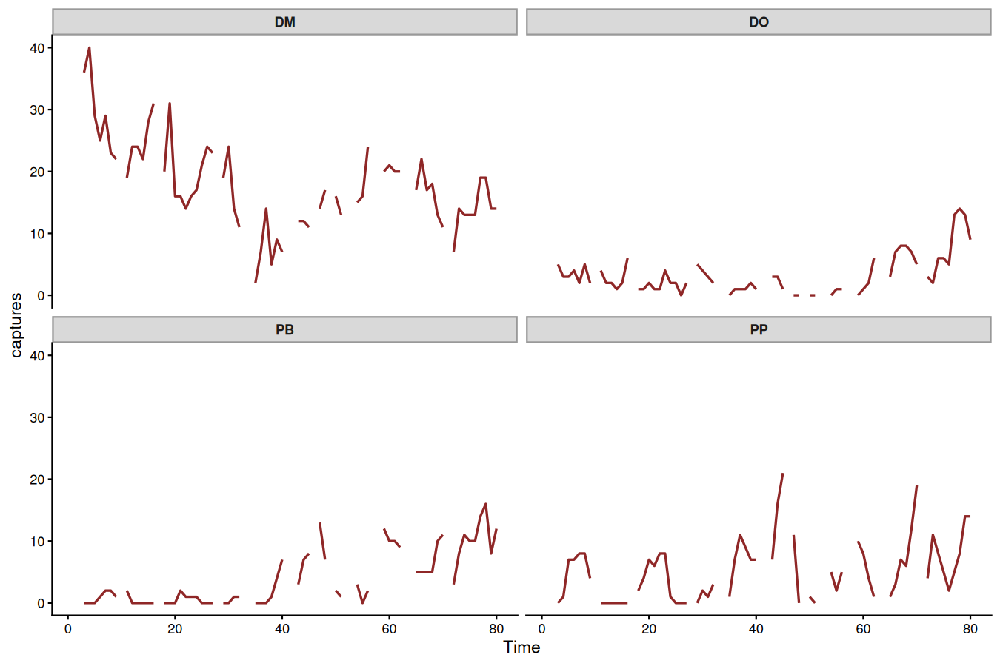

``` r
mvgam_data(portal_data, y = "captures", family = poisson(), series = 1L)
#> ✔ Data check passed for family 'poisson (link = log)'.
#> • series: 4 level(s)
#> • time: 1 to 80
#> • n obs: 320 (68 NA)
```

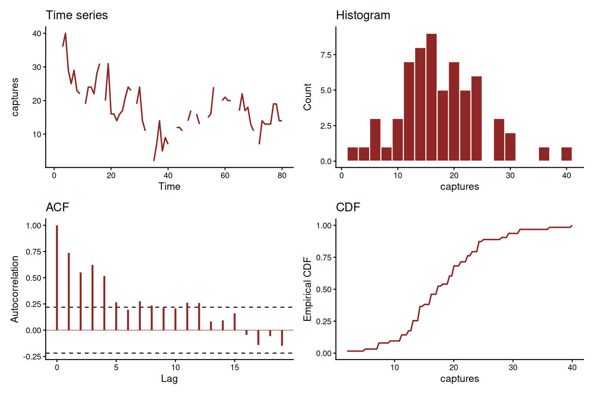

These plots show that the time series are count responses, with missing
data, many zeroes, seasonality and temporal autocorrelation all present.
These features make time series analysis and forecasting very difficult
using conventional software. But `mvgam` shines in these tasks.

For most forecasting exercises, we’ll want to split the data into
training and testing folds:

``` r
data_train <- portal_data %>%
  dplyr::filter(time <= 60)
data_test <- portal_data %>%
  dplyr::filter(time > 60 &
                  time <= 65)
```

Formulate an `mvgam` model; this model fits a State-Space GAM in which
each species has its own intercept, linear association with `ndvi_ma12`
and potentially nonlinear association with `mintemp`. These effects are
estimated jointly with a full time series model for the temporal
dynamics (in this case a Vector Autoregressive process). We assume the
outcome follows a Poisson distribution and will condition the model in
`Stan` using MCMC sampling with `Cmdstan`:

``` r
mod <- mvgam(
  # Observation model is empty as we don't have any
  # covariates that impact observation error
  formula = captures ~ 0,

  # Process model contains per-series random intercepts on
  # ndvi_ma12 and per-series smooths of mintemp, written
  # against `by = lv_axis()` so the smooths live on the
  # trend side. Temporal dynamics are modelled with a
  # Vector Autoregression (VAR(1)).
  trend_formula = ~
    s(ndvi_ma12, bs = 're', by = lv_axis()) +
    s(mintemp, bs = 'bs', by = lv_axis()) - 1 +
    VAR(),

  # Observations are conditionally Poisson
  family = poisson(),

  # Condition on the training data
  data = data_train,
  backend = 'cmdstanr'
)
```

Using `print()` returns a quick summary of the object:

``` r
mod
#> GAM observation formula:
#> captures ~ 0 + .mvgam_empty_obs
#> <environment: 0x55d605720658>
#> 
#> GAM process formula:
#> trend_y ~ s(ndvi_ma12, bs = "re", by = series) + s(mintemp, bs = "bs", 
#>     by = series) - 1
#> 
#> 
#> Family:
#> poisson 
#> 
#> Link function:
#> log 
#> 
#> 
#> Trend model:
#> VAR 
#> 
#> 
#> N series:
#> 4 
#> 
#> 
#> N timepoints:
#> 60 
#> 
#> 
#> Status:
#> Loading required namespace: rstan
#> 4 chains, each with iter = 1000 
#>   Total post-warmup draws = 4000
```

Split Rhat and Effective Sample Size diagnostics show good convergence
of model estimates

``` r
mcmc_plot(mod, 
          type = 'rhat_hist')
#> `stat_bin()` using `bins = 30`. Pick better value `binwidth`.
```

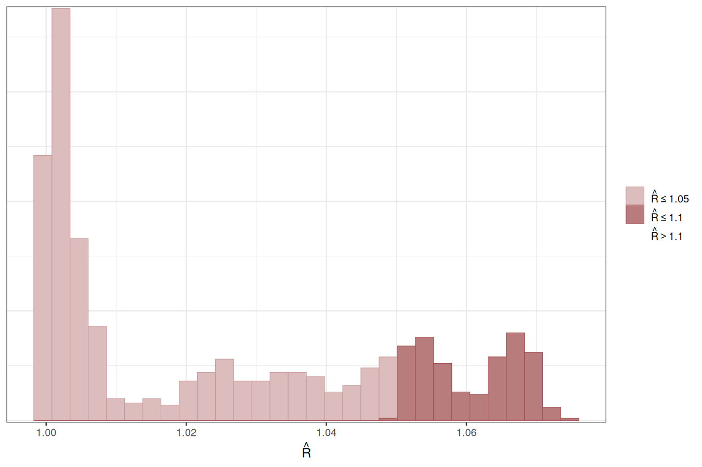

``` r
mcmc_plot(mod, 
          type = 'neff_hist')
#> `stat_bin()` using `bins = 30`. Pick better value `binwidth`.
```

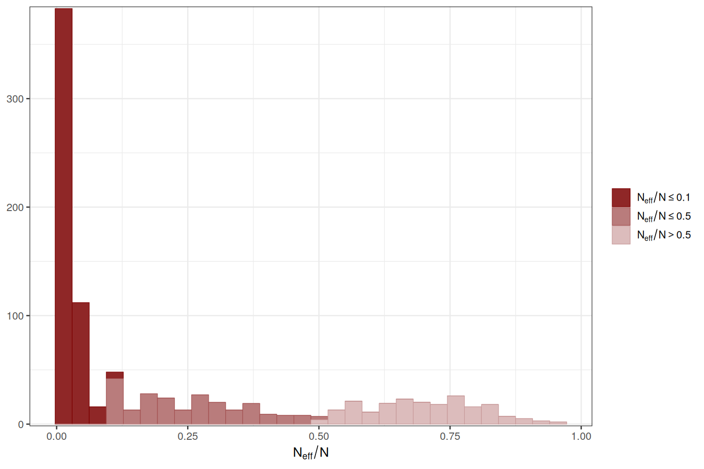

Use `conditional_effects()` for a quick visualisation of the main terms
in model formulae

``` r
conditional_effects(mod, 
                    type = 'link')
```

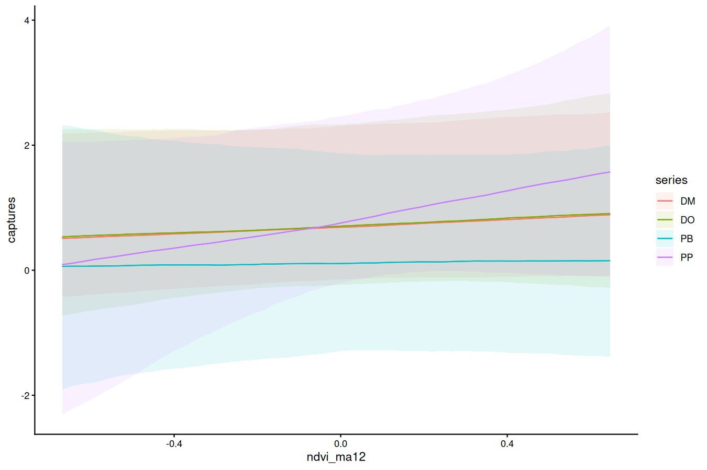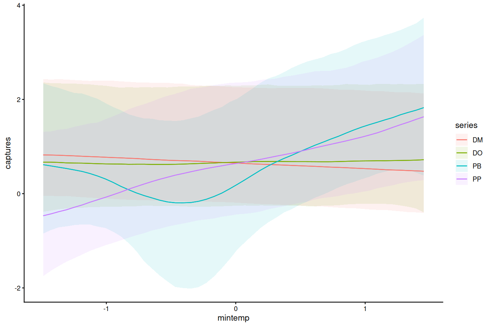

Design more targeted plots using `plot_predictions()` from the
`marginaleffects` package

``` r
plot_predictions(
  mod,
  condition = c('ndvi_ma12',
                'series',
                'series'),
  type = 'link'
)
```

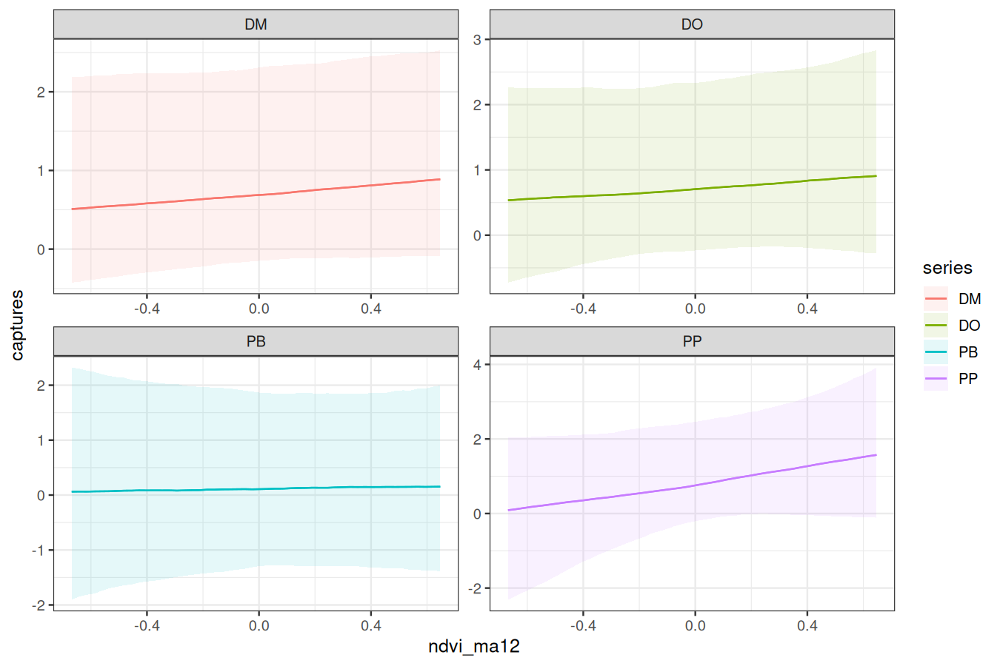

``` r
plot_predictions(
  mod,
  condition = c('mintemp',
                'series',
                'series'),
  type = 'link'
)
```

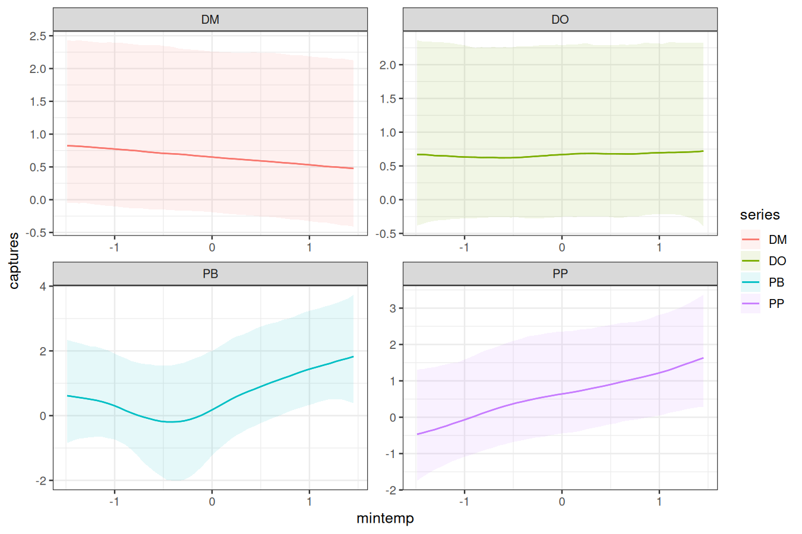

We can also view the model’s posterior predictions for the entire series
(testing and training). Forecasts can be scored using a range of proper
scoring rules. See `?score.mvgam_forecast` for more details

``` r
fcs <- forecast(mod, 
                newdata = data_test)
plot(fcs, series = 1) +
  plot(fcs, series = 2) +
  plot(fcs, series = 3) +
  plot(fcs, series = 4)
```

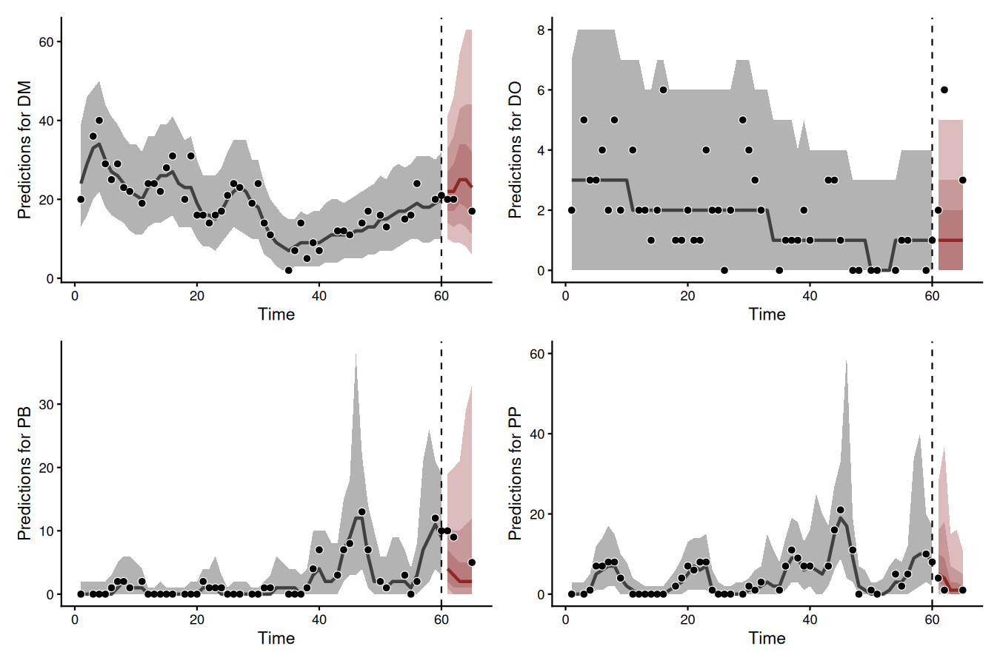

For Vector Autoregressions fit in `mvgam`, we can inspect <a
href="https://ecogambler.netlify.app/blog/vector-autoregressions/#impulse-response-functions"
target="_blank">impulse response functions and forecast error variance
decompositions</a>. The `irf()` function runs an Impulse Response
Function (IRF) simulation whereby a positive “shock” is generated for a
target process at time `t = 0`. All else remaining stable, it then
monitors how each of the remaining processes in the latent VAR would be
expected to respond over the forecast horizon `h`. The function computes
impulse responses for all processes in the object and returns them in an
array that can be plotted using the S3 `plot()` function. Here we will
use the generalized IRF, which makes no assumptions about the order in
which the series appear in the VAR process, and inspect how each process
is expected to respond to a sudden, positive pulse from the other
processes over a horizon of 12 timepoints.

``` r
irfs <- irf(mod, 
            h = 12, 
            orthogonal = FALSE)
plot(irfs, 
     series = 1)
```

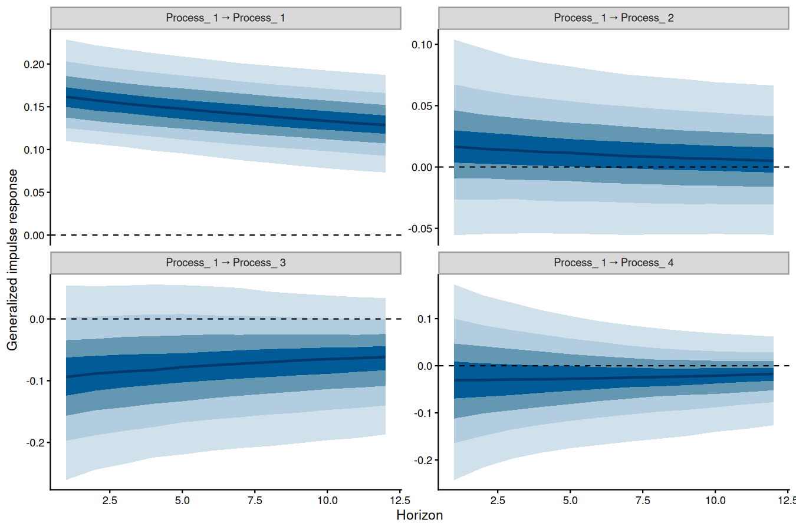

``` r
plot(irfs, 
     series = 3)
```

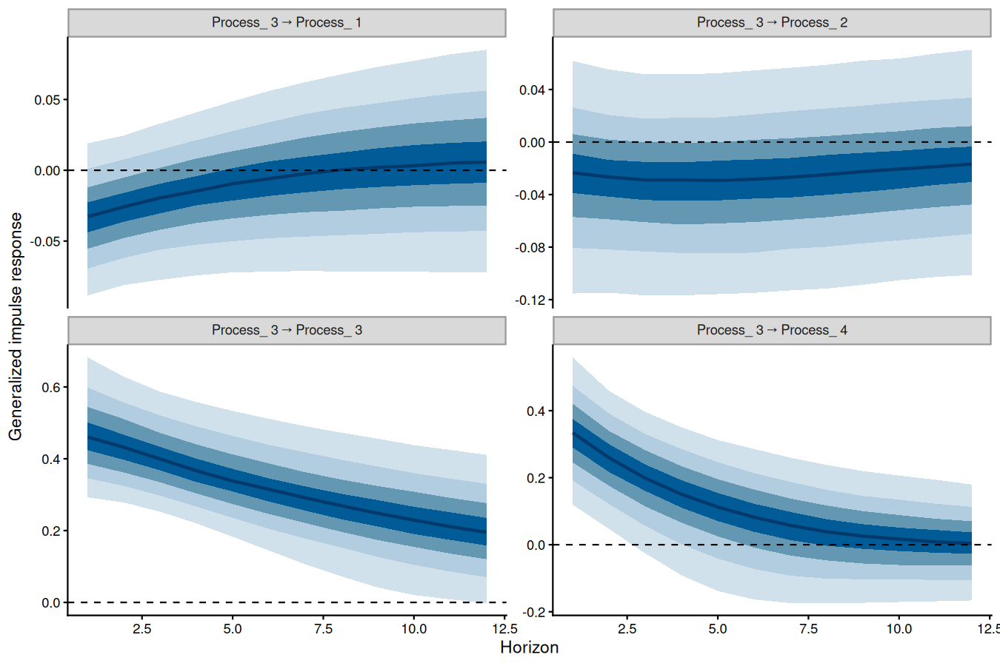

Using the same logic as above, we can inspect forecast error variance
decompositions (FEVDs) for each process using`fevd()`. This type of
analysis asks how orthogonal shocks to all process in the system
contribute to the variance of forecast uncertainty for a focal process
over increasing horizons. In other words, the proportion of the forecast
variance of each latent time series can be attributed to the effects of
the other series in the VAR process. FEVDs are useful because some
shocks may not be expected to cause variations in the short-term but may
cause longer-term fluctuations

``` r
fevds <- fevd(mod, 
              h = 12)
plot(fevds)
```

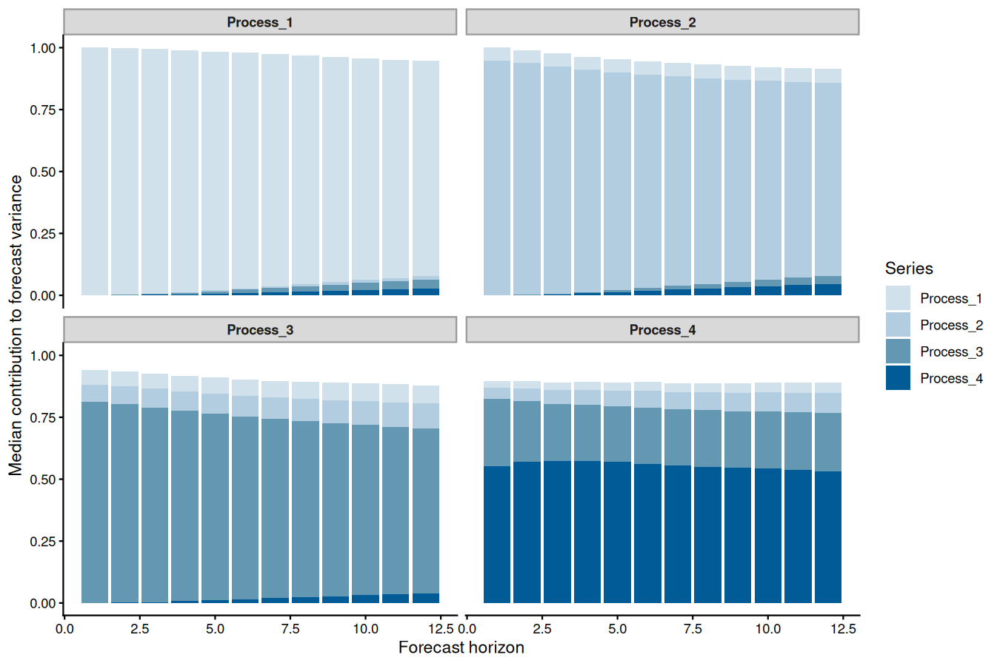

This plot shows that the variance of forecast uncertainty for each
process is initially dominated by contributions from that same process
(i.e. self-dependent effects) but that effects from other processes
become more important over increasing forecast horizons. Given what we
saw from the IRF plots above, these long-term contributions from
interactions among the processes makes sense.

Plotting randomized quantile residuals over `time` for each series can
give useful information about what might be missing from the model. We
can use the highly versatile `pp_check()` function to plot these:

``` r
pp_check(
  mod, 
  type = 'resid_ribbon_grouped',
  group = 'series',
  x = 'time',
  ndraws = 200
)
```

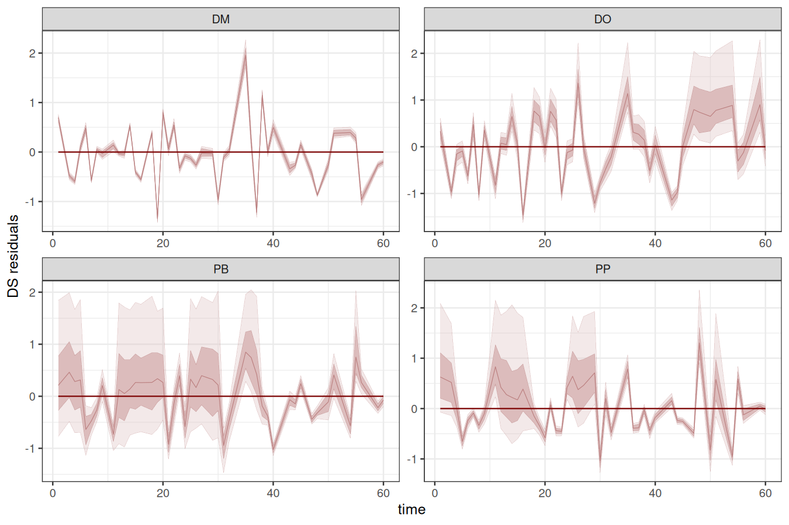

When describing the model, it can be helpful to use the `how_to_cite()`
function to generate a scaffold for describing the model and sampling
details in scientific communications

``` r
description <- how_to_cite(mod)
```

``` r
description
```

    #> Methods text skeleton
    #> We used the R package mvgam (version 2.0.0; Clark & Wells, 2023) to
    #>   construct, fit and interrogate the model. mvgam fits Bayesian
    #>   state-space models that combine flexible predictor effects in both the
    #>   process and observation components, building on functionality from the
    #>   brms (Burkner 2017) and mgcv (Wood 2017) packages. To encourage
    #>   stability and prevent forecast variance from increasing indefinitely, we
    #>   enforced stationarity of the Vector Autoregressive process following
    #>   Heaps (2023) and Clark et al. (2025). The mvgam-constructed model and
    #>   data were passed to Stan (Carpenter et al. 2017) via the cmdstanr
    #>   interface (Gabry et al. 2024). We ran 4 Hamiltonian Monte Carlo chains
    #>   for 1000 warmup iterations and 1000 sampling iterations. Rank-normalised
    #>   split Rhat and effective sample sizes (Vehtari et al. 2021) were used to
    #>   monitor convergence.

    #> 
    #> Primary references
    #> Clark NJ and Wells K (2023). Dynamic Generalized Additive Models (DGAMs)
    #>   for forecasting discrete ecological time series. Methods in Ecology and
    #>   Evolution, 14, 771-784. https://doi.org/10.1111/2041-210X.13974
    #> Burkner PC (2017). brms: An R Package for Bayesian Multilevel Models
    #>   Using Stan. Journal of Statistical Software, 80(1), 1-28.
    #>   https://doi.org/10.18637/jss.v080.i01
    #> Wood SN (2017). Generalized Additive Models: An Introduction with R (2nd
    #>   edition). Chapman and Hall/CRC.
    #> Heaps SE (2023). Enforcing stationarity through the prior in vector
    #>   autoregressions. Journal of Computational and Graphical Statistics 32,
    #>   74-83.
    #> Clark NJ, Ernest SKM, Senyondo H, Simonis J, White EP, Yenni GM and
    #>   Karunarathna KANK (2025). Beyond single-species models: leveraging
    #>   multispecies forecasts to navigate the dynamics of ecological
    #>   predictability. PeerJ 13, e18929.
    #> Carpenter B, Gelman A, Hoffman MD, Lee D, Goodrich B, Betancourt M,
    #>   Brubaker M, Guo J, Li P and Riddell A (2017). Stan: A probabilistic
    #>   programming language. Journal of Statistical Software 76.
    #> Gabry J, Cesnovar R, Johnson A and Bronder S (2024). cmdstanr: R
    #>   Interface to 'CmdStan'. https://mc-stan.org/cmdstanr/
    #> Vehtari A, Gelman A, Simpson D, Carpenter B and Burkner P (2021).
    #>   Rank-normalization, folding, and localization: An improved Rhat for
    #>   assessing convergence of MCMC. Bayesian Analysis 16(2), 667-718.
    #>   https://doi.org/10.1214/20-BA1221
    #> 
    #> Other useful references
    #> Arel-Bundock V, Greifer N and Heiss A (2024). How to interpret
    #>   statistical models using marginaleffects for R and Python. Journal of
    #>   Statistical Software, 111(9), 1-32.
    #>   https://doi.org/10.18637/jss.v111.i09
    #> Gabry J, Simpson D, Vehtari A, Betancourt M and Gelman A (2019).
    #>   Visualization in Bayesian workflow. Journal of the Royal Statistical
    #>   Society A, 182, 389-402. https://doi.org/10.1111/rssa.12378
    #> Vehtari A, Gelman A and Gabry J (2017). Practical Bayesian model
    #>   evaluation using leave-one-out cross-validation and WAIC. Statistics and
    #>   Computing, 27, 1413-1432. https://doi.org/10.1007/s11222-016-9696-4
    #> Burkner PC, Gabry J and Vehtari A (2020). Approximate leave-future-out
    #>   cross-validation for Bayesian time series models. Journal of Statistical
    #>   Computation and Simulation, 90(14), 2499-2523.
    #>   https://doi.org/10.1080/00949655.2020.1783262

The post-processing methods we have shown above are just the tip of the
iceberg. For a full list of methods to apply on fitted model objects,
type `methods(class = "mvgam")`.

## Extended observation families

`mvgam` was originally designed to analyse and forecast non-negative
integer-valued data. But further development of `mvgam` has resulted in
support for a growing number of observation families. Currently, the
package can handle data for the following:

- `gaussian()` for real-valued data
- `student_t()` for heavy-tailed real-valued data
- `lognormal()` for non-negative real-valued data
- `Gamma()` for non-negative real-valued data
- `Beta()` for proportional data on `(0,1)`
- `bernoulli()` for binary data
- `poisson()` for count data
- `nb()` for overdispersed count data
- `binomial()` for count data with known number of trials
- `beta_binomial()` for overdispersed count data with known number of
  trials
- `nmix()` for count data with imperfect detection (unknown number of
  trials)

See `??mvgam_families` for more information. Below is a simple example
for simulating and modelling proportional data with `Beta` observations
over a set of series with a smoothed covariate effect and independent
autoregressive dynamic trends:

``` r
set.seed(100)
data <- sim_mvgam(
  family       = Beta(),
  n_series     = 3L,
  n_timepoints = 80L,
  trend_model  = AR(),
  prop_trend   = 0.5
)
mvgam_data(data$data_train, y = "y", family = Beta())
```

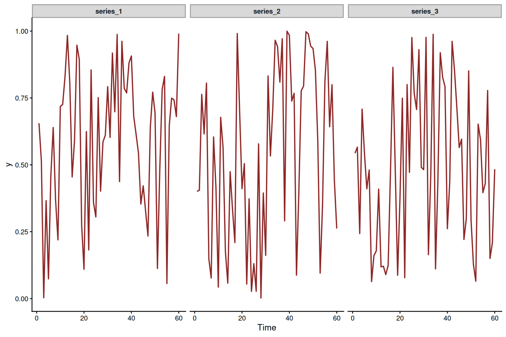

``` r
mod <- mvgam(
  y ~ s(x, by = series, k = 6),
  trend_formula = ~ AR(p = 1),
  data = data$data_train,
  newdata = data$data_test,
  family = Beta(),
  silent = 2
)
```

Inspect the summary to see that the posterior now also contains
estimates for the `Beta` precision parameters $\phi$.

``` r
summary(mod, 
        include_betas = FALSE)
#>  Family: beta 
#>   Links: mu = logit 
#> Formula: y ~ s(x, by = series, k = 6) 
#>    Data: data$data_train (Number of observations: 180) 
#>  Series: 3 
#>  Trends: AR(); formula: ~0 
#>   Draws: 4 chains, each with iter = 1000; warmup = 500; thin = 1; 
#>          total post-warmup draws = 4000
#> 
#> == Observation Model ==
#> Population-Level Effects:
#>           Estimate Est.Error l-95% CI u-95% CI Rhat Bulk_ESS Tail_ESS
#> Intercept     0.19      0.17    -0.13     0.55    1   831.47  1656.26
#> 
#> Smooth Terms:
#>          Estimate Est.Error l-95% CI u-95% CI Rhat Bulk_ESS Tail_ESS
#> sds_1[1]     4.69      2.33     1.72    10.32 1.00  1697.25  1984.08
#> sds_2[1]     5.98      2.57     2.49    12.28 1.00  1097.27  1378.18
#> sds_3[1]     8.96      3.65     3.79    18.36 1.00  1164.42  1622.96
#> s_1_1[1]     2.31      4.53    -4.92    13.30 1.00  1729.45  1888.80
#> s_1_1[2]     1.78      2.71    -4.05     7.04 1.00  1891.68  2430.50
#> s_1_1[3]    -6.58      3.21   -13.86    -1.28 1.00  1434.53  1631.25
#> s_1_1[4]     2.29      2.15    -2.00     6.73 1.00  2414.93  2712.05
#> s_2_1[1]     4.01      5.12    -4.76    15.54 1.00  1621.80  1557.77
#> s_2_1[2]     0.38      2.64    -5.25     5.27 1.00  2037.57  2223.11
#> s_2_1[3]    -8.83      2.65   -14.07    -3.56 1.01   838.28  1907.40
#> s_2_1[4]     5.37      2.78     0.29    11.26 1.00  1479.55  2130.82
#> s_3_1[1]    14.08      6.06     2.22    26.18 1.00  1586.80  1835.02
#> s_3_1[2]     5.78      2.68     0.80    11.13 1.00   865.43  2135.11
#> s_3_1[3]   -11.30      2.70   -16.53    -5.98 1.00  1526.84  2167.88
#> s_3_1[4]    -0.48      2.49    -5.51     4.23 1.00  1299.91  2197.23
#> 
#> Further Distributional Parameters:
#>     Estimate Est.Error l-95% CI u-95% CI Rhat Bulk_ESS Tail_ESS
#> phi    12.08      6.94     5.18    31.52 1.04   108.91   155.27
#> 
#> == Trend Model ==
#> Trend Specific Parameters:
#>                Estimate Est.Error l-95% CI u-95% CI Rhat Bulk_ESS Tail_ESS
#> sigma_trend[1]     0.79      0.22     0.37     1.22 1.02   162.14   359.13
#> sigma_trend[2]     0.86      0.22     0.45     1.30 1.02   194.55   420.79
#> sigma_trend[3]     0.50      0.21     0.06     0.90 1.03   143.82   208.69
#> ar1_trend[1]       0.56      0.20     0.15     0.91 1.01   536.65  1127.34
#> ar1_trend[2]       0.71      0.13     0.45     0.93 1.00   562.30  1420.17
#> ar1_trend[3]       0.54      0.28    -0.21     0.92 1.01   728.42   588.66
#> 
#> Draws were sampled using sampling(NUTS). For each parameter, Bulk_ESS
#> and Tail_ESS are effective sample size measures, and Rhat is the potential
#> scale reduction factor on split chains (at convergence, Rhat = 1).
#> 
#> Next steps:
#>   - `pp_check(fit)`: posterior predictive checks
#>   - `forecast(fit, newdata = ...)`: out-of-sample forecasts
#>   - `loo(fit)` / `loo_compare(...)`: model fit + comparison
#> Use `how_to_cite(fit)` for a citation-ready model description.
```

Plot the hindcast and forecast distributions for each series

``` r
library(patchwork)
fc <- forecast(mod)
wrap_plots(
  plot(fc, series = 1),
  plot(fc, series = 2),
  plot(fc, series = 3),
  ncol = 2
)
```

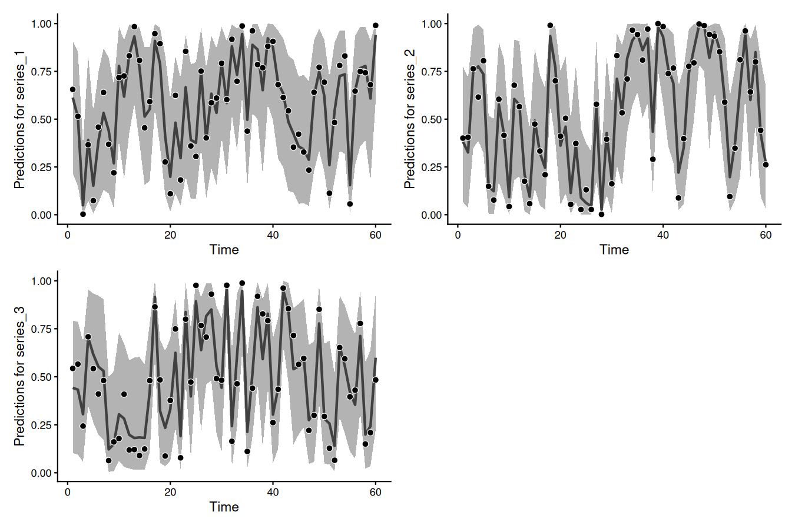

There are many more extended uses of `mvgam`, including the ability to
fit hierarchical State-Space GAMs that include dynamic and spatially
varying coefficient models, dynamic factors, Joint Species Distribution
Models and much more. See the
<a href="https://nicholasjclark.github.io/mvgam/"
target="_blank">package documentation</a> for more details. `mvgam` can
also be used to generate all necessary data structures and modelling
code necessary to fit DGAMs using `Stan`. This can be helpful if users
wish to make changes to the model to better suit their own bespoke
research / analysis goals. The <a href="https://discourse.mc-stan.org/"
target="_blank"><code>Stan</code> Discourse</a> is a helpful place to
troubleshoot.

## Citing `mvgam` and related software

When using any software please make sure to appropriately acknowledge
the hard work that developers and maintainers put into making these
packages available. Citations are currently the best way to formally
acknowledge this work (but feel free to ⭐ this repo as well).

When using `mvgam`, please cite the following:

> Clark, N.J. and Wells, K. (2023). Dynamic Generalized Additive Models
> (DGAMs) for forecasting discrete ecological time series. *Methods in
> Ecology and Evolution*. DOI: <https://doi.org/10.1111/2041-210X.13974>

As `mvgam` acts as an interface to `Stan`, please additionally cite:

> Carpenter B., Gelman A., Hoffman M. D., Lee D., Goodrich B.,
> Betancourt M., Brubaker M., Guo J., Li P., and Riddell A. (2017).
> Stan: A probabilistic programming language. *Journal of Statistical
> Software*. 76(1). DOI: <https://doi.org/10.18637/jss.v076.i01>

`mvgam` relies on several other `R` packages and, of course, on `R`
itself. Use `how_to_cite()` to simplify the process of finding
appropriate citations for your software setup.

## Getting help

If you encounter a clear bug, please file an issue with a minimal
reproducible example on
[GitHub](https://github.com/nicholasjclark/mvgam/issues). Please also
feel free to use the [`mvgam` Discussion
Board](https://github.com/nicholasjclark/mvgam/discussions) to hunt for
or post other discussion topics related to the package, and do check out
the [`mvgam`
Changelog](https://nicholasjclark.github.io/mvgam/news/index.html) for
any updates about recent upgrades that the package has incorporated.

## Other resources

A series of <a href="https://nicholasjclark.github.io/mvgam/"
target="_blank">vignettes cover data formatting, forecasting and several
extended case studies of DGAMs</a>. A number of other examples,
including some step-by-step introductory webinars, have also been
compiled:

- <a
  href="https://www.youtube.com/playlist?list=PLzFHNoUxkCvsFIg6zqogylUfPpaxau_a3"
  target="_blank">Time series in R and Stan using the <code>mvgam</code>
  package</a>
- <a href="https://www.youtube.com/watch?v=0zZopLlomsQ"
  target="_blank">Ecological Forecasting with Dynamic Generalized Additive
  Models</a>
- <a href="https://ecogambler.netlify.app/blog/distributed-lags-mgcv/"
  target="_blank">Distributed lags (and hierarchical distributed lags)
  using <code>mgcv</code> and <code>mvgam</code></a>
- <a href="https://ecogambler.netlify.app/blog/vector-autoregressions/"
  target="_blank">State-Space Vector Autoregressions in
  <code>mvgam</code></a>
- <a href="https://www.youtube.com/watch?v=RwllLjgPUmM"
  target="_blank">Ecological Forecasting with Dynamic GAMs; a tutorial and
  detailed case study</a>
- <a href="https://ecogambler.netlify.app/blog/time-varying-seasonality/"
  target="_blank">Incorporating time-varying seasonality in forecast
  models</a>

## Interested in contributing?

I’m actively seeking PhD students and other researchers to work in the
areas of ecological forecasting, multivariate model evaluation and
development of `mvgam`. Please reach out if you are interested
(n.clark’at’uq.edu.au). Other contributions are also very welcome, but
please see [The Contributor
Instructions](https://github.com/nicholasjclark/mvgam/blob/master/.github/CONTRIBUTING.md)
for general guidelines. Note that by participating in this project you
agree to abide by the terms of its [Contributor Code of
Conduct](https://dplyr.tidyverse.org/CODE_OF_CONDUCT).

## License

The `mvgam` project is licensed under an `MIT` open source license
