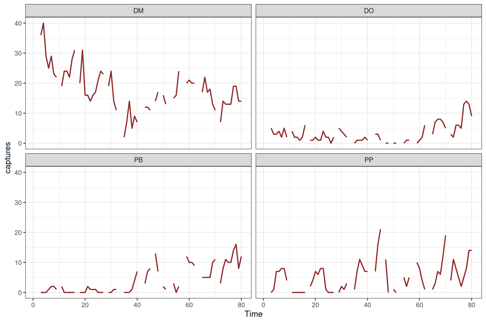
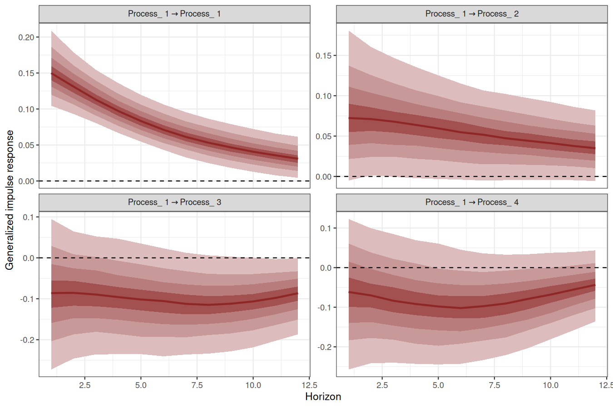
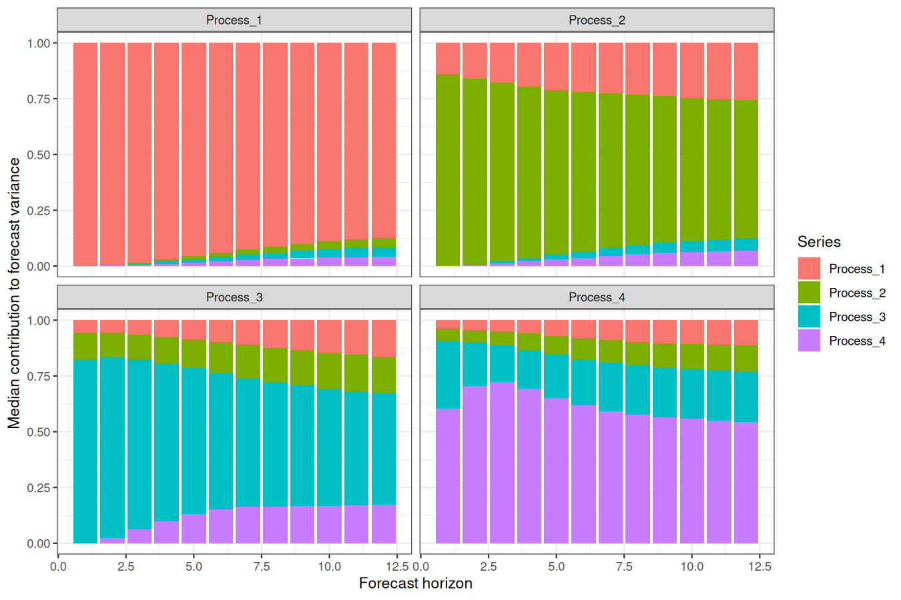

<!-- README.md is generated from README.Rmd. Please edit that file -->

[](https://mc-stan.org/)

# *mvgam*

The goal of `mvgam` is to fit Bayesian Dynamic Generalized Additive
Models to time series data. The motivation for the package is described
in <a
href="https://besjournals.onlinelibrary.wiley.com/doi/10.1111/2041-210X.13974"
target="_blank">Clark &amp; Wells 2022</a> (published in *Methods in
Ecology and Evolution*), with additional inspiration on the use of
Bayesian probabilistic modelling coming from
<a href="https://betanalpha.github.io/writing/" target="_blank">Michael
Betancourt</a>,
<a href="https://www.bu.edu/earth/profiles/michael-dietze/"
target="_blank">Michael Dietze</a> and
<a href="https://emilybfox.su.domains/" target="_blank">Emily Fox</a>,
among many others.

## Resources

A series of <a href="https://nicholasjclark.github.io/mvgam/"
target="_blank">vignettes cover data formatting, forecasting and several
extended case studies of DGAMs</a>. A number of other examples have also
been compiled:

- <a href="https://www.youtube.com/watch?v=0zZopLlomsQ"
  target="_blank">Ecological Forecasting with Dynamic Generalized Additive
  Models</a>
- <a href="https://ecogambler.netlify.app/blog/distributed-lags-mgcv/"
  target="_blank">Distributed lags (and hierarchical distributed lags)
  using <code>mgcv</code> and <code>mvgam</code></a>
- <a href="https://www.youtube.com/watch?v=RwllLjgPUmM"
  target="_blank">Ecological Forecasting with Dynamic GAMs; a tutorial and
  detailed case study</a>
- <a href="https://ecogambler.netlify.app/blog/interpreting-gams/"
  target="_blank">How to interpret and report nonlinear effects from
  Generalized Additive Models</a>
- <a href="https://ecogambler.netlify.app/blog/phylogenetic-smooths-mgcv/"
  target="_blank">Phylogenetic smoothing using mgcv</a>
- <a href="https://ecogambler.netlify.app/blog/distributed-lags-mgcv/"
  target="_blank">Distributed lags (and hierarchical distributed lags)
  using mgcv and mvgam</a>

## Installation

Install from `GitHub` using:
`devtools::install_github("nicholasjclark/mvgam")`. Note that to
condition models on observed data, either `JAGS` (along with packages
`rjags` and `runjags`) or `Stan` must be installed (along with either
`rstan` and/or `cmdstanr`). Please refer to installation links for
`JAGS` <a href="https://sourceforge.net/projects/mcmc-jags/files/"
target="_blank">here</a>, for `Stan` with `rstan`
<a href="https://mc-stan.org/users/interfaces/rstan"
target="_blank">here</a>, or for `Stan` with `cmdstandr`
<a href="https://mc-stan.org/cmdstanr/" target="_blank">here</a>. You
will need a fairly recent version of `Stan` to ensure all syntax is
recognized. If you see warnings such as
`variable "array" does not exist`, this is usually a sign that you need
to update `Stan`. We highly recommend you use `Cmdstan` through the
`cmdstanr` interface. This is because `Cmdstan` is easier to install, is
more up to date with new features, and uses less memory than `Rstan`.
See <a
href="http://mc-stan.org/cmdstanr/articles/cmdstanr.html#comparison-with-rstan"
target="_blank">this documentation from the <code>Cmdstan</code> team
for more information</a>.

## Citing mvgam and related software

When using any software please make sure to appropriately acknowledge
the hard work that developers and maintainers put into making these
packages available. Citations are currently the best way to formally
acknowledge this work, so we highly encourage you to cite any packages
that you rely on for your research.

When using `mvgam`, please cite the following:

- Clark, N.J. and Wells, K. (2022). Dynamic Generalized Additive Models
  (DGAMs) for forecasting discrete ecological time series. *Methods in
  Ecology and Evolution*. DOI: <https://doi.org/10.1111/2041-210X.13974>

As `mvgam` acts as an interface to `Stan` and `JAGS`, please
additionally cite whichever software you use for parameter estimation:

- Carpenter B., Gelman A., Hoffman M. D., Lee D., Goodrich B.,
  Betancourt M., Brubaker M., Guo J., Li P., and Riddell A. (2017).
  Stan: A probabilistic programming language. *Journal of Statistical
  Software*. 76(1). 10.18637/jss.v076.i01
- Plummer, M. (2013). JAGS: A program for analysis of Bayesian graphical
  models using Gibbs sampling. *Proceedings of the 3rd International
  Workshop on Distributed Statistical Computing*. 124(125.10).

`mvgam` relies on several other `R` packages and, of course, on `R`
itself. To find out how to cite R and its packages, use the `citation`
function. There are some features of `mvgam` which specifically rely on
certain packages. The most important of these is the generation of data
necessary to estimate smoothing splines, which entirely rely on `mgcv`.
The `rstan` and `cmdstanr` packages together with `Rcpp` makes `Stan`
conveniently accessible in `R`, while the `rjags` and `runjags` packages
together with the `coda` package make `JAGS` accessible in `R`. If you
use some of these features, please also consider citing the related
packages.

## Cheatsheet

[](https://github.com/nicholasjclark/mvgam/raw/master/misc/mvgam_cheatsheet.pdf)

## Introducing mvgam for fitting Generalized Additive Models to time seriese

We can explore the model’s primary functions using a dataset that is
available with all `R` installations. Load the `lynx` data and plot the
series as well as its autocorrelation function

``` r
data(lynx)
lynx_full <- data.frame(year = 1821:1934, 
                        population = as.numeric(lynx))
plot(lynx_full$population, type = 'l', ylab = 'Lynx trappings',
     xlab = 'Time', bty = 'l', lwd = 2)
box(bty = 'l', lwd  = 2)
```



``` r
acf(lynx_full$population, main = '', bty = 'l', lwd = 2,
    ci.col = 'darkred')
box(bty = 'l', lwd  = 2)
```


Along with serial autocorrelation, there is a clear ~19-year cyclic
pattern. Create a `season` term that can be used to model this effect
and give a better representation of the data generating process than we
would likely get with a linear model

``` r
plot(stl(ts(lynx_full$population, frequency = 19), s.window = 'periodic'),
     lwd = 2, col.range = 'darkred')
```


``` r
lynx_full$season <- (lynx_full$year%%19) + 1
```

For `mvgam` models, we need an indicator of the series name as a
`factor` (if the column `series` is missing, this will be added
automatically by assuming that all observations are from a single time
series). A `time` column is needed to index time

``` r
lynx_full$time <- 1:NROW(lynx_full)
lynx_full$series <- factor('series1')
```

Split the data into training (first 50 years) and testing (next 10 years
of data) to evaluate forecasts

``` r
lynx_train = lynx_full[1:50, ]
lynx_test = lynx_full[51:60, ]
```

Inspect the series in a bit more detail using `mvgam`’s plotting utility

``` r
plot_mvgam_series(data = lynx_train, y = 'population')
```


Now we will formulate an `mvgam` model; this model fits a GAM in which a
cyclic smooth function for `season` is estimated jointly with a full
time series model for the temporal process (in this case an `AR3`
process). We assume the outcome follows a Poisson distribution and will
condition the model in `Stan` using MCMC sampling with the `Cmdstan`
interface:

``` r
lynx_mvgam <- mvgam(population ~ s(season, bs = 'cc', k = 12),
                    knots = list(season = c(0.5, 19.5)),
                    data = lynx_train,
                    newdata = lynx_test,
                    family = poisson(),
                    trend_model = AR(p = 3),
                    backend = 'cmdstanr')
```

Inspect the `Stan` code for the model

``` r
code(lynx_mvgam)
#> // Stan model code generated by package mvgam
#> data {
#>   int<lower=0> total_obs; // total number of observations
#>   int<lower=0> n; // number of timepoints per series
#>   int<lower=0> n_sp; // number of smoothing parameters
#>   int<lower=0> n_series; // number of series
#>   int<lower=0> num_basis; // total number of basis coefficients
#>   vector[num_basis] zero; // prior locations for basis coefficients
#>   matrix[total_obs, num_basis] X; // mgcv GAM design matrix
#>   array[n, n_series] int<lower=0> ytimes; // time-ordered matrix (which col in X belongs to each [time, series] observation?)
#>   matrix[10, 10] S1; // mgcv smooth penalty matrix S1
#>   int<lower=0> n_nonmissing; // number of nonmissing observations
#>   array[n_nonmissing] int<lower=0> flat_ys; // flattened nonmissing observations
#>   matrix[n_nonmissing, num_basis] flat_xs; // X values for nonmissing observations
#>   array[n_nonmissing] int<lower=0> obs_ind; // indices of nonmissing observations
#> }
#> parameters {
#>   // raw basis coefficients
#>   vector[num_basis] b_raw;
#>   
#>   // latent trend AR1 terms
#>   vector<lower=-1.5, upper=1.5>[n_series] ar1;
#>   
#>   // latent trend AR2 terms
#>   vector<lower=-1.5, upper=1.5>[n_series] ar2;
#>   
#>   // latent trend AR3 terms
#>   vector<lower=-1.5, upper=1.5>[n_series] ar3;
#>   
#>   // latent trend variance parameters
#>   vector<lower=0>[n_series] sigma;
#>   
#>   // latent trends
#>   matrix[n, n_series] trend;
#>   
#>   // smoothing parameters
#>   vector<lower=0>[n_sp] lambda;
#> }
#> transformed parameters {
#>   // basis coefficients
#>   vector[num_basis] b;
#>   b[1 : num_basis] = b_raw[1 : num_basis];
#> }
#> model {
#>   // prior for (Intercept)...
#>   b_raw[1] ~ student_t(3, 6.5, 2.5);
#>   
#>   // prior for s(season)...
#>   b_raw[2 : 11] ~ multi_normal_prec(zero[2 : 11],
#>                                     S1[1 : 10, 1 : 10] * lambda[1]);
#>   
#>   // priors for AR parameters
#>   ar1 ~ std_normal();
#>   ar2 ~ std_normal();
#>   ar3 ~ std_normal();
#>   
#>   // priors for smoothing parameters
#>   lambda ~ normal(5, 30);
#>   
#>   // priors for latent trend variance parameters
#>   sigma ~ student_t(3, 0, 2.5);
#>   
#>   // trend estimates
#>   trend[1, 1 : n_series] ~ normal(0, sigma);
#>   trend[2, 1 : n_series] ~ normal(trend[1, 1 : n_series] * ar1, sigma);
#>   trend[3, 1 : n_series] ~ normal(trend[2, 1 : n_series] * ar1
#>                                   + trend[1, 1 : n_series] * ar2, sigma);
#>   for (s in 1 : n_series) {
#>     trend[4 : n, s] ~ normal(ar1[s] * trend[3 : (n - 1), s]
#>                              + ar2[s] * trend[2 : (n - 2), s]
#>                              + ar3[s] * trend[1 : (n - 3), s], sigma[s]);
#>   }
#>   {
#>     // likelihood functions
#>     vector[n_nonmissing] flat_trends;
#>     flat_trends = to_vector(trend)[obs_ind];
#>     flat_ys ~ poisson_log_glm(append_col(flat_xs, flat_trends), 0.0,
#>                               append_row(b, 1.0));
#>   }
#> }
#> generated quantities {
#>   vector[total_obs] eta;
#>   matrix[n, n_series] mus;
#>   vector[n_sp] rho;
#>   vector[n_series] tau;
#>   array[n, n_series] int ypred;
#>   rho = log(lambda);
#>   for (s in 1 : n_series) {
#>     tau[s] = pow(sigma[s], -2.0);
#>   }
#>   
#>   // posterior predictions
#>   eta = X * b;
#>   for (s in 1 : n_series) {
#>     mus[1 : n, s] = eta[ytimes[1 : n, s]] + trend[1 : n, s];
#>     ypred[1 : n, s] = poisson_log_rng(mus[1 : n, s]);
#>   }
#> }
```

Have a look at this model’s summary to see what is being estimated. Note
that no pathological behaviours have been detected and we achieve good
effective sample sizes / mixing for all parameters

``` r
summary(lynx_mvgam)
#> GAM formula:
#> population ~ s(season, bs = "cc", k = 12)
#> 
#> Family:
#> poisson
#> 
#> Link function:
#> log
#> 
#> Trend model:
#> AR(p = 3)
#> 
#> N series:
#> 1 
#> 
#> N timepoints:
#> 50 
#> 
#> Status:
#> Fitted using Stan 
#> 4 chains, each with iter = 1000; warmup = 500; thin = 1 
#> Total post-warmup draws = 2000
#> 
#> 
#> GAM coefficient (beta) estimates:
#>                2.5%    50%  97.5% Rhat n_eff
#> (Intercept)   6.100  6.600  7.000 1.00   658
#> s(season).1  -0.630  0.058  0.730 1.00   829
#> s(season).2  -0.150  0.750  1.800 1.00   489
#> s(season).3  -0.056  1.100  2.400 1.01   448
#> s(season).4  -0.550  0.410  1.400 1.01   695
#> s(season).5  -1.200 -0.059  0.960 1.00   474
#> s(season).6  -1.100  0.058  1.100 1.00   560
#> s(season).7  -0.740  0.350  1.400 1.00   865
#> s(season).8  -1.000  0.160  1.700 1.00   473
#> s(season).9  -1.100 -0.330  0.600 1.00   572
#> s(season).10 -1.300 -0.640 -0.031 1.00   827
#> 
#> Approximate significance of GAM observation smooths:
#>            edf Ref.df Chi.sq p-value
#> s(season) 9.93     10  16564    0.29
#> 
#> Latent trend AR parameter estimates:
#>           2.5%   50% 97.5% Rhat n_eff
#> ar1[1]    0.79  1.10 1.500    1   751
#> ar2[1]   -0.84 -0.41 0.048    1  1406
#> ar3[1]   -0.49 -0.14 0.250    1   680
#> sigma[1]  0.40  0.51 0.650    1  1074
#> 
#> Stan MCMC diagnostics:
#> n_eff / iter looks reasonable for all parameters
#> Rhat looks reasonable for all parameters
#> 0 of 2000 iterations ended with a divergence (0%)
#> 0 of 2000 iterations saturated the maximum tree depth of 12 (0%)
#> E-FMI indicated no pathological behavior
#> 
#> Samples were drawn using NUTS(diag_e) at Wed Mar 27 6:38:25 PM 2024.
#> For each parameter, n_eff is a crude measure of effective sample size,
#> and Rhat is the potential scale reduction factor on split MCMC chains
#> (at convergence, Rhat = 1)
```

As with any `MCMC` software, we can inspect traceplots. Here for the
`GAM` smoothing parameters, using `mvgam`’s reliance on the excellent
`bayesplot` library:

``` r
mcmc_plot(lynx_mvgam, variable = 'rho', regex = TRUE, type = 'trace')
#> No divergences to plot.
```


and for the latent trend parameters

``` r
mcmc_plot(lynx_mvgam, variable = 'trend_params', regex = TRUE, type = 'trace')
#> No divergences to plot.
```


Use posterior predictive checks to see if the model can simulate data
that looks realistic and unbiased. First, examine histograms for
posterior retrodictions (`yhat`) and compare to the histogram of the
observations (`y`)

``` r
ppc(lynx_mvgam, series = 1, type = 'hist')
```


Next examine simulated empirical Cumulative Distribution Functions (CDF)
for posterior predictions

``` r
ppc(lynx_mvgam, series = 1, type = 'cdf')
```



Rootograms are
<a href="https://arxiv.org/pdf/1605.01311.pdf" target="_blank">popular
graphical tools for checking a discrete model’s ability to capture
dispersion properties of the response variable</a>. Posterior predictive
hanging rootograms can be displayed using the `ppc()` function. In the
plot below, we bin the unique observed values into `25` bins to prevent
overplotting and help with interpretation. This plot compares the
frequencies of observed vs predicted values for each bin. For example,
if the gray bars (representing observed frequencies) tend to stretch
below zero, this suggests the model’s simulations predict the values in
that particular bin less frequently than they are observed in the data.
A well-fitting model that can generate realistic simulated data will
provide a rootogram in which the lower boundaries of the grey bars are
generally near zero

``` r
ppc(lynx_mvgam, series = 1, type = 'rootogram', n_bins = 25)
```



All plots indicate the model is well calibrated against the training
data. Inspect the estimated cyclic smooth, which is shown as a ribbon
plot of posterior empirical quantiles. We can also overlay posterior
quantiles of partial residuals (shown in red), which represent the
leftover variation that the model expects would remain if this smooth
term was dropped but all other parameters remained unchanged. A strong
pattern in the partial residuals suggests there would be strong patterns
left unexplained in the model *if* we were to drop this term, giving us
further confidence that this function is important in the model

``` r
plot(lynx_mvgam, type = 'smooths', residuals = TRUE)
```


First derivatives of smooths can be plotted to inspect how the slope of
the function changes. To plot these we use the more flexible
`plot_mvgam_smooth()` function

``` r
plot_mvgam_smooth(lynx_mvgam, series = 1, 
                  smooth = 'season', 
                  derivatives = TRUE)
```


As for many types of regression models, it is often more useful to plot
model effects on the outcome scale. `mvgam` has support for the
wonderful `marginaleffects` package, allowing a wide variety of
posterior contrasts, averages, conditional and marginal predictions to
be calculated and plotted. Below is the conditional effect of season
plotted on the outcome scale, for example:

``` r
require(ggplot2)
#> Loading required package: ggplot2
#> Warning: package 'ggplot2' was built under R version 4.3.3
plot_predictions(lynx_mvgam, condition = 'season', points = 0.5) +
  theme_classic()
```


We can also view the `mvgam`’s posterior predictions for the entire
series (testing and training)

``` r
plot(lynx_mvgam, type = 'forecast', newdata = lynx_test)
```


    #> Out of sample CRPS:
    #> [1] 2941.682

And the estimated latent trend component, again using the more flexible
`plot_mvgam_...()` option to show first derivatives of the estimated
trend

``` r
plot_mvgam_trend(lynx_mvgam, newdata = lynx_test, derivatives = TRUE)
```


A key aspect of ecological forecasting is to understand <a
href="https://esajournals.onlinelibrary.wiley.com/doi/full/10.1002/eap.1589"
target="_blank">how different components of a model contribute to
forecast uncertainty</a>. We can estimate relative contributions to
forecast uncertainty for the GAM component and the latent trend
component using `mvgam`

``` r
plot_mvgam_uncertainty(lynx_mvgam, newdata = lynx_test, legend_position = 'none')
text(1, 0.2, cex = 1.5, label="GAM component", 
     pos = 4, col="white", family = 'serif')
text(1, 0.8, cex = 1.5, label="Trend component", 
     pos = 4, col="#7C0000", family = 'serif')
```


Both components contribute to forecast uncertainty. Diagnostics of the
model can also be performed using `mvgam`. Have a look at the model’s
residuals, which are posterior empirical quantiles of Dunn-Smyth
randomised quantile residuals so should follow approximate normality. We
are primarily looking for a lack of autocorrelation, which would suggest
our AR3 model is appropriate for the latent trend

``` r
plot(lynx_mvgam, type = 'residuals')
```


## Extended observation families

`mvgam` was originally designed to analyse and forecast non-negative
integer-valued data. These data are traditionally challenging to analyse
with existing time-series analysis packages. But further development of
`mvgam` has resulted in support for a growing number of observation
families. Currently, the package can handle data for the following:

- `gaussian()` for real-valued data
- `student_t()` for heavy-tailed real-valued data
- `lognormal()` for non-negative real-valued data
- `Gamma()` for non-negative real-valued data
- `betar()` for proportional data on `(0,1)`
- `bernoulli()` for binary data
- `poisson()` for count data
- `nb()` for overdispersed count data
- `binomial()` for count data with known number of trials
- `beta_binomial()` for overdispersed count data with known number of
  trials
- `nmix()` for count data with imperfect detection (unknown number of
  trials)
- `tweedie()` for overdispersed count data

Note that only `poisson()`, `nb()`, and `tweedie()` are available if
using `JAGS`. All families, apart from `tweedie()`, are supported if
using `Stan`. See `??mvgam_families` for more information. Below is a
simple example for simulating and modelling proportional data with
`Beta` observations over a set of seasonal series with independent
Gaussian Process dynamic trends:

``` r
set.seed(100)
data <- sim_mvgam(family = betar(),
                  T = 80,
                  trend_model = 'GP',
                  prop_trend = 0.5, 
                  seasonality = 'shared')
plot_mvgam_series(data = data$data_train, series = 'all')
```


``` r
mod <- mvgam(y ~ s(season, bs = 'cc', k = 7) +
               s(season, by = series, m = 1, k = 5),
             trend_model = 'GP',
             data = data$data_train,
             newdata = data$data_test,
             family = betar())
```

Inspect the summary to see that the posterior now also contains
estimates for the `Beta` precision parameters $\phi$. We can suppress a
summary of the $\beta$ coefficients, which is useful when there are many
spline coefficients to report:

``` r
summary(mod, include_betas = FALSE)
#> GAM formula:
#> y ~ s(season, bs = "cc", k = 7) + s(season, by = series, m = 1, 
#>     k = 5)
#> 
#> Family:
#> beta
#> 
#> Link function:
#> logit
#> 
#> Trend model:
#> GP
#> 
#> N series:
#> 3 
#> 
#> N timepoints:
#> 60 
#> 
#> Status:
#> Fitted using Stan 
#> 4 chains, each with iter = 1000; warmup = 500; thin = 1 
#> Total post-warmup draws = 2000
#> 
#> 
#> Observation precision parameter estimates:
#>        2.5% 50% 97.5% Rhat n_eff
#> phi[1]  5.5 8.4    12    1  1516
#> phi[2]  5.8 8.7    13    1  1333
#> phi[3]  5.6 8.5    12    1  1690
#> 
#> GAM coefficient (beta) estimates:
#>              2.5%  50% 97.5% Rhat n_eff
#> (Intercept) -0.19 0.19  0.44    1   822
#> 
#> Approximate significance of GAM observation smooths:
#>                            edf Ref.df Chi.sq p-value    
#> s(season)                4.639      5  35.50  <2e-16 ***
#> s(season):seriesseries_1 0.887      4   0.53    0.98    
#> s(season):seriesseries_2 0.940      4   0.44    0.99    
#> s(season):seriesseries_3 1.391      4   1.40    0.78    
#> ---
#> Signif. codes:  0 '***' 0.001 '**' 0.01 '*' 0.05 '.' 0.1 ' ' 1
#> 
#> Latent trend marginal deviation (alpha) and length scale (rho) estimates:
#>             2.5%  50% 97.5% Rhat n_eff
#> alpha_gp[1] 0.10 0.44  0.98 1.00   770
#> alpha_gp[2] 0.37 0.74  1.30 1.00  1129
#> alpha_gp[3] 0.16 0.46  0.98 1.00   824
#> rho_gp[1]   1.20 3.80 14.00 1.00   705
#> rho_gp[2]   1.80 7.30 33.00 1.01   411
#> rho_gp[3]   1.30 4.90 23.00 1.01   658
#> 
#> Stan MCMC diagnostics:
#> n_eff / iter looks reasonable for all parameters
#> Rhat looks reasonable for all parameters
#> 3 of 2000 iterations ended with a divergence (0.15%)
#>  *Try running with larger adapt_delta to remove the divergences
#> 0 of 2000 iterations saturated the maximum tree depth of 12 (0%)
#> E-FMI indicated no pathological behavior
#> 
#> Samples were drawn using NUTS(diag_e) at Wed Mar 27 6:40:30 PM 2024.
#> For each parameter, n_eff is a crude measure of effective sample size,
#> and Rhat is the potential scale reduction factor on split MCMC chains
#> (at convergence, Rhat = 1)
```

Plot the hindcast and forecast distributions for each series

``` r
layout(matrix(1:4, nrow = 2, byrow = TRUE))
for(i in 1:3){
  plot(mod, type = 'forecast', series = i)
}
```

    #> Out of sample CRPS:
    #> [1] 2.0731
    #> Out of sample CRPS:
    #> [1] 1.833157
    #> Out of sample CRPS:
    #> [1] 1.736085


There are many more extended uses of `mvgam`, including the ability to
fit hierarchical GAMs that include dynamic coefficient models, dynamic
factor and Vector Autoregressive processes. See the
<a href="https://nicholasjclark.github.io/mvgam/"
target="_blank">package documentation</a> for more details. The package
can also be used to generate all necessary data structures, initial
value functions and modelling code necessary to fit DGAMs using `Stan`
or `JAGS`. This can be helpful if users wish to make changes to the
model to better suit their own bespoke research / analysis goals. The
following resources can be helpful to troubleshoot:

- <a href="https://discourse.mc-stan.org/" target="_blank">Stan
  Discourse</a>
- <a href="https://sourceforge.net/projects/mcmc-jags/"
  target="_blank">JAGS Discourse</a>

## License

This project is licensed under an `MIT` open source license

## Interested in contributing?

I’m actively seeking PhD students and other researchers to work in the
areas of ecological forecasting, multivariate model evaluation and
development of `mvgam`. Please reach out if you are interested
(n.clark’at’uq.edu.au)
