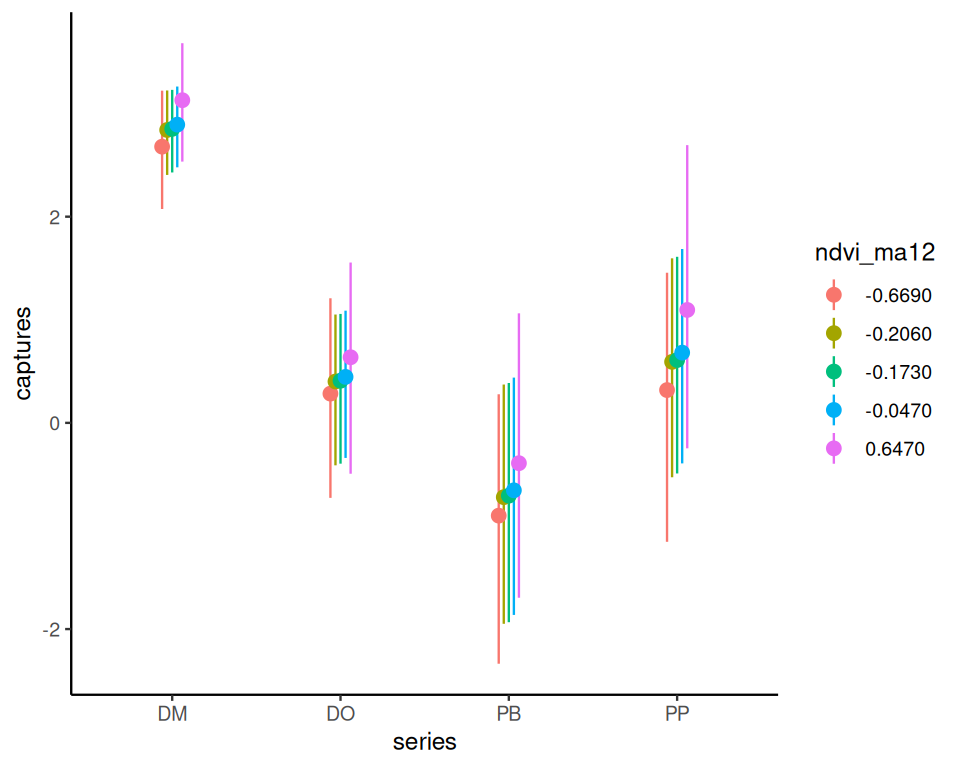
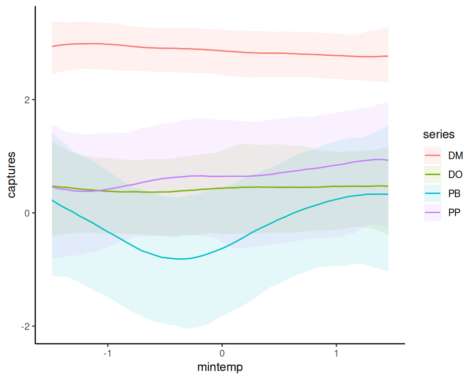
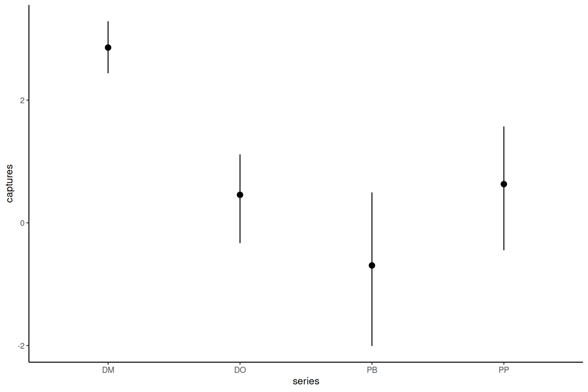
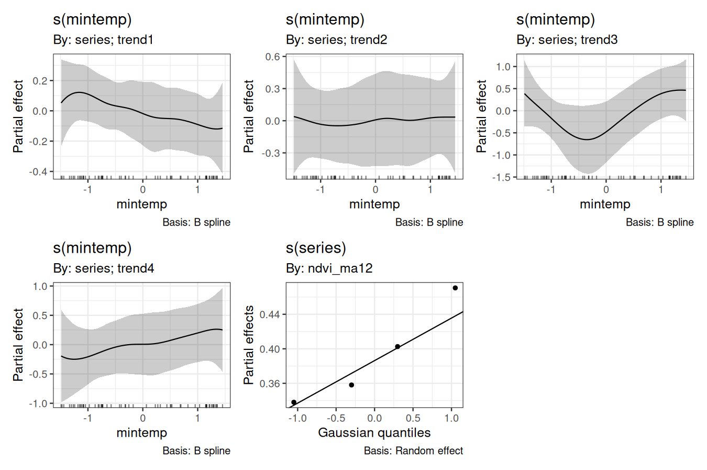
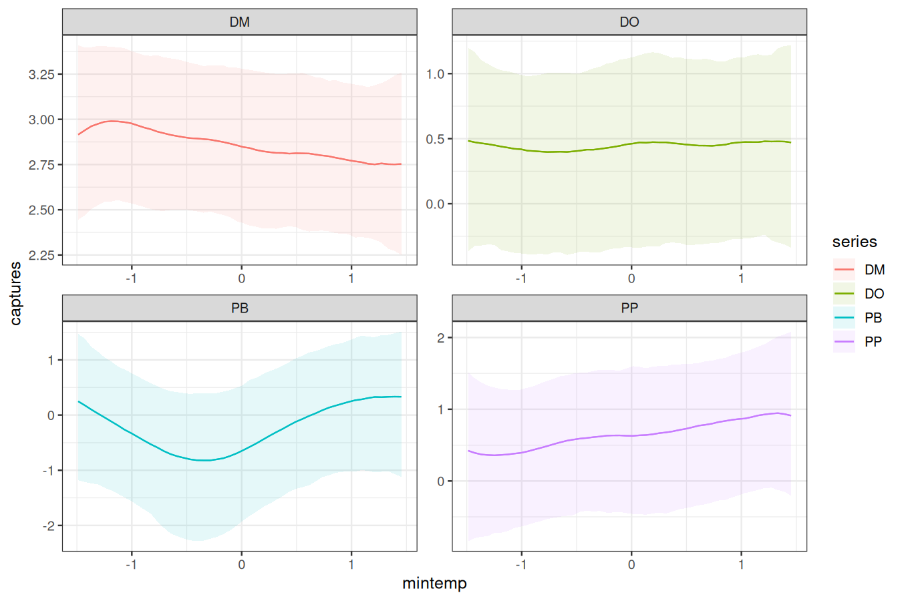
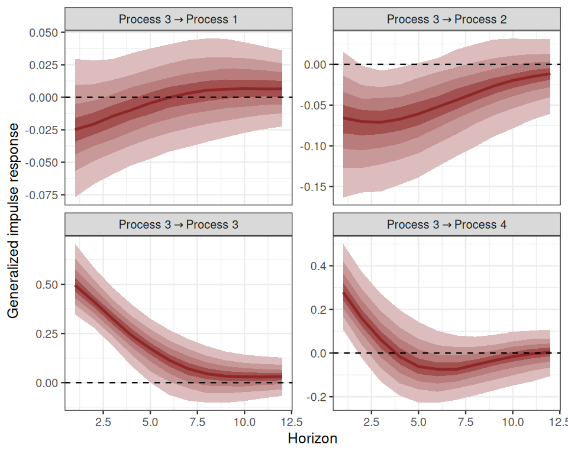

<!-- README.md is generated from README.Rmd. Please edit that file -->

[](https://mc-stan.org/)

# mvgam

> **M**ulti**V**ariate (Dynamic) **G**eneralized **A**ddivite **M**odels

[](https://github.com/nicholasjclark/mvgam/actions/)
[](https://app.codecov.io/gh/nicholasjclark/mvgam)
[](https://nicholasjclark.github.io/mvgam/)
[](https://doi.org/10.1111/2041-210X.13974)
[](https://cran.r-project.org/package=mvgam)
[](https://cran.r-project.org/package=mvgam)

The goal of `mvgam` is to fit Bayesian Dynamic Generalized Additive
Models (DGAMs) that can include highly flexible nonlinear predictor
effects for both process and observation components. The package does
this by relying on functionalities from the impressive
<a href="https://paulbuerkner.com/brms/"
target="_blank"><code>brms</code></a> and
<a href="https://cran.r-project.org/package=mgcv"
target="_blank"><code>mgcv</code></a> packages. This allows `mvgam` to
fit a wide range of models, including:

- <a
  href="https://nicholasjclark.github.io/mvgam/articles/trend_formulas.html"
  target="_blank">Multivariate State-Space Time Series models</a>
- Hierarchical
  <a href="https://nicholasjclark.github.io/mvgam/articles/nmixtures.html"
  target="_blank">N-mixture models</a>
- <a href="https://www.youtube.com/watch?v=2POK_FVwCHk"
  target="_blank">Hierarchical Generalized Additive Models</a>
- <a href="https://nicholasjclark.github.io/mvgam/reference/jsdgam.html"
  target="_blank">Joint Species Distribution Models</a>

## Installation

Install the stable version from `CRAN` using:
`install.packages('mvgam')`, or install the development version from
`GitHub` using: `devtools::install_github("nicholasjclark/mvgam")`. To
condition models on observed data, `Stan` must be installed (along with
either `rstan` and/or `cmdstanr`). Please refer to installation links
for `Stan` with `rstan`
<a href="https://mc-stan.org/users/interfaces/rstan"
target="_blank">here</a>, or for `Stan` with `cmdstandr`
<a href="https://mc-stan.org/cmdstanr/" target="_blank">here</a>.

## Cheatsheet

[](https://github.com/nicholasjclark/mvgam/raw/master/misc/mvgam_cheatsheet.pdf)

## A simple example

We can explore the package’s primary functions using one of it’s
built-in datasets. Use `plot_mvgam_series()` to inspect features for the
four time series, which represent captures of rodent species over time
(see `?portal_data` for more details)

``` r
data(portal_data)
plot_mvgam_series(data = portal_data, 
                  y = 'captures',
                  series = 'all')
```


``` r
plot_mvgam_series(data = portal_data, 
                  y = 'captures',
                  series = 1)
#> Warning: Removed 17 rows containing non-finite outside the scale range
#> (`stat_bin()`).
```


``` r
plot_mvgam_series(data = portal_data, 
                  y = 'captures',
                  series = 4)
#> Warning: Removed 17 rows containing non-finite outside the scale range
#> (`stat_bin()`).
```


For most forecasting exercises, we’ll want to split the data into
training and testing folds

``` r
data_train <- portal_data %>%
  dplyr::filter(time <= 60)
data_test <- portal_data %>%
  dplyr::filter(time > 60 &
                  time <= 65)
```

Formulate an `mvgam` model; this model fits a State-Space GAM in which
each species has its own intercept, linear association with `ndvi_ma12`
and potentially nonlinear association with `mintemp`. These effects are
estimated jointly with a full time series model for the temporal
dynamics (in this case an Vector Autoregressive process). We assume the
outcome follows a Poisson distribution and will condition the model in
`Stan` using MCMC sampling with the `Cmdstan` interface:

``` r
mod <- mvgam(
  # Observation model is empty as we don't have any
  # covariates that impact observation error
  formula = captures ~ 0,
  
  # Process model contains varying intercepts, 
  # varying slopes of ndvi_ma12 and varying smooths 
  # of mintemp for each series. 
  # Temporal dynamics are modelled with a Vector 
  # Autoregression (VAR(1))
  trend_formula = ~ 
    trend +
    s(trend, bs = 're', by = ndvi_ma12) +
    s(mintemp, bs = 'bs', by = trend) - 1,
  trend_model = VAR(cor = TRUE),
  
  # Obvservations are conditionally Poisson
  family = poisson(),

  # Condition on the training data
  data = data_train,
  backend = 'cmdstanr'
)
```

Have a look at this model’s summary to see what is being estimated. We
can suppress a summary of the spline $\beta$ coefficients, which is
useful when there are many coefficients to report:

``` r
summary(mod, include_betas = FALSE)
#> GAM observation formula:
#> captures ~ 1
#> 
#> GAM process formula:
#> ~trend + s(trend, bs = "re", by = ndvi_ma12) + s(mintemp, bs = "bs", 
#>     by = trend) - 1
#> 
#> Family:
#> poisson
#> 
#> Link function:
#> log
#> 
#> Trend model:
#> VAR(cor = TRUE)
#> 
#> 
#> N process models:
#> 4 
#> 
#> N series:
#> 4 
#> 
#> N timepoints:
#> 60 
#> 
#> Status:
#> Fitted using Stan 
#> 4 chains, each with iter = 1500; warmup = 1000; thin = 1 
#> Total post-warmup draws = 2000
#> 
#> 
#> GAM observation model coefficient (beta) estimates:
#>             2.5% 50% 97.5% Rhat n_eff
#> (Intercept)    0   0     0  NaN   NaN
#> 
#> Process model VAR parameter estimates:
#>          2.5%     50% 97.5% Rhat n_eff
#> A[1,1]  0.670  0.9000 1.100 1.02   251
#> A[1,2] -0.260 -0.0130 0.240 1.02   239
#> A[1,3] -0.093  0.0084 0.100 1.01   451
#> A[1,4] -0.100 -0.0080 0.062 1.01   626
#> A[2,1] -0.300  0.0390 0.580 1.03   189
#> A[2,2]  0.330  0.8300 1.100 1.02   251
#> A[2,3] -0.250 -0.0200 0.120 1.00   463
#> A[2,4] -0.170 -0.0077 0.160 1.01   258
#> A[3,1] -1.000 -0.0900 1.800 1.06    87
#> A[3,2] -2.000 -0.0970 1.200 1.07    70
#> A[3,3]  0.140  0.7200 1.100 1.02   199
#> A[3,4] -0.110  0.2000 0.850 1.03   165
#> A[4,1] -2.400 -0.1700 2.800 1.05    93
#> A[4,2] -3.800 -0.2600 2.700 1.06    78
#> A[4,3] -1.200 -0.2700 0.620 1.03   189
#> A[4,4]  0.540  0.9600 1.600 1.05   150
#> 
#> Process error parameter estimates:
#>                2.5%      50% 97.5% Rhat n_eff
#> Sigma[1,1]  0.00700  2.5e-02 0.064 1.01   212
#> Sigma[1,2] -0.00950  1.1e-02 0.053 1.01   293
#> Sigma[1,3] -0.06800 -1.3e-02 0.033 1.00   611
#> Sigma[1,4] -0.06900 -1.1e-02 0.041 1.00   936
#> Sigma[2,1] -0.00950  1.1e-02 0.053 1.01   293
#> Sigma[2,2]  0.00710  5.0e-02 0.260 1.06    77
#> Sigma[2,3] -0.15000 -3.3e-02 0.039 1.00   579
#> Sigma[2,4] -0.09000  2.3e-05 0.110 1.00   666
#> Sigma[3,1] -0.06800 -1.3e-02 0.033 1.00   611
#> Sigma[3,2] -0.15000 -3.3e-02 0.039 1.00   579
#> Sigma[3,3]  0.08400  2.6e-01 0.740 1.03   156
#> Sigma[3,4] -0.00018  1.4e-01 0.420 1.02   326
#> Sigma[4,1] -0.06900 -1.1e-02 0.041 1.00   936
#> Sigma[4,2] -0.09000  2.3e-05 0.110 1.00   666
#> Sigma[4,3] -0.00018  1.4e-01 0.420 1.02   326
#> Sigma[4,4]  0.13000  3.7e-01 0.930 1.04   220
#> 
#> GAM process model coefficient (beta) estimates:
#>                    2.5%    50% 97.5% Rhat n_eff
#> trendtrend1_trend  2.60  2.900  3.30    1   924
#> trendtrend2_trend -0.24  0.460  0.96    1   500
#> trendtrend3_trend -1.20 -0.078  0.94    1   661
#> trendtrend4_trend -0.30  0.730  1.70    1   923
#> 
#> GAM process model group-level estimates:
#>                                  2.5%  50% 97.5% Rhat n_eff
#> mean(s(trend):ndvi_ma12)_trend -0.510 0.39   1.3    1   863
#> sd(s(trend):ndvi_ma12)_trend    0.017 0.41   2.1    1   712
#> 
#> Approximate significance of GAM process smooths:
#>                          edf Ref.df Chi.sq p-value
#> s(mintemp):seriestrend1 1.68      9   1.64    0.40
#> s(mintemp):seriestrend2 1.30      9   0.09    0.89
#> s(mintemp):seriestrend3 2.35      9   3.83    0.19
#> s(mintemp):seriestrend4 1.98      9   0.81    0.65
#> s(series):ndvi_ma12     2.23      4   1.18    0.62
#> 
#> Stan MCMC diagnostics:
#> n_eff / iter looks reasonable for all parameters
#> Rhats above 1.05 found for 8 parameters
#>  *Diagnose further to investigate why the chains have not mixed
#> 28 of 2000 iterations ended with a divergence (1.4%)
#>  *Try running with larger adapt_delta to remove the divergences
#> 0 of 2000 iterations saturated the maximum tree depth of 10 (0%)
#> Chain 1: E-FMI = 0.1831
#> Chain 2: E-FMI = 0.1373
#> Chain 3: E-FMI = 0.099
#> Chain 4: E-FMI = 0.0902
#>  *E-FMI below 0.2 indicates you may need to reparameterize your model
#> 
#> Samples were drawn using NUTS(diag_e) at Wed Mar 05 12:30:25 PM 2025.
#> For each parameter, n_eff is a crude measure of effective sample size,
#> and Rhat is the potential scale reduction factor on split MCMC chains
#> (at convergence, Rhat = 1)
#> 
#> Use how_to_cite(mod) to get started describing this model
```

Split Rhat diagnostics show good convergence of the model estimates

``` r
mcmc_plot(mod, type = 'rhat_hist')
#> Warning: Dropped 1 NAs from 'new_rhat(rhat)'.
#> `stat_bin()` using `bins = 30`. Pick better value with `binwidth`.
```


Use `conditional_effects()` for a quick visualisation of the main terms
in model formulae

``` r
conditional_effects(mod, type = 'link')
```



If you have the `gratia` package installed, it can also be used to plot
partial effects of smooths

``` r
require(gratia)
#> Loading required package: gratia
#> 
#> Attaching package: 'gratia'
#> The following object is masked from 'package:mvgam':
#> 
#>     add_residuals
draw(mod, trend_effects = TRUE)
```



Or design more targeted plots using `plot_predictions()` from the
`marginaleffects` package

``` r
plot_predictions(mod,
                 condition = c('ndvi_ma12',
                               'series',
                               'series'),
                 type = 'link')
```



``` r
plot_predictions(mod,
                 condition = c('mintemp',
                               'series',
                               'series'),
                 type = 'link')
```


We can also view the model’s posterior predictions for the entire series
(testing and training). These forecasts can be scored using a range of
proper scoring rules. See `?score.mvgam_forecast` for more details

``` r
fcs <- forecast(mod, newdata = data_test)
plot(fcs, series = 1) +
  plot(fcs, series = 2) +
  plot(fcs, series = 3) +
  plot(fcs, series = 4)
#> Out of sample DRPS:
#> 8.3086915
#> Out of sample DRPS:
#> 5.2079045
#> Out of sample DRPS:
#> 8.8530545
#> Out of sample DRPS:
#> 3.97454875
```



For Vector Autoregressions fit in `mvgam`, we can inspect <a
href="https://ecogambler.netlify.app/blog/vector-autoregressions/#impulse-response-functions"
target="_blank">impulse response functions and forecast error variance
decompositions</a>. The `irf()` function runs an Impulse Response
Function (IRF) simulation whereby a positive “shock” is generated for a
target process at time `t = 0`. All else remaining stable, it then
monitors how each of the remaining processes in the latent VAR would be
expected to respond over the forecast horizon `h`. The function computes
impulse responses for all processes in the object and returns them in an
array that can be plotted using the S3 `plot()` function. Here we will
use the generalized IRF, which makes no assumptions about the order in
which the series appear in the VAR process, and inspect how each process
is expected to respond to a sudden, positive pulse from the other
processes over a horizon of 12 timepoints.

``` r
irfs <- irf(mod, h = 12, orthogonal = FALSE)
plot(irfs, series = 1)
```


``` r
plot(irfs, series = 3)
```



Using the same logic as above, we can inspect forecast error variance
decompositions (FEVDs) for each process using the `fevd()` function.
This type of analysis asks how orthogonal shocks to all process in the
system contribute to the variance of forecast uncertainty for a focal
process over increasing horizons. In other words, the proportion of the
forecast variance of each latent time series can be attributed to the
effects of the other series in the VAR process. FEVDs are useful because
some shocks may not be expected to cause variations in the short-term
but may cause longer-term fluctuations

``` r
fevds <- fevd(mod, h = 12)
plot(fevds)
```


This plot shows that the variance of forecast uncertainty for each
process is initially dominated by contributions from that same process
(i.e. self-dependent effects) but that effects from other processes
become more important over increasing forecast horizons. Given what we
saw from the IRF plots above, these long-term contributions from
interactions among the processes makes sense.

Plotting randomized quantile residuals over `time` for each series can
give useful information about what might be missing from the model. We
can use the highly versatile `pp_check()` function to plot these:

``` r
pp_check(mod, 
         type = 'resid_ribbon_grouped',
         group = 'series',
         x = 'time',
         ndraws = 200)
```


When describing the model, it can be helpful to use the `how_to_cite()`
function to generate a scaffold for describing the model and sampling
details in scientific communications

``` r
description <- how_to_cite(mod)
```

``` r
description
```

    #> Methods text skeleton
    #> We used the R package mvgam (version 1.1.5001; Clark & Wells, 2023) to
    #>   construct, fit and interrogate the model. mvgam fits Bayesian
    #>   State-Space models that can include flexible predictor effects in both
    #>   the process and observation components by incorporating functionalities
    #>   from the brms (Burkner 2017), mgcv (Wood 2017) and splines2 (Wang & Yan,
    #>   2023) packages. To encourage stability and prevent forecast variance
    #>   from increasing indefinitely, we enforced stationarity of the Vector
    #>   Autoregressive process following methods described by Heaps (2023) and
    #>   Clark et al. (2025). The mvgam-constructed model and observed data were
    #>   passed to the probabilistic programming environment Stan (version
    #>   2.36.0; Carpenter et al. 2017, Stan Development Team 2025), specifically
    #>   through the cmdstanr interface (Gabry & Cesnovar, 2021). We ran 4
    #>   Hamiltonian Monte Carlo chains for 1000 warmup iterations and 500
    #>   sampling iterations for joint posterior estimation. Rank normalized
    #>   split Rhat (Vehtari et al. 2021) and effective sample sizes were used to
    #>   monitor convergence.

    #> 
    #> Primary references
    #> Clark, NJ and Wells K (2022). Dynamic Generalized Additive Models
    #>   (DGAMs) for forecasting discrete ecological time series. Methods in
    #>   Ecology and Evolution, 14, 771-784. doi.org/10.1111/2041-210X.13974
    #> Burkner, PC (2017). brms: An R Package for Bayesian Multilevel Models
    #>   Using Stan. Journal of Statistical Software, 80(1), 1-28.
    #>   doi:10.18637/jss.v080.i01
    #> Wood, SN (2017). Generalized Additive Models: An Introduction with R
    #>   (2nd edition). Chapman and Hall/CRC.
    #> Wang W and Yan J (2021). Shape-Restricted Regression Splines with R
    #>   Package splines2. Journal of Data Science, 19(3), 498-517.
    #>   doi:10.6339/21-JDS1020 https://doi.org/10.6339/21-JDS1020.
    #> Heaps, SE (2023). Enforcing stationarity through the prior in vector
    #>   autoregressions. Journal of Computational and Graphical Statistics 32,
    #>   74-83.
    #> Clark NJ, Ernest SKM, Senyondo H, Simonis J, White EP, Yenni GM,
    #>   Karunarathna KANK (2025). Beyond single-species models: leveraging
    #>   multispecies forecasts to navigate the dynamics of ecological
    #>   predictability. PeerJ 13:e18929.
    #> Carpenter, B, Gelman, A, Hoffman, MD, Lee, D, Goodrich, B, Betancourt,
    #>   M, Brubaker, M, Guo, J, Li, P and Riddell, A (2017). Stan: A
    #>   probabilistic programming language. Journal of Statistical Software 76.
    #> Gabry J, Cesnovar R, Johnson A, and Bronder S (2025). cmdstanr: R
    #>   Interface to 'CmdStan'. https://mc-stan.org/cmdstanr/,
    #>   https://discourse.mc-stan.org.
    #> Vehtari A, Gelman A, Simpson D, Carpenter B, and Burkner P (2021).
    #>   Rank-normalization, folding, and localization: An improved Rhat for
    #>   assessing convergence of MCMC (with discussion). Bayesian Analysis 16(2)
    #>   667-718. https://doi.org/10.1214/20-BA1221.
    #> 
    #> Other useful references
    #> Arel-Bundock, V, Greifer, N, and Heiss, A (2024). How to interpret
    #>   statistical models using marginaleffects for R and Python. Journal of
    #>   Statistical Software, 111(9), 1-32.
    #>   https://doi.org/10.18637/jss.v111.i09
    #> Gabry J, Simpson D, Vehtari A, Betancourt M, and Gelman A (2019).
    #>   Visualization in Bayesian workflow. Journal of the Royal Statatistical
    #>   Society A, 182, 389-402. doi:10.1111/rssa.12378.
    #> Vehtari A, Gelman A, and Gabry J (2017). Practical Bayesian model
    #>   evaluation using leave-one-out cross-validation and WAIC. Statistics and
    #>   Computing, 27, 1413-1432. doi:10.1007/s11222-016-9696-4.
    #> Burkner, PC, Gabry, J, and Vehtari, A. (2020). Approximate
    #>   leave-future-out cross-validation for Bayesian time series models.
    #>   Journal of Statistical Computation and Simulation, 90(14), 2499-2523.
    #>   https://doi.org/10.1080/00949655.2020.1783262

The post-processing methods we have shown above are just the tip of the
iceberg. For a full list of methods to apply on fitted model objects,
type `methods(class = "mvgam")`.

## Extended observation families

`mvgam` was originally designed to analyse and forecast non-negative
integer-valued data. These data are traditionally challenging to analyse
with existing time-series analysis packages. But further development of
`mvgam` has resulted in support for a growing number of observation
families. Currently, the package can handle data for the following:

- `gaussian()` for real-valued data
- `student_t()` for heavy-tailed real-valued data
- `lognormal()` for non-negative real-valued data
- `Gamma()` for non-negative real-valued data
- `betar()` for proportional data on `(0,1)`
- `bernoulli()` for binary data
- `poisson()` for count data
- `nb()` for overdispersed count data
- `binomial()` for count data with known number of trials
- `beta_binomial()` for overdispersed count data with known number of
  trials
- `nmix()` for count data with imperfect detection (unknown number of
  trials)

See `??mvgam_families` for more information. Below is a simple example
for simulating and modelling proportional data with `Beta` observations
over a set of seasonal series with independent Gaussian Process dynamic
trends:

``` r
set.seed(100)
data <- sim_mvgam(
  family = betar(),
  T = 80,
  trend_model = GP(),
  prop_trend = 0.5,
  seasonality = "shared"
)
plot_mvgam_series(data = data$data_train, series = "all")
```


``` r
mod <- mvgam(
  y ~ s(season, bs = "cc", k = 7) +
    s(season, by = series, m = 1, k = 5),
  trend_model = GP(),
  data = data$data_train,
  newdata = data$data_test,
  family = betar()
)
```

Inspect the summary to see that the posterior now also contains
estimates for the `Beta` precision parameters $\phi$.

``` r
summary(mod, include_betas = FALSE)
#> GAM formula:
#> y ~ s(season, bs = "cc", k = 7) + s(season, by = series, m = 1, 
#>     k = 5)
#> 
#> Family:
#> beta
#> 
#> Link function:
#> logit
#> 
#> Trend model:
#> GP()
#> 
#> 
#> N series:
#> 3 
#> 
#> N timepoints:
#> 80 
#> 
#> Status:
#> Fitted using Stan 
#> 4 chains, each with iter = 1000; warmup = 500; thin = 1 
#> Total post-warmup draws = 2000
#> 
#> 
#> Observation precision parameter estimates:
#>        2.5%  50% 97.5% Rhat n_eff
#> phi[1]  8.1 12.0  18.0    1  1644
#> phi[2]  5.7  8.6  13.0    1  1124
#> phi[3]  4.1  6.0   8.6    1  1830
#> 
#> GAM coefficient (beta) estimates:
#>             2.5%  50% 97.5% Rhat n_eff
#> (Intercept) 0.13 0.46  0.69    1   685
#> 
#> Approximate significance of GAM smooths:
#>                           edf Ref.df Chi.sq p-value  
#> s(season)                3.95      5   7.96    0.06 .
#> s(season):seriesseries_1 2.00      4   4.84    0.13  
#> s(season):seriesseries_2 3.08      4   1.68    0.36  
#> s(season):seriesseries_3 1.21      4   4.07    0.41  
#> ---
#> Signif. codes:  0 '***' 0.001 '**' 0.01 '*' 0.05 '.' 0.1 ' ' 1
#> 
#> Latent trend marginal deviation (alpha) and length scale (rho) estimates:
#>              2.5%   50% 97.5% Rhat n_eff
#> alpha_gp[1] 0.097  0.39  0.86 1.01   547
#> alpha_gp[2] 0.550  0.92  1.40 1.00  1721
#> alpha_gp[3] 0.074  0.40  0.96 1.00   848
#> rho_gp[1]   1.100  3.80 12.00 1.00   652
#> rho_gp[2]   3.200 12.00 31.00 1.01   375
#> rho_gp[3]   1.300  5.00 26.00 1.01   734
#> 
#> Stan MCMC diagnostics:
#> n_eff / iter looks reasonable for all parameters
#> Rhat looks reasonable for all parameters
#> 0 of 2000 iterations ended with a divergence (0%)
#> 0 of 2000 iterations saturated the maximum tree depth of 10 (0%)
#> E-FMI indicated no pathological behavior
#> 
#> Samples were drawn using NUTS(diag_e) at Wed Mar 05 12:31:48 PM 2025.
#> For each parameter, n_eff is a crude measure of effective sample size,
#> and Rhat is the potential scale reduction factor on split MCMC chains
#> (at convergence, Rhat = 1)
#> 
#> Use how_to_cite(mod) to get started describing this model
```

Plot the hindcast and forecast distributions for each series

``` r
library(patchwork)
fc <- forecast(mod)
wrap_plots(
  plot(fc, series = 1),
  plot(fc, series = 2),
  plot(fc, series = 3),
  ncol = 2
)
```


There are many more extended uses of `mvgam`, including the ability to
fit hierarchical State-Space GAMs that include dynamic and spatially
varying coefficient models, dynamic factors and Vector Autoregressive
processes. See the <a href="https://nicholasjclark.github.io/mvgam/"
target="_blank">package documentation</a> for more details. The package
can also be used to generate all necessary data structures, initial
value functions and modelling code necessary to fit DGAMs using `Stan`.
This can be helpful if users wish to make changes to the model to better
suit their own bespoke research / analysis goals. The
<a href="https://discourse.mc-stan.org/" target="_blank">Stan
Discourse</a> is a helpful place to troubleshoot.

## Citing `mvgam` and related software

When using any software please make sure to appropriately acknowledge
the hard work that developers and maintainers put into making these
packages available. Citations are currently the best way to formally
acknowledge this work, so we highly encourage you to cite any packages
that you rely on for your research.

When using `mvgam`, please cite the following:

> Clark, N.J. and Wells, K. (2022). Dynamic Generalized Additive Models
> (DGAMs) for forecasting discrete ecological time series. *Methods in
> Ecology and Evolution*. DOI: <https://doi.org/10.1111/2041-210X.13974>

As `mvgam` acts as an interface to `Stan`, please additionally cite:

> Carpenter B., Gelman A., Hoffman M. D., Lee D., Goodrich B.,
> Betancourt M., Brubaker M., Guo J., Li P., and Riddell A. (2017).
> Stan: A probabilistic programming language. *Journal of Statistical
> Software*. 76(1). DOI: <https://doi.org/10.18637/jss.v076.i01>

`mvgam` relies on several other `R` packages and, of course, on `R`
itself. To find out how to cite `R` and its packages, use `citation()`.
There are some features of `mvgam` which specifically rely on certain
packages. The most important of these is the generation of data
necessary to estimate smoothing splines and Gaussian Processes, which
rely on the `mgcv`, `brms` and `splines2` packages. The `rstan` and
`cmdstanr` packages together with `Rcpp` makes `Stan` conveniently
accessible in `R`. If you use some of these features, please also
consider citing the related packages.

## Getting help

If you encounter a clear bug, please file an issue with a minimal
reproducible example on
[GitHub](https://github.com/nicholasjclark/mvgam/issues). Please also
feel free to use the [`mvgam` Discussion
Board](https://github.com/nicholasjclark/mvgam/discussions) to hunt for
or post other discussion topics related to the package, and do check out
the [`mvgam`
changelog](https://nicholasjclark.github.io/mvgam/news/index.html) for
any updates about recent upgrades that the package has incorporated.

## Other resources

A series of <a href="https://nicholasjclark.github.io/mvgam/"
target="_blank">vignettes cover data formatting, forecasting and several
extended case studies of DGAMs</a>. A number of other examples,
including some step-by-step introductory webinars, have also been
compiled:

- <a
  href="https://www.youtube.com/playlist?list=PLzFHNoUxkCvsFIg6zqogylUfPpaxau_a3"
  target="_blank">Time series in R and Stan using the <code>mvgam</code>
  package</a>
- <a href="https://www.youtube.com/watch?v=0zZopLlomsQ"
  target="_blank">Ecological Forecasting with Dynamic Generalized Additive
  Models</a>
- <a href="https://ecogambler.netlify.app/blog/distributed-lags-mgcv/"
  target="_blank">Distributed lags (and hierarchical distributed lags)
  using <code>mgcv</code> and <code>mvgam</code></a>
- <a href="https://ecogambler.netlify.app/blog/vector-autoregressions/"
  target="_blank">State-Space Vector Autoregressions in
  <code>mvgam</code></a>
- <a href="https://www.youtube.com/watch?v=RwllLjgPUmM"
  target="_blank">Ecological Forecasting with Dynamic GAMs; a tutorial and
  detailed case study</a>
- <a href="https://ecogambler.netlify.app/blog/time-varying-seasonality/"
  target="_blank">Incorporating time-varying seasonality in forecast
  models</a>

## Interested in contributing?

I’m actively seeking PhD students and other researchers to work in the
areas of ecological forecasting, multivariate model evaluation and
development of `mvgam`. Please reach out if you are interested
(n.clark’at’uq.edu.au). Other contributions are also very welcome, but
please see [The Contributor
Instructions](https://github.com/nicholasjclark/mvgam/blob/master/.github/CONTRIBUTING.md)
for general guidelines. Note that by participating in this project you
agree to abide by the terms of its [Contributor Code of
Conduct](https://dplyr.tidyverse.org/CODE_OF_CONDUCT).

## License

This project is licensed under an `MIT` open source license
