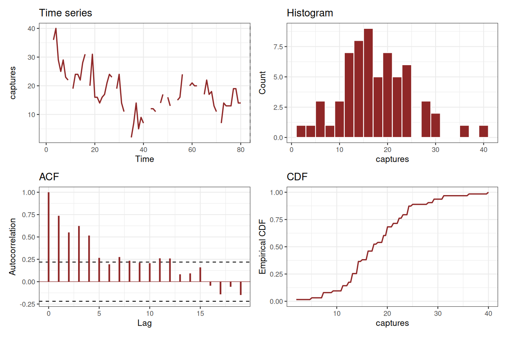
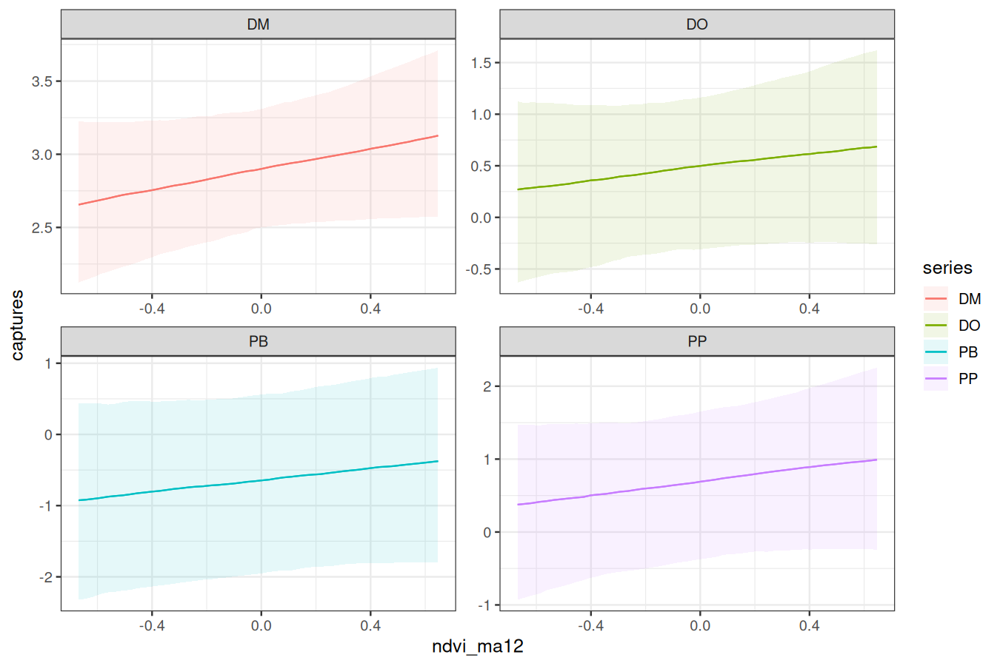
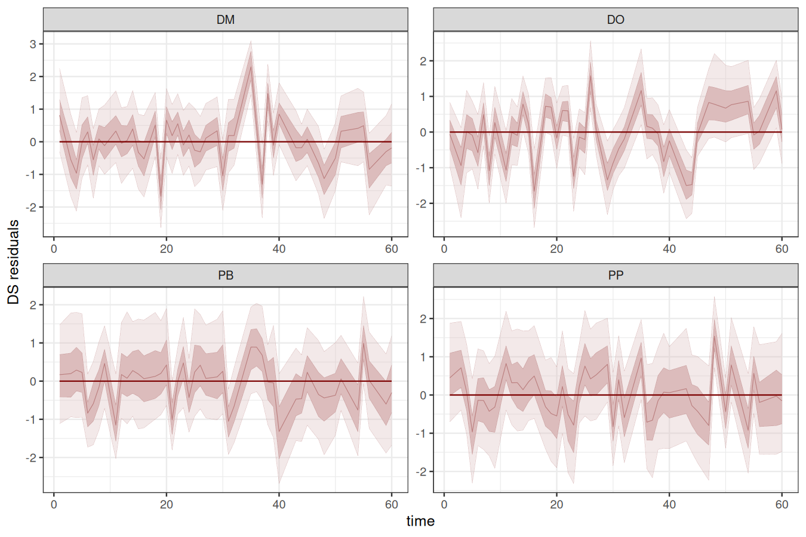
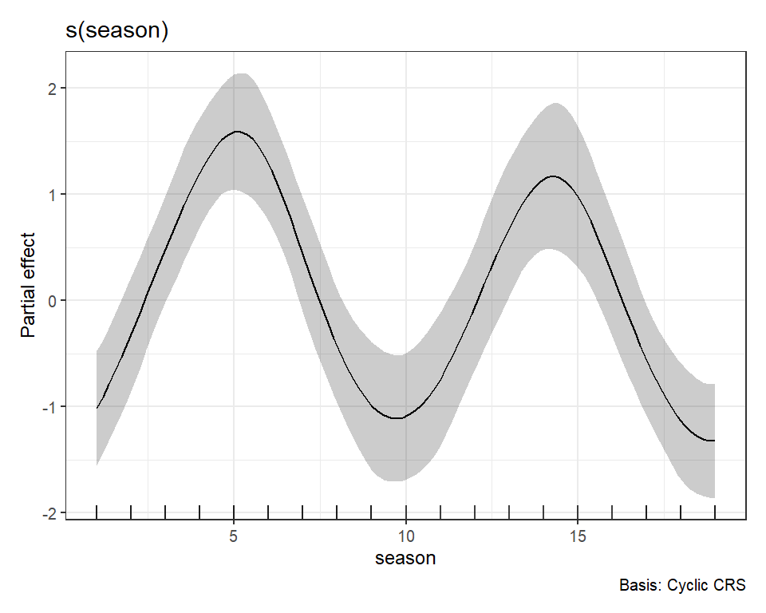
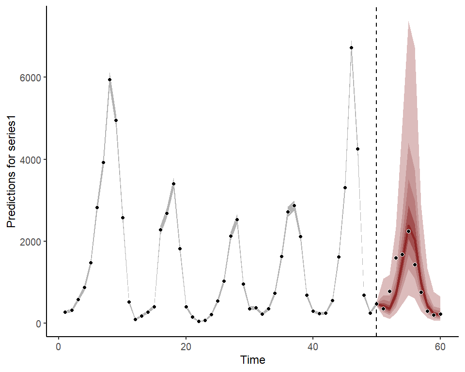
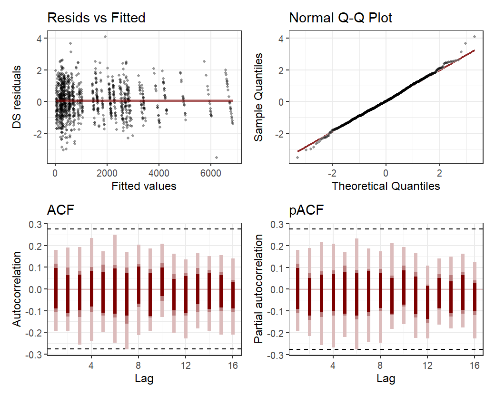

<!-- README.md is generated from README.Rmd. Please edit that file -->

[](https://mc-stan.org/)

# mvgam

> **M**ulti**V**ariate (Dynamic) **G**eneralized **A**ddivite **M**odels

[](https://github.com/nicholasjclark/mvgam/actions/)
[](https://app.codecov.io/gh/nicholasjclark/mvgam)
[](https://nicholasjclark.github.io/mvgam/)
[](https://cran.r-project.org/package=mvgam)
[](https://cran.r-project.org/package=mvgam)

The goal of `mvgam` is to fit Bayesian (Dynamic) Generalized Additive
Models. This package constructs State-Space models that can include
highly flexible nonlinear predictor effects for both process and
observation components by leveraging functionalities from the impressive
<a href="https://paulbuerkner.com/brms/"
target="_blank"><code>brms</code></a> and
<a href="https://cran.r-project.org/web/packages/mgcv/index.html"
target="_blank"><code>mgcv</code></a> packages. This allows `mvgam` to
fit a wide range of models, including hierarchical ecological models
such as N-mixture or Joint Species Distribution models, as well as
univariate and multivariate time series models with imperfect detection.
The original motivation for the package is described in <a
href="https://besjournals.onlinelibrary.wiley.com/doi/10.1111/2041-210X.13974"
target="_blank">Clark &amp; Wells 2022</a> (published in *Methods in
Ecology and Evolution*), with additional inspiration on the use of
Bayesian probabilistic modelling coming from
<a href="https://betanalpha.github.io/writing/" target="_blank">Michael
Betancourt</a>,
<a href="https://www.bu.edu/earth/profiles/michael-dietze/"
target="_blank">Michael Dietze</a> and
<a href="https://www.durham.ac.uk/staff/sarah-e-heaps/"
target="_blank">Sarah Heaps</a>, among many others.

## Resources

A series of <a href="https://nicholasjclark.github.io/mvgam/"
target="_blank">vignettes cover data formatting, forecasting and several
extended case studies of DGAMs</a>. A number of other examples have also
been compiled:

- <a href="https://www.youtube.com/watch?v=0zZopLlomsQ"
  target="_blank">Ecological Forecasting with Dynamic Generalized Additive
  Models</a>
- <a href="https://ecogambler.netlify.app/blog/distributed-lags-mgcv/"
  target="_blank">Distributed lags (and hierarchical distributed lags)
  using <code>mgcv</code> and <code>mvgam</code></a>
- <a href="https://ecogambler.netlify.app/blog/vector-autoregressions/"
  target="_blank">State-Space Vector Autoregressions in
  <code>mvgam</code></a>
- <a href="https://www.youtube.com/watch?v=RwllLjgPUmM"
  target="_blank">Ecological Forecasting with Dynamic GAMs; a tutorial and
  detailed case study</a>
- <a href="https://ecogambler.netlify.app/blog/interpreting-gams/"
  target="_blank">How to interpret and report nonlinear effects from
  Generalized Additive Models</a>
- <a href="https://ecogambler.netlify.app/blog/phylogenetic-smooths-mgcv/"
  target="_blank">Phylogenetic smoothing using <code>mgcv</code></a>
- <a href="https://ecogambler.netlify.app/blog/time-varying-seasonality/"
  target="_blank">Incorporating time-varying seasonality in forecast
  models</a>

Please also feel free to use the [`mvgam` Discussion
Board](https://github.com/nicholasjclark/mvgam/discussions) to hunt for
or post other discussion topics related to the package.

## Installation

Install the stable version from `CRAN` using:
`install.packages('mvgam')`, or install the development version from
`GitHub` using: `devtools::install_github("nicholasjclark/mvgam")`. Note
that to condition models on observed data, `Stan` must be installed
(along with either `rstan` and/or `cmdstanr`). Please refer to
installation links for `Stan` with `rstan`
<a href="https://mc-stan.org/users/interfaces/rstan"
target="_blank">here</a>, or for `Stan` with `cmdstandr`
<a href="https://mc-stan.org/cmdstanr/" target="_blank">here</a>.

We highly recommend you use `Cmdstan` through the `cmdstanr` interface.
This is because `Cmdstan` is easier to install, is more up to date with
new features, and uses less memory than `rstan`. See <a
href="http://mc-stan.org/cmdstanr/articles/cmdstanr.html#comparison-with-rstan"
target="_blank">this documentation from the <code>Cmdstan</code> team
for more information</a>.

## Citing `mvgam` and related software

When using any software please make sure to appropriately acknowledge
the hard work that developers and maintainers put into making these
packages available. Citations are currently the best way to formally
acknowledge this work, so we highly encourage you to cite any packages
that you rely on for your research.

When using `mvgam`, please cite the following:

> Clark, N.J. and Wells, K. (2022). Dynamic Generalized Additive Models
> (DGAMs) for forecasting discrete ecological time series. *Methods in
> Ecology and Evolution*. DOI: <https://doi.org/10.1111/2041-210X.13974>

As `mvgam` acts as an interface to `Stan`, please additionally cite:

> Carpenter B., Gelman A., Hoffman M. D., Lee D., Goodrich B.,
> Betancourt M., Brubaker M., Guo J., Li P., and Riddell A. (2017).
> Stan: A probabilistic programming language. *Journal of Statistical
> Software*. 76(1). DOI: <https://doi.org/10.18637/jss.v076.i01>

`mvgam` relies on several other `R` packages and, of course, on `R`
itself. To find out how to cite `R` and its packages, use the
`citation()` function. There are some features of `mvgam` which
specifically rely on certain packages. The most important of these is
the generation of data necessary to estimate smoothing splines, which
rely on `mgcv` and `splines2`. The `rstan` and `cmdstanr` packages
together with `Rcpp` makes `Stan` conveniently accessible in `R`. If you
use some of these features, please also consider citing the related
packages.

## Cheatsheet

[](https://github.com/nicholasjclark/mvgam/raw/master/misc/mvgam_cheatsheet.pdf)

## Introducing `mvgam` for fitting Dynamic Generalized Additive Models

We can explore the package’s primary functions using a dataset that is
available with all `R` installations. Load the `lynx` data and plot the
series as well as its autocorrelation function

``` r
data(lynx)
lynx_full <- data.frame(year = 1821:1934, 
                        population = as.numeric(lynx))
plot(lynx_full$population, type = 'l', ylab = 'Lynx trappings',
     xlab = 'Time', bty = 'l', lwd = 2)
box(bty = 'l', lwd  = 2)
```


``` r
acf(lynx_full$population, main = '', bty = 'l', lwd = 2,
    ci.col = 'darkred')
box(bty = 'l', lwd  = 2)
```



Along with serial autocorrelation, there is a clear ~19-year cyclic
pattern. Create a `season` term that can be used to model this effect
and give a better representation of the data generating process than we
would likely get with a linear model

``` r
plot(stl(ts(lynx_full$population, frequency = 19), s.window = 'periodic'),
     lwd = 2, col.range = 'darkred')
```


``` r
lynx_full$season <- (lynx_full$year%%19) + 1
```

For most `mvgam` models, we need an indicator of the series name as a
`factor`. A `time` column is also needed for most models to index time
(but note that these variables are not necessarily needed for other
models supported by `mvgam`, such as [Joint Species Distribution
Models](https://nicholasjclark.github.io/mvgam/reference/jsdgam.html))

``` r
lynx_full$time <- 1:NROW(lynx_full)
lynx_full$series <- factor('series1')
```

Split the data into training (first 50 years) and testing (next 10 years
of data) to evaluate forecasts

``` r
lynx_train = lynx_full[1:50, ]
lynx_test = lynx_full[51:60, ]
```

Inspect the series in a bit more detail using `mvgam`’s plotting utility

``` r
plot_mvgam_series(data = lynx_train, y = 'population')
```


Formulate an `mvgam` model; this model fits a GAM in which a cyclic
smooth function for `season` is estimated jointly with a full time
series model for the temporal process (in this case an `AR1` process).
We assume the outcome follows a Poisson distribution and will condition
the model in `Stan` using MCMC sampling with the `Cmdstan` interface:

``` r
lynx_mvgam <- mvgam(population ~ s(season, bs = 'cc', k = 12),
                    knots = list(season = c(0.5, 19.5)),
                    data = lynx_train,
                    newdata = lynx_test,
                    family = poisson(),
                    trend_model = AR(p = 1),
                    backend = 'cmdstanr')
```

Have a look at this model’s summary to see what is being estimated. Note
that no pathological behaviours have been detected and we achieve good
effective sample sizes / mixing for all parameters

``` r
summary(lynx_mvgam)
#> GAM formula:
#> population ~ s(season, bs = "cc", k = 12)
#> 
#> Family:
#> poisson
#> 
#> Link function:
#> log
#> 
#> Trend model:
#> AR(p = 1)
#> 
#> 
#> N series:
#> 1 
#> 
#> N timepoints:
#> 60 
#> 
#> Status:
#> Fitted using Stan 
#> 4 chains, each with iter = 1000; warmup = 500; thin = 1 
#> Total post-warmup draws = 2000
#> 
#> 
#> GAM coefficient (beta) estimates:
#>                2.5%   50%  97.5% Rhat n_eff
#> (Intercept)   6.400  6.60  6.900 1.00   788
#> s(season).1  -0.600 -0.13  0.380 1.00  1208
#> s(season).2   0.740  1.30  2.000 1.01   772
#> s(season).3   1.200  1.90  2.500 1.00   908
#> s(season).4  -0.062  0.54  1.100 1.00  1262
#> s(season).5  -1.300 -0.71 -0.062 1.00   910
#> s(season).6  -1.300 -0.55  0.085 1.00   670
#> s(season).7   0.047  0.71  1.400 1.01   970
#> s(season).8   0.640  1.40  2.100 1.00   821
#> s(season).9  -0.360  0.23  0.810 1.00   995
#> s(season).10 -1.400 -0.86 -0.370 1.00  1184
#> 
#> Approximate significance of GAM smooths:
#>            edf Ref.df Chi.sq p-value    
#> s(season) 9.96     10   50.6  <2e-16 ***
#> ---
#> Signif. codes:  0 '***' 0.001 '**' 0.01 '*' 0.05 '.' 0.1 ' ' 1
#> 
#> Latent trend parameter AR estimates:
#>          2.5%  50% 97.5% Rhat n_eff
#> ar1[1]   0.59 0.83  0.98    1   711
#> sigma[1] 0.39 0.48  0.61    1   724
#> 
#> Stan MCMC diagnostics:
#> n_eff / iter looks reasonable for all parameters
#> Rhat looks reasonable for all parameters
#> 0 of 2000 iterations ended with a divergence (0%)
#> 0 of 2000 iterations saturated the maximum tree depth of 10 (0%)
#> E-FMI indicated no pathological behavior
#> 
#> Samples were drawn using NUTS(diag_e) at Fri Nov 22 12:05:29 PM 2024.
#> For each parameter, n_eff is a crude measure of effective sample size,
#> and Rhat is the potential scale reduction factor on split MCMC chains
#> (at convergence, Rhat = 1)
```

As with any MCMC software, we can inspect traceplots. Here for the GAM
smoothing parameters, using `mvgam`’s reliance on the excellent
`bayesplot` library:

``` r
mcmc_plot(lynx_mvgam, variable = 'rho', regex = TRUE, type = 'trace')
#> No divergences to plot.
```


and for the latent trend parameters

``` r
mcmc_plot(lynx_mvgam, variable = 'trend_params', regex = TRUE, type = 'trace')
#> No divergences to plot.
```



Use posterior predictive checks, which capitalize on the extensive
functionality of the `bayesplot` package, to see if the model can
simulate data that looks realistic and unbiased. First, examine
histograms for posterior retrodictions (`yhat`) and compare to the
histogram of the observations (`y`)

``` r
pp_check(lynx_mvgam, type = "hist", ndraws = 5)
#> `stat_bin()` using `bins = 30`. Pick better value with `binwidth`.
```


Next examine simulated empirical Cumulative Distribution Functions (CDF)
for posterior predictions

``` r
pp_check(lynx_mvgam, type = "ecdf_overlay", ndraws = 25)
```


Rootograms are
<a href="http://arxiv.org/pdf/1605.01311" target="_blank">popular
graphical tools for checking a discrete model’s ability to capture
dispersion properties of the response variable</a>. Posterior predictive
hanging rootograms can be displayed using the `ppc()` function. In the
plot below, we bin the unique observed values into `25` bins to prevent
overplotting and help with interpretation. This plot compares the
frequencies of observed vs predicted values for each bin. For example,
if the gray bars (representing observed frequencies) tend to stretch
below zero, this suggests the model’s simulations predict the values in
that particular bin less frequently than they are observed in the data.
A well-fitting model that can generate realistic simulated data will
provide a rootogram in which the lower boundaries of the grey bars are
generally near zero. For this plot we use the `S3` function
`ppc.mvgam()`, which is not as versatile as `pp_check()` but allows us
to bin rootograms to avoid overplotting

``` r
ppc(lynx_mvgam, type = "rootogram", n_bins = 25)
```


All plots indicate the model is well calibrated against the training
data. Inspect the estimated cyclic smooth, which is shown as a ribbon
plot of posterior empirical quantiles. We can also overlay posterior
quantiles of partial residuals (shown in red), which represent the
leftover variation that the model expects would remain if this smooth
term was dropped but all other parameters remained unchanged. A strong
pattern in the partial residuals suggests there would be strong patterns
left unexplained in the model *if* we were to drop this term, giving us
further confidence that this function is important in the model

``` r
plot(lynx_mvgam, type = 'smooths', residuals = TRUE)
```


First derivatives of smooths can be plotted to inspect how the slope of
the function changes. To plot these we use the more flexible
`plot_mvgam_smooth()` function

``` r
plot_mvgam_smooth(lynx_mvgam, series = 1, 
                  smooth = 'season', 
                  derivatives = TRUE)
```



If you have the `gratia` package installed, it can also be used to plot
partial effects of smooths on the link scale

``` r
require(gratia)
#> Loading required package: gratia
#> Warning: package 'gratia' was built under R version 4.2.3
#> 
#> Attaching package: 'gratia'
#> The following object is masked from 'package:mvgam':
#> 
#>     add_residuals
draw(lynx_mvgam)
```



As for many types of regression models, it is often more useful to plot
model effects on the outcome scale. `mvgam` has support for the
wonderful `marginaleffects` package, allowing a wide variety of
posterior contrasts, averages, conditional and marginal predictions to
be calculated and plotted. Below is the conditional effect of season
plotted on the outcome scale, for example:

``` r
require(ggplot2); require(marginaleffects)
#> Loading required package: marginaleffects
plot_predictions(lynx_mvgam, condition = 'season', points = 0.5) +
  theme_classic()
```


We can also view the `mvgam`’s posterior predictions for the entire
series (testing and training)

``` r
plot(lynx_mvgam, type = 'forecast', newdata = lynx_test)
```



    #> Out of sample DRPS:
    #> 2474.07104475

And the estimated latent trend component, again using the more flexible
`plot_mvgam_...()` option to show first derivatives of the estimated
trend

``` r
plot_mvgam_trend(lynx_mvgam, newdata = lynx_test, derivatives = TRUE)
```


A key aspect of ecological forecasting is to understand <a
href="https://esajournals.onlinelibrary.wiley.com/doi/full/10.1002/eap.1589"
target="_blank">how different components of a model contribute to
forecast uncertainty</a>. We can estimate relative contributions to
forecast uncertainty for the GAM component and the latent trend
component using `mvgam`

``` r
plot_mvgam_uncertainty(lynx_mvgam, newdata = lynx_test, legend_position = 'none')
text(1, 0.2, cex = 1.5, label = "GAM component", 
     pos = 4, col = "white", family = 'serif')
text(1, 0.8, cex = 1.5, label = "Trend component", 
     pos = 4, col = "#7C0000", family = 'serif')
```


Both components contribute to forecast uncertainty. Diagnostics of the
model can also be performed using `mvgam`. Have a look at the model’s
residuals, which are posterior empirical quantiles of Dunn-Smyth
randomised quantile residuals so should follow approximate normality. We
are primarily looking for a lack of autocorrelation, which would suggest
our AR1 model is appropriate for the latent trend

``` r
plot(lynx_mvgam, type = 'residuals')
```



## Extended observation families

`mvgam` was originally designed to analyse and forecast non-negative
integer-valued data. These data are traditionally challenging to analyse
with existing time-series analysis packages. But further development of
`mvgam` has resulted in support for a growing number of observation
families. Currently, the package can handle data for the following:

- `gaussian()` for real-valued data
- `student_t()` for heavy-tailed real-valued data
- `lognormal()` for non-negative real-valued data
- `Gamma()` for non-negative real-valued data
- `betar()` for proportional data on `(0,1)`
- `bernoulli()` for binary data
- `poisson()` for count data
- `nb()` for overdispersed count data
- `binomial()` for count data with known number of trials
- `beta_binomial()` for overdispersed count data with known number of
  trials
- `nmix()` for count data with imperfect detection (unknown number of
  trials)

See `??mvgam_families` for more information. Below is a simple example
for simulating and modelling proportional data with `Beta` observations
over a set of seasonal series with independent Gaussian Process dynamic
trends:

``` r
set.seed(100)
data <- sim_mvgam(family = betar(),
                  T = 80,
                  trend_model = GP(),
                  prop_trend = 0.5, 
                  seasonality = 'shared')
plot_mvgam_series(data = data$data_train, series = 'all')
```


``` r
mod <- mvgam(y ~ s(season, bs = 'cc', k = 7) +
               s(season, by = series, m = 1, k = 5),
             trend_model = GP(),
             data = data$data_train,
             newdata = data$data_test,
             family = betar())
```

Inspect the summary to see that the posterior now also contains
estimates for the `Beta` precision parameters $\phi$. We can suppress a
summary of the $\beta$ coefficients, which is useful when there are many
spline coefficients to report:

``` r
summary(mod, include_betas = FALSE)
#> GAM formula:
#> y ~ s(season, bs = "cc", k = 7) + s(season, by = series, m = 1, 
#>     k = 5)
#> 
#> Family:
#> beta
#> 
#> Link function:
#> logit
#> 
#> Trend model:
#> GP()
#> 
#> 
#> N series:
#> 3 
#> 
#> N timepoints:
#> 80 
#> 
#> Status:
#> Fitted using Stan 
#> 4 chains, each with iter = 1000; warmup = 500; thin = 1 
#> Total post-warmup draws = 2000
#> 
#> 
#> Observation precision parameter estimates:
#>        2.5%  50% 97.5% Rhat n_eff
#> phi[1]  7.8 12.0  17.0    1  2422
#> phi[2]  5.6  8.5  13.0    1  1701
#> phi[3]  4.2  6.0   8.5    1  1694
#> 
#> GAM coefficient (beta) estimates:
#>              2.5%  50% 97.5% Rhat n_eff
#> (Intercept) 0.096 0.46   0.7 1.01   543
#> 
#> Approximate significance of GAM smooths:
#>                            edf Ref.df Chi.sq p-value  
#> s(season)                4.338      5   6.27   0.069 .
#> s(season):seriesseries_1 1.838      4   5.15   0.139  
#> s(season):seriesseries_2 3.288      4   1.57   0.356  
#> s(season):seriesseries_3 0.804      4   5.42   0.506  
#> ---
#> Signif. codes:  0 '***' 0.001 '**' 0.01 '*' 0.05 '.' 0.1 ' ' 1
#> 
#> Latent trend marginal deviation (alpha) and length scale (rho) estimates:
#>              2.5%   50% 97.5% Rhat n_eff
#> alpha_gp[1] 0.140  0.39  0.81 1.00  1028
#> alpha_gp[2] 0.550  0.92  1.50 1.00  1151
#> alpha_gp[3] 0.047  0.39  0.93 1.00   829
#> rho_gp[1]   1.100  3.80 11.00 1.00  1622
#> rho_gp[2]   3.200 13.00 32.00 1.01   296
#> rho_gp[3]   1.200  4.90 23.00 1.00   817
#> 
#> Stan MCMC diagnostics:
#> n_eff / iter looks reasonable for all parameters
#> Rhat looks reasonable for all parameters
#> 7 of 2000 iterations ended with a divergence (0.35%)
#>  *Try running with larger adapt_delta to remove the divergences
#> 0 of 2000 iterations saturated the maximum tree depth of 10 (0%)
#> E-FMI indicated no pathological behavior
#> 
#> Samples were drawn using NUTS(diag_e) at Fri Nov 22 12:06:48 PM 2024.
#> For each parameter, n_eff is a crude measure of effective sample size,
#> and Rhat is the potential scale reduction factor on split MCMC chains
#> (at convergence, Rhat = 1)
```

Plot the hindcast and forecast distributions for each series

``` r
layout(matrix(1:4, nrow = 2, byrow = TRUE))
for(i in 1:3){
  plot(mod, type = 'forecast', series = i)
}
```


There are many more extended uses of `mvgam`, including the ability to
fit hierarchical State-Space GAMs that include dynamic and spatially
varying coefficient models, dynamic factors and Vector Autoregressive
processes. See the <a href="https://nicholasjclark.github.io/mvgam/"
target="_blank">package documentation</a> for more details. The package
can also be used to generate all necessary data structures, initial
value functions and modelling code necessary to fit DGAMs using `Stan`.
This can be helpful if users wish to make changes to the model to better
suit their own bespoke research / analysis goals. The
<a href="https://discourse.mc-stan.org/" target="_blank">Stan
Discourse</a> is a helpful place to troubleshoot.

## License

This project is licensed under an `MIT` open source license

## Interested in contributing?

I’m actively seeking PhD students and other researchers to work in the
areas of ecological forecasting, multivariate model evaluation and
development of `mvgam`. Please reach out if you are interested
(n.clark’at’uq.edu.au). Other contributions are also very welcome, but
please see [The Contributor
Instructions](https://github.com/nicholasjclark/mvgam/blob/master/.github/CONTRIBUTING.md)
for general guidelines. Note that by participating in this project you
agree to abide by the terms of its [Contributor Code of
Conduct](https://dplyr.tidyverse.org/CODE_OF_CONDUCT).
