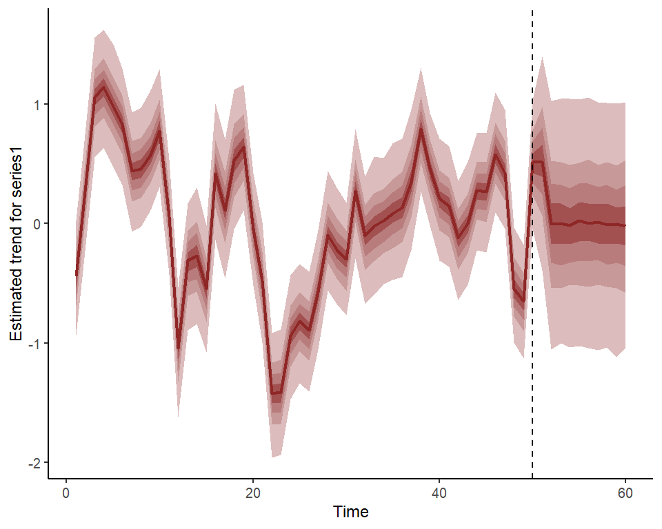
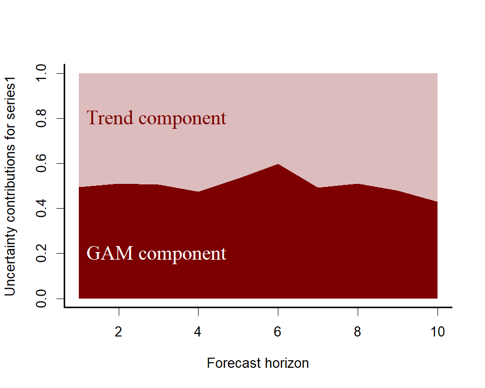
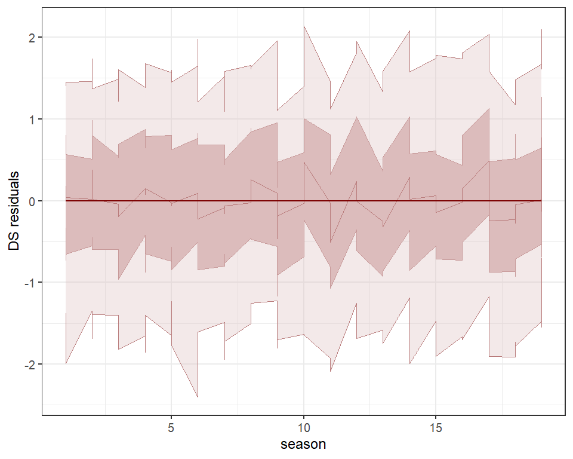

<!-- README.md is generated from README.Rmd. Please edit that file -->

# *mvgam*

The goal of `mvgam` is to use a Bayesian framework to estimate
parameters of Generalized Additive Models (DGAMs) for time series with
dynamic trend components. The motivation for the package and some of its
primary objectives are described in detail by <a
href="https://besjournals.onlinelibrary.wiley.com/doi/10.1111/2041-210X.13974"
target="_blank">Clark &amp; Wells 2022</a> (published in *Methods in
Ecology and Evolution*), with additional inspiration on the use of
Bayesian probabilistic modelling to quantify uncertainty and advise
principled decision making coming from
<a href="https://betanalpha.github.io/writing/" target="_blank">Michael
Betancourt</a>,
<a href="https://www.bu.edu/earth/profiles/michael-dietze/"
target="_blank">Michael Dietze</a> and
<a href="https://emilybfox.su.domains/" target="_blank">Emily Fox</a>,
among many others.

## Resources

A number of case studies have been compiled to highlight how DGAMs can
be estimated using MCMC sampling. These are hosted currently on `RPubs`
at the following links:

- <a href="https://rpubs.com/NickClark47/mvgam" target="_blank">mvgam case
  study 1: model comparison and data assimilation</a>
- <a href="https://rpubs.com/NickClark47/mvgam2" target="_blank">mvgam
  case study 2: multivariate models</a>
- <a href="https://rpubs.com/NickClark47/mvgam3" target="_blank">mvgam
  case study 3: distributed lag models</a>

The package can also be used to generate all necessary data structures,
initial value functions and modelling code necessary to fit DGAMs using
`Stan` or `JAGS`. This can be helpful if users wish to make changes to
the model to better suit their own bespoke research / analysis goals.
The following resources can be helpful to troubleshoot:

- <a href="https://discourse.mc-stan.org/" target="_blank">Stan
  Discourse</a>
- <a href="https://sourceforge.net/projects/mcmc-jags/"
  target="_blank">JAGS Discourse</a>

## Installation

Install the development version from `GitHub` using:
`devtools::install_github("nicholasjclark/mvgam")`. Note that to
actually condition models with MCMC sampling, either the `JAGS` software
must be installed (along with the `R` packages `rjags` and `runjags`) or
the `Stan` software must be installed (along with either `rstan` and/or
`cmdstanr`). Only `rstan` is listed as a dependency of `mvgam` to ensure
that installation is less difficult. If users wish to fit the models
using `mvgam`, please refer to installation links for `JAGS`
<a href="https://sourceforge.net/projects/mcmc-jags/files/"
target="_blank">here</a>, for `Stan` with `rstan`
<a href="https://mc-stan.org/users/interfaces/rstan"
target="_blank">here</a>, or for `Stan` with `cmdstandr`
<a href="https://mc-stan.org/cmdstanr/" target="_blank">here</a>. You
will need a fairly recent version of `Stan` to ensure all the model
syntax is recognized. If you see warnings such as
`variable "array" does not exist`, this is usually a sign that you need
to update your version of `Stan`. We highly recommend you use `Cmdstan`
through the `cmdstanr` interface as the backend. This is because
`Cmdstan` is easier to install, is more up to date with new features,
and uses less memory than `Rstan`. See <a
href="http://mc-stan.org/cmdstanr/articles/cmdstanr.html#comparison-with-rstan"
target="_blank">this documentation from the <code>Cmdstan</code> team
for more information</a>.

## Citing mvgam and related software

When using open source software (or software in general), please make
sure to appropriately acknowledge the hard work that developers and
maintainers put into making these packages available. Citations are
currently the best way to formally acknowledge this work, so we highly
encourage you to cite any packages that you rely on for your research.

When using `mvgam`, please cite the following publication:

- Clark, N.J. and Wells, K. (2022). Dynamic Generalized Additive Models
  (DGAMs) for forecasting discrete ecological time series. *Methods in
  Ecology and Evolution*. DOI: <https://doi.org/10.1111/2041-210X.13974>

As `mvgam` acts as an interface to `Stan` and `JAGS`, please
additionally cite whichever software you use for parameter estimation:

- Carpenter B., Gelman A., Hoffman M. D., Lee D., Goodrich B.,
  Betancourt M., Brubaker M., Guo J., Li P., and Riddell A. (2017).
  Stan: A probabilistic programming language. *Journal of Statistical
  Software*. 76(1). 10.18637/jss.v076.i01
- Plummer, M. (2013). JAGS: A program for analysis of Bayesian graphical
  models using Gibbs sampling. *Proceedings of the 3rd International
  Workshop on Distributed Statistical Computing*. 124(125.10).

`mvgam` relies on several other `R` packages and, of course, on `R`
itself. To find out how to cite R and its packages, use the `citation`
function. There are some features of `mvgam` which specifically rely on
certain packages. The most important of these is the generation of data
necessary to estimate smoothing splines, which entirely rely on `mgcv`.
The `rstan` and `cmdstanr` packages together with `Rcpp` makes `Stan`
conveniently accessible in `R`, while the `rjags` and `runjags` packages
together with the `coda` package make `JAGS` accessible in `R`. If you
use some of these features, please also consider citing the related
packages.

## Dynamic latent temporal processes

`mvgam` is designed to propagate unobserved temporal processes to
capture autocorrelation in the observed time series. This works in a
state-space format, with the temporal *trend* evolving independently of
the observation process. Available trend models are:

- `RW` Random Walk
- `AR1` Autoregressive model with AR coefficient for lag 1
- `AR2` Autoregressive model with AR coefficients for lags 1 and 2
- `AR3` Autoregressive model with AR coefficients for lags 1, 2 and 3
- `VAR1` Vector Autoregressive model with VAR coefficients for lag 1;
  contemporaneously uncorrelated errors
- `VAR1cor` Vector Autoregressive model with VAR coefficients for lag 1;
  contemporaneously correlated (multivariate) errors
- `GP` Squared exponential Gaussian Process
- `None` No latent trend is fitted

When using `Stan` as the back-end, all of these trend models (apart from
`VAR` models) can be estimated using a set of dimension-reduced dynamic
factors. Please see
<a href="https://rpubs.com/NickClark47/mvgam2" target="_blank">mvgam
case study 2: multivariate models</a> for more information

## A brief introduction to the package

We can explore the model’s primary functions using a test dataset that
is available with all `R` installations. We introduce Dynamic
Generalized Additive Models and some of the key utility functions
provided in `mvgam`. First, load the `lynx` data and plot the series as
well as its estimated autocorrelation function

``` r
library(mvgam)
#> Loading required package: mgcv
#> Warning: package 'mgcv' was built under R version 4.2.2
#> Loading required package: nlme
#> This is mgcv 1.8-41. For overview type 'help("mgcv-package")'.
#> Loading required package: brms
#> Warning: package 'brms' was built under R version 4.2.3
#> Loading required package: Rcpp
#> Warning: package 'Rcpp' was built under R version 4.2.3
#> Loading 'brms' package (version 2.19.0). Useful instructions
#> can be found by typing help('brms'). A more detailed introduction
#> to the package is available through vignette('brms_overview').
#> 
#> Attaching package: 'brms'
#> The following objects are masked from 'package:mgcv':
#> 
#>     s, t2
#> The following object is masked from 'package:stats':
#> 
#>     ar
#> Loading required package: marginaleffects
#> Warning: package 'marginaleffects' was built under R version 4.2.3
#> Loading required package: insight
#> Warning: package 'insight' was built under R version 4.2.3
#> Welcome to mvgam. Please cite as: Clark, NJ, and Wells, K. 2022. Dynamic Generalized Additive Models (DGAMs) for forecasting discrete ecological time series. Methods in Ecology and Evolution, 2022, https://doi.org/10.1111/2041-210X.13974
data(lynx)
lynx_full = data.frame(year = 1821:1934, 
                       population = as.numeric(lynx))
plot(lynx_full$population, type = 'l', ylab = 'Lynx trappings',
     xlab = 'Time', bty = 'l', lwd = 2)
box(bty = 'l', lwd  = 2)
```


``` r
acf(lynx_full$population, main = '', bty = 'l', lwd = 2,
    ci.col = 'darkred')
box(bty = 'l', lwd  = 2)
```


Along with serial autocorrelation, there is a clear ~19-year cyclic
pattern to the data. Create a `season` term that can be used to model
this effect and give a better representation of the data generating
process than we would likely get with a linear model

``` r
plot(stl(ts(lynx_full$population, frequency = 19), s.window = 'periodic'),
     lwd = 2, col.range = 'darkred')
```


``` r
lynx_full$season <- (lynx_full$year %%19) + 1
```

For `mvgam` models, we need an indicator of the series name as a
`factor` variable (if the column `series` is missing, this will be added
automatically by assuming that all observations are from a single time
series). Finally, a `time` column is needed to index time

``` r
lynx_full$time <- 1:NROW(lynx_full)
lynx_full$series <- factor('series1')
```

Split the data into training (first 50 years) and testing (next 10 years
of data) to evaluate multi-step ahead forecasts

``` r
lynx_train = lynx_full[1:50, ]
lynx_test = lynx_full[51:60, ]
```

Inspect the series in a bit more detail using `mvgam`’s plotting utility

``` r
plot_mvgam_series(data = lynx_train, y = 'population')
```


Now we will formulate an `mvgam` model; this model fits a GAM in which a
cyclic smooth function for `season` is estimated jointly with a full
time series model for the temporal process (in this case an `AR3`
process), rather than relying on smoothing splines that do not
incorporate a concept of the future. We assume the outcome follows a
Poisson distribution. But before conditioning the model on observed
data, a check of prior smooth function realisations is useful to ensure
we are allowing enough flexibility to capture the types of functional
behaviours we think are reasonable without allowing outrageous
behaviours. First we follow conventional recommendations to set `k` for
the smooth term to be large, which would allow maximum flexibility in
functional behaviours

``` r
lynx_mvgam_prior <- mvgam(data = lynx_train,
               formula = population ~ s(season, bs = 'cc', k = 19),
               knots = list(season = c(0.5, 19.5)),
               family = 'poisson',
               trend_model = 'AR3',
               chains = 4,
               prior_simulation = TRUE)
```

Plot empirical quantiles of the prior seasonal smooth function

``` r
plot(lynx_mvgam_prior, type = 'smooths')
```


Plot a set of realisations from the prior seasonal smooth function

``` r
plot(lynx_mvgam_prior, type = 'smooths', realisations = TRUE,
     n_realisations = 20)
```


These functions are showing the marginal contribution of the seasonal
smooth function to the linear predictor (on the log scale), and they are
clearly allowed to move into ridiculous spaces that we should give very
little prior plausibility to:

``` r
exp(-15)
#> [1] 3.059023e-07
exp(15)
#> [1] 3269017
```

Setting `k` to a smaller value results in less flexibility. This is
because number of basis functions that contribute to functional
behaviour is reduced

``` r
lynx_mvgam_prior <- mvgam(data = lynx_train,
               formula = population ~ s(season, bs = 'cc', k = 12),
               knots = list(season = c(0.5, 19.5)),
               family = 'poisson',
               trend_model = 'AR3',
               chains = 4,
               prior_simulation = TRUE)
```

The resulting prior looks more reasonable given the range of the
observations, and there is clearly enough flexibility to support a wide
range of functional shapes.

``` r
plot(lynx_mvgam_prior, type = 'smooths')
```


``` r
plot(lynx_mvgam_prior, type = 'smooths', realisations = TRUE,
     n_realisations = 20)
```


In practice, imparting domain knowledge into prior specifications for
penalised smooth functions is challenging, as these behaviours are often
the cumulative result of multiple penalty matrices that all have their
own separate smoothing parameters. Changing the prior on the smoothing
parameters is another option (`mvgam` uses a half-normal prior by
default, which regularises functions more than the default approach used
in `mgcv::jagam`). But without running through prior visualisations (and
other prior pushforward checks) it will be more difficult to reason
about how to set `k` to respect domain knowledge. In general it is
highly recommended that users view `mvgam` and related interfaces such
as `brms` as tools for building scaffold models that can then be
modified to suit the bespoke needs of each particular analysis.

Users can also check what the default prior distributions are for given
model formulations, which can be helpful to understand how the model can
be modified but also to see any restrictions on what can be changed
within the `mvgam` framework.

``` r
test_priors <- get_mvgam_priors(population ~ s(season, bs = 'cc', k = 12),
                                family = 'poisson',
                                data = lynx_train,
                                trend_model = 'AR3',
                                use_stan = TRUE)
test_priors
#>                                    param_name param_length
#> 1               vector<lower=0>[n_sp] lambda;            1
#> 2 vector<lower=-1.5,upper=1.5>[n_series] ar1;            1
#> 3 vector<lower=-1.5,upper=1.5>[n_series] ar2;            1
#> 4 vector<lower=-1.5,upper=1.5>[n_series] ar3;            1
#> 5            vector<lower=0>[n_series] sigma;            1
#>                    param_info                    prior
#> 1 s(season) smooth parameters lambda ~ normal(10, 25);
#> 2       trend AR1 coefficient      ar1 ~ std_normal();
#> 3       trend AR2 coefficient      ar2 ~ std_normal();
#> 4       trend AR3 coefficient      ar3 ~ std_normal();
#> 5                    trend sd  sigma ~ exponential(2);
#>                example_change new_lowerbound new_upperbound
#> 1 lambda ~ exponential(0.08);             NA             NA
#> 2  ar1 ~ normal(-0.36, 0.14);             NA             NA
#> 3    ar2 ~ normal(0.57, 0.3);             NA             NA
#> 4   ar3 ~ normal(0.79, 0.89);             NA             NA
#> 5  sigma ~ exponential(0.11);             NA             NA
```

Any of the above priors can be changed by modifying the `prior` column
and supplying the resulting `data.frame` to the `priors` argument in
`mvgam()`. But for now, we will proceed with the defaults by
conditioning the model on observed data in `Stan` using MCMC sampling
with the `Cmdstan` interface (installation links for `rstan` and
`cmdstanr` are found
<a href="https://mc-stan.org/users/interfaces/rstan"
target="_blank">here</a> and
<a href="https://mc-stan.org/cmdstanr/articles/cmdstanr.html"
target="_blank">here</a>).

``` r
lynx_mvgam <- mvgam(data = lynx_train,
               newdata = lynx_test,
               formula = population ~ s(season, bs = 'cc', k = 12),
               knots = list(season = c(0.5, 19.5)),
               family = 'poisson',
               trend_model = 'AR3',
               use_stan = TRUE)
```

Inspect the resulting model file, which is written in the `Stan`
probabilistic programming language

``` r
code(lynx_mvgam)
#> // Stan model code generated by package mvgam
#> data {
#>   int<lower=0> total_obs; // total number of observations
#>   int<lower=0> n; // number of timepoints per series
#>   int<lower=0> n_sp; // number of smoothing parameters
#>   int<lower=0> n_series; // number of series
#>   int<lower=0> num_basis; // total number of basis coefficients
#>   vector[num_basis] zero; // prior locations for basis coefficients
#>   real p_taus[1]; // prior precisions for parametric coefficients
#>   real p_coefs[1]; // prior locations for parametric coefficients
#>   matrix[total_obs, num_basis] X; // mgcv GAM design matrix
#>   int<lower=0> ytimes[n, n_series]; // time-ordered matrix (which col in X belongs to each [time, series] observation?)
#>   matrix[10,10] S1; // mgcv smooth penalty matrix S1
#>   int<lower=0> n_nonmissing; // number of nonmissing observations
#>   int<lower=0> flat_ys[n_nonmissing]; // flattened nonmissing observations
#>   matrix[n_nonmissing, num_basis] flat_xs; // X values for nonmissing observations
#>   int<lower=0> obs_ind[n_nonmissing]; // indices of nonmissing observations
#> }
#> parameters {
#>   // raw basis coefficients
#>   vector[num_basis] b_raw;
#>   // latent trend AR1 terms
#>   vector<lower=-1.5,upper=1.5>[n_series] ar1;
#>   // latent trend AR2 terms
#>   vector<lower=-1.5,upper=1.5>[n_series] ar2;
#>   // latent trend AR3 terms
#>   vector<lower=-1.5,upper=1.5>[n_series] ar3;
#>   // latent trend variance parameters
#>   vector<lower=0>[n_series] sigma;
#>   // latent trends
#>   matrix[n, n_series] trend;
#>   // smoothing parameters
#>   vector<lower=0>[n_sp] lambda;
#> }
#> transformed parameters {
#>   // basis coefficients
#>   vector[num_basis] b;
#>   b[1:num_basis] = b_raw[1:num_basis];
#> }
#> model {
#>   // parametric effect priors (regularised for identifiability)
#>   for (i in 1:1) {
#>   b_raw[i] ~ normal(p_coefs[i], sqrt(1 / p_taus[i]));
#>   }
#>   // prior for s(season)...
#>   b_raw[2:11] ~ multi_normal_prec(zero[2:11],S1[1:10,1:10] * lambda[1]);
#>   // priors for AR parameters
#>   ar1 ~ std_normal();
#>   ar2 ~ std_normal();
#>   ar3 ~ std_normal();
#>   // priors for smoothing parameters
#>   lambda ~ normal(10, 25);
#>   // priors for latent trend variance parameters
#>   sigma ~ exponential(2);
#>   // trend estimates
#>   trend[1, 1:n_series] ~ normal(0, sigma);
#>   trend[2, 1:n_series] ~ normal(trend[1, 1:n_series] * ar1, sigma);
#>   trend[3, 1:n_series] ~ normal(trend[2, 1:n_series] * ar1 + trend[1, 1:n_series] * ar2, sigma);
#>   for(s in 1:n_series){
#>   trend[4:n, s] ~ normal(ar1[s] * trend[3:(n - 1), s] + ar2[s] * trend[2:(n - 2), s] + ar3[s] * trend[1:(n - 3), s], sigma[s]);
#>   }
#>   {
#>   // likelihood functions
#>   vector[n_nonmissing] flat_trends;
#>   flat_trends = (to_vector(trend))[obs_ind];
#>   flat_ys ~ poisson_log_glm(append_col(flat_xs, flat_trends),
#>   0.0,append_row(b, 1.0));
#>   }
#> }
#> generated quantities {
#>   vector[total_obs] eta;
#>   matrix[n, n_series] mus;
#>   vector[n_sp] rho;
#>   vector[n_series] tau;
#>   array[n, n_series] int ypred;
#>   rho = log(lambda);
#>   for (s in 1:n_series) {
#>   tau[s] = pow(sigma[s], -2.0);
#>   }
#>   // posterior predictions
#>   eta = X * b;
#>   for(s in 1:n_series){ 
#>   mus[1:n, s] = eta[ytimes[1:n, s]] + trend[1:n, s];
#>   ypred[1:n, s] = poisson_log_rng(mus[1:n, s]);
#>   }
#> }
```

Perform a series of posterior retrodictive checks to see if the model is
able to simulate data for the training period that looks realistic and
unbiased. First, examine histograms for posterior retrodictions (`yhat`)
and compare to the histogram of the observations (`y`)

``` r
ppc(lynx_mvgam, series = 1, type = 'hist')
```


Next examine simulated empirical Cumulative Distribution Functions (CDF)
for posterior retrodictions (`yhat`) and compare to the CDF of the
observations (`y`)

``` r
ppc(lynx_mvgam, series = 1, type = 'cdf')
```


Rootograms are becoming
<a href="https://arxiv.org/pdf/1605.01311.pdf" target="_blank">popular
graphical tools for checking a discrete model’s ability to capture
dispersion properties of the response variable</a>. Posterior predictive
hanging rootograms can be displayed using the `ppc()` function in
`mvgam`. In the plot below, we bin the unique observed values into `25`
bins to prevent overplotting and help with interpretation. This plot
compares the frequencies of observed vs predicted values for each bin,
which can help to identify aspects of poor model fit. For example, if
the gray bars (representing observed frequencies) tend to stretch below
zero, this suggests the model’s simulations predict the values in that
particular bin less frequently than they are observed in the data. A
well-fitting model that can generate realistic simulated data will
provide a rootogram in which the lower boundaries of the grey bars are
generally near zero

``` r
ppc(lynx_mvgam, series = 1, type = 'rootogram', n_bins = 25)
```



Finally look for any biases in predictions by examining a Probability
Integral Transform (PIT) histogram. If our predictions are not biased
one way or another (i.e. not consistently under- or over-predicting),
this histogram should look roughly uniform

``` r
ppc(lynx_mvgam, series = 1, type = 'pit')
```



All of these plots indicate the model is well calibrated against the
training data, with no apparent pathological behaviors exhibited. Have a
look at this model’s summary to see what is being estimated. Note that
no pathological behaviours have been detected and we achieve good
effective sample sizes / mixing for all parameters

``` r
summary(lynx_mvgam)
#> GAM formula:
#> population ~ s(season, bs = "cc", k = 12)
#> 
#> Family:
#> poisson
#> 
#> Link function:
#> log
#> 
#> Trend model:
#> AR3
#> 
#> N series:
#> 1 
#> 
#> N timepoints:
#> 50 
#> 
#> Status:
#> Fitted using Stan 
#> 
#> GAM coefficient (beta) estimates:
#>                2.5%    50%  97.5% Rhat n.eff
#> (Intercept)   6.800  6.800  6.800 1.00  3175
#> s(season).1  -0.560  0.059  0.780 1.00   764
#> s(season).2  -0.240  0.800  1.900 1.00   351
#> s(season).3  -0.037  1.200  2.500 1.01   357
#> s(season).4  -0.540  0.440  1.300 1.00   813
#> s(season).5  -1.100 -0.120  0.940 1.00   368
#> s(season).6  -0.960  0.030  1.100 1.01   378
#> s(season).7  -0.720  0.350  1.400 1.01   629
#> s(season).8  -1.100  0.210  1.700 1.01   361
#> s(season).9  -1.200 -0.370  0.570 1.00   460
#> s(season).10 -1.400 -0.710 -0.028 1.00   580
#> 
#> GAM observation smoothing parameter (rho) estimates:
#>               2.5% 50% 97.5% Rhat n.eff
#> s(season)_rho  2.1 3.4   4.3    1   531
#> 
#> Latent trend AR parameter estimates:
#>           2.5%   50% 97.5% Rhat n.eff
#> ar1[1]    0.70  1.10 1.400 1.00   607
#> ar2[1]   -0.83 -0.41 0.049 1.00  1297
#> ar3[1]   -0.45 -0.14 0.270 1.01   452
#> sigma[1]  0.40  0.49 0.620 1.00  1436
#> 
#> Stan MCMC diagnostics:
#> n_eff / iter looks reasonable for all parameters
#> Rhat looks reasonable for all parameters
#> 0 of 2000 iterations ended with a divergence (0%)
#> 0 of 2000 iterations saturated the maximum tree depth of 12 (0%)
#> E-FMI indicated no pathological behavior
```

As with any `MCMC` based software, we can inspect traceplots. Here for
the `GAM` component smoothing parameters, using `mvgam`’s reliance on
the excellent `bayesplot` library:

``` r
mcmc_plot(lynx_mvgam, variable = 'rho', regex = TRUE, type = 'trace')
#> No divergences to plot.
```



and for the latent trend component parameters

``` r
mcmc_plot(lynx_mvgam, variable = 'trend_params', regex = TRUE, type = 'trace')
#> No divergences to plot.
```


Inspect the model’s estimated smooth for the 19-year cyclic pattern,
which is shown as a ribbon plot of posterior empirical quantiles. We can
also overlay posterior quantiles of partial residuals (shown as ribbon
rectangles in red), which represent the leftover variation that the
model expects would remain if this smooth term was dropped but all other
parameters remained unchanged. Note that these are on a different scale
to those from `mgcv::plot.gam` as these are randomised quantile
residuals that are essentially standard normal in distribution. But
either way, a strong pattern in the partial residuals suggests there
would be strong patterns left unexplained in the model *if* we were to
drop this term, giving us further confidence that this function is
important in the model

``` r
plot(lynx_mvgam, type = 'smooths', residuals = TRUE)
```


It is often also useful to compare prior to posterior function
realisations to understand how informative the observed data have been
for learning these functional shapes

``` r
layout(matrix(1:2, nrow = 2))
plot(lynx_mvgam_prior, type = 'smooths', realisations = TRUE,
     n_realisations = 30)
```


``` r
plot(lynx_mvgam, type = 'smooths', realisations = TRUE,
     n_realisations = 30)
```


``` r
layout(1)
```

First derivatives of smooth functions can be plotted to inspect how the
slope of the function changes across its length. To plot these we use
the more flexible `plot_mvgam_smooth()` function

``` r
plot_mvgam_smooth(lynx_mvgam, series = 1, 
                  smooth = 'season', 
                  derivatives = TRUE)
```


As for many types of regression models, it is often more useful and
intuitive to plot model effects on the scale of the outcome. `mvgam` has
support for the wonderful `marginaleffects` package, allowing a wide
variety of posterior contrasts, averages, conditional and marginal
predictions to be seamlessly calculated and plotted. Below is the
conditional effect of season plotted on the outcome scale, for example:

``` r
require(ggplot2)
#> Loading required package: ggplot2
plot_predictions(lynx_mvgam, condition = 'season', points = 0.5) +
  theme_classic()
```


We can also view the `mvgam`’s posterior retrodictions and predictions
for the entire series (testing and training)

``` r
plot(lynx_mvgam, type = 'forecast', newdata = lynx_test)
```


    #> Out of sample DRPS:
    #> [1] 3148.147

And the estimated latent trend component, again using the more flexible
`plot_mvgam_...()` option to show first derivatives of the estimated
trend

``` r
plot_mvgam_trend(lynx_mvgam, newdata = lynx_test, derivatives = TRUE)
```


We can also re-do the posterior predictive checks, but this time
focusing only on the out of sample period. This will give us better
insight into how the model is performing and whether it is able to
simulate realistic and unbiased future values

``` r
ppc(lynx_mvgam, series = 1, type = 'rootogram', newdata = lynx_test)
```


``` r
ppc(lynx_mvgam, series = 1, type = 'cdf', newdata = lynx_test)
```


``` r
ppc(lynx_mvgam, series = 1, type = 'pit', newdata = lynx_test)
```


A key aspect of ecological forecasting is to understand <a
href="https://esajournals.onlinelibrary.wiley.com/doi/full/10.1002/eap.1589"
target="_blank">how different components of a model contribute to
forecast uncertainty</a>. We can estimate relative contributions to
forecast uncertainty for the GAM component and the latent trend
component using `mvgam`

``` r
plot_mvgam_uncertainty(lynx_mvgam, newdata = lynx_test, legend_position = 'none')
text(1, 0.2, cex = 1.5, label="GAM component", 
     pos = 4, col="white", family = 'serif')
text(1, 0.8, cex = 1.5, label="Trend component", 
     pos = 4, col="#7C0000", family = 'serif')
```


Both components contribute to forecast uncertainty, suggesting we would
still need some more work to learn about factors driving the dynamics of
the system. But we will leave the model as-is for this example.
Diagnostics of the model can also be performed using `mvgam`. Have a
look at the model’s residuals, which are posterior empirical quantiles
of Dunn-Smyth randomised quantile residuals so should follow approximate
normality. We are primarily looking for a lack of autocorrelation, which
would suggest our AR3 model is appropriate for the latent trend

``` r
plot(lynx_mvgam, type = 'residuals')
```


## Comparing models based on forecasts

Another useful utility of `mvgam` is the ability to use approximate
rolling window forecasts to evaluate competing models that may represent
different hypotheses about the series dynamics. Here we will fit a
poorly specified model to showcase how these evaluations works. In this
model, we ignore the cyclic pattern of seasonality. We also use a random
walk process for the trend

``` r
lynx_mvgam_poor <- mvgam(data = lynx_train,
               newdata = lynx_test,
               formula = population ~ 1,
               family = 'poisson',
               trend_model = 'RW',
               use_stan = TRUE,
               chains = 4)
```

The first approximator targets each model’s ability to simulate temporal
dynamics using the single model that has been fit. We choose a set of
timepoints within the training data to forecast from, allowing us to
simulate a situation where the model’s parameters had already been
estimated but we have only observed data up to the evaluation timepoint
and would like to generate forecasts from the latent trends. Here we
simulate scenarios where we forecast ahead for the next 10 years. The
`compare_mvgams` function automates this process by rolling along a set
of timepoints for each model, ensuring a more in-depth evaluation of
each competing model at the same set of timepoints.

``` r
compare_mvgams(lynx_mvgam, lynx_mvgam_poor, fc_horizon = 10)
#> RPS summaries per model (lower is better)
#>             Min.   1st Qu.    Median      Mean   3rd Qu.      Max.
#> Model 1 3484.029  4387.575  5230.923  5350.424  6140.907  7346.334
#> Model 2 5798.542 11725.989 17921.953 15874.719 19879.518 22535.450
#> 
#> 90% interval coverages per model (closer to 0.9 is better)
#> Model 1 0.95 
#> Model 2 0.89
```


Summary statistics of the two models’ out of sample Discrete Rank
Probability Score (DRPS) indicate that the well-specified model performs
markedly better (lower DRPS) across most out of sample horizons.

The second approximator uses more conventional leave-future-out
comparisons. Time series models are often evaluated using an expanding
window training technique, where the model is initially trained on some
subset of data from `t = 1` to `t = n_train`, and then is used to
produce forecasts for the next `fc_horizon` time steps
`t = n_train + fc_horizon`. In the next iteration, the size of training
data is expanded by a single time point and the process repeated. This
is obviously computationally challenging for Bayesian time series
models, as the number of refits can be very large. `mvgam` uses an
approximation based on importance sampling. Briefly, we refit the model
using the first `min_t` observations to perform a single exact
`fc_horizon`-ahead forecast step. This forecast is evaluated against the
`min_t + fc_horizon` out of sample observations using the Expected Log
Predictive Density (ELPD). Next, we approximate each successive round of
expanding window forecasts by moving forward one step at a time
`for i in 1:N_evaluations` and re-weighting draws from the model’s
posterior predictive distribution using Pareto Smoothed Importance
Sampling (PSIS). In each iteration `i`, PSIS weights are obtained for
all observations that would have been included in the model if we had
re-fit. If these importance ratios are stable, we consider the
approximation adequate and use the re-weighted posterior’s forecast for
evaluating the next holdout set of testing observations
(`(min_t + i + 1):(min_t + i + fc_horizon)`). This is similar to the
process of particle filtering to update forecasts in light of new data
by re-weighting the posterior draws using importance weights. But at
some point the importance ratio variability will become too large and
importance sampling will be unreliable. This is indicated by the
estimated shape parameter `k` of the generalized Pareto distribution
crossing a certain threshold `pareto_k_threshold`. Only then do we refit
the model using all of the observations up to the time of the failure.
We then restart the process and iterate forward until the next refit is
triggered. The process is computationally much more efficient, as only a
fraction of the evaluations typically requires refits (the algorithm is
described in detail by Bürkner et al. 2020).

Paul-Christian Bürkner, Jonah Gabry & Aki Vehtari (2020). Approximate
leave-future-out cross-validation for Bayesian time series models.
Journal of Statistical Computation and Simulation. 90:14, 2499-2523.

For this example, we simulate a single count-valued time series of
length `T = 60`, using a latent `AR1` trend and a cyclic seasonal
pattern. Two models are fit as before, the first is a complex but more
correct model, while the second is simpler and mis-specified. We then
run approximate leave-future-out cross-validation, setting `min_t = 36`
so that the first refit uses all observations from `t = 1` to `t = 36`.
This is done for both models so that we can compare approximate ELPD
values when forecasting two time steps ahead (`fc_horizon = 2`)

``` r
set.seed(12345)
simdat <- sim_mvgam(T = 60, prop_train = 1, n_series = 1,
                    mu = 2,
                    trend_model = 'AR1', trend_rel = 0.35)
good <- mvgam(y ~ s(season, bs = 'cc', k = 8),
              trend_model = 'AR1',
              family = poisson(),
              data = simdat$data_train)
poor <- update(good, formula = y ~ 1,
               trend_model = 'RW')
lfo_good <- lfo_cv(good, min_t = 36,
                   fc_horizon = 2)
lfo_poor <- lfo_cv(poor, min_t = 36,
                   fc_horizon = 2)
```

The `S3` plotting function for these `lfo_cv` objects will show the
Pareto-k values and ELPD values over the evaluation time points. For the
Pareto-k plot, a dashed red line indicates the specified threshold
chosen for triggering model refits. For the ELPD plot, a dashed red line
indicates the bottom 10% quantile of ELPD values. Points below this
threshold may represent outliers that were more difficult to forecast

``` r
par(mar = c(4,4, 1, 1))
plot(lfo_good)
```


``` r
par(mar = c(4,4, 1, 1))
plot(lfo_poor)
```


The model with the better ELPD values (higher values are better in this
case) should be preferred. First we can calculate the proportion of
forecast time points in which the first model gives better forecasts
than the poor model

``` r
length(which((lfo_good$elpds - lfo_poor$elpds) > 0)) /
  length(lfo_good$elpds)
#> [1] 0.8181818
```

Total ELPDs per model are also a useful overall indicator of performance

``` r
lfo_good$sum_ELPD
#> [1] -131.9259
lfo_poor$sum_ELPD
#> [1] -148.8736
```

As before, these metrics all favour the more complex model over the
simpler “poor” model. This gives us confidence that the more complex
model will perform better in future forecasting exercises. The first
approximator is faster as it does not require refits, but caution is
needed as the state of the latent trend at the evaluation time point has
already been informed by both the past and future observations. The
second approximator, using PSIS for approximate leave-future-out, should
be preferred when computationally accessible.

## Extended observation families

`mvgam` was originally designed to analyse and forecast non-negative
integer-valued data (counts). These data are traditionally challenging
to analyse with existing time-series analysis packages. But further
development of `mvgam` has resulted in support for a growing number of
observation families that extend to other types of data. Currently, the
package can handle data for the following families:

- `gaussian()` for real-valued data
- `student_t()` for heavy-tailed real-valued data
- `lognormal()` for non-negative real-valued data
- `Gamma()` for non-negative real-valued data
- `betar()` for proportional data on `(0,1)`
- `poisson()` for count data
- `nb()` for overdispersed count data
- `tweedie()` for overdispersed count data

Note that only `poisson()`, `nb()`, and `tweedie()` are available if
using `JAGS`. All families, apart from `tweedie()`, are supported if
using `Stan`. See `??mvgam_families` for more information. Below is a
simple example for simulating and modelling proportional data with
`Beta` observations over a set of seasonal series with independent
Gaussian Process dynamic trends:

``` r
set.seed(100)
data <- sim_mvgam(family = betar(),
                 T = 80,
                 trend_model = 'GP',
                 trend_rel = 0.5, 
                 seasonality = 'shared')
plot_mvgam_series(data = data$data_train, series = 'all')
```


``` r
mod <- mvgam(y ~ s(season, bs = 'cc', k = 7) +
               s(season, by = series, m = 1, k = 5),
             trend_model = 'GP',
             data = data$data_train,
             newdata = data$data_test,
             family = betar())
```

Inspect the summary to see that the posterior now also contains
estimates for the `Beta` precision parameters $\phi$. Note that we can
also suppress a summary of the $\beta$ coefficients as an option, which
is useful when there are many spline coefficients to report:

``` r
summary(mod, include_betas = FALSE)
#> GAM formula:
#> y ~ s(season, bs = "cc", k = 7) + s(season, by = series, m = 1, 
#>     k = 5)
#> 
#> Family:
#> beta
#> 
#> Link function:
#> logit
#> 
#> Trend model:
#> GP
#> 
#> N series:
#> 3 
#> 
#> N timepoints:
#> 60 
#> 
#> Status:
#> Fitted using Stan 
#> 
#> Observation precision parameter estimates:
#>        2.5% 50% 97.5% Rhat n.eff
#> phi[1]  3.8 5.8   8.4    1  1313
#> phi[2]  4.4 6.5   9.4    1  1693
#> phi[3]  5.9 8.8  12.0    1  3078
#> 
#> GAM observation smoothing parameter (rho) estimates:
#>                              2.5% 50% 97.5% Rhat n.eff
#> s(season)_rho                1.40 3.1   4.1 1.00  1489
#> s(season):seriesseries_1_rho 0.92 3.1   4.2 1.01   457
#> s(season):seriesseries_2_rho 1.30 3.1   4.2 1.00  1086
#> s(season):seriesseries_3_rho 1.60 3.3   4.2 1.00  1091
#> 
#> Latent trend marginal deviation (alpha) and length scale (rho) estimates:
#>               2.5%   50% 97.5% Rhat n.eff
#> alpha_gp[1] 0.2700  0.63  1.20    1   829
#> alpha_gp[2] 0.3800  0.72  1.20    1  1145
#> alpha_gp[3] 0.0097  0.20  0.67    1   862
#> rho_gp[1]   1.8000  9.50 44.00    1   499
#> rho_gp[2]   3.2000 12.00 56.00    1   489
#> rho_gp[3]   1.1000  4.30 41.00    1   789
#> 
#> Stan MCMC diagnostics:
#> n_eff / iter looks reasonable for all parameters
#> Rhat looks reasonable for all parameters
#> 74 of 2000 iterations ended with a divergence (3.7%)
#> *Try running with larger adapt_delta to remove the divergences
#> 0 of 2000 iterations saturated the maximum tree depth of 12 (0%)
#> E-FMI indicated no pathological behavior
```

Plot the hindcast and forecast distributions for one series

``` r
plot(mod, type = 'forecast', newdata = data$data_test, series = 2)
```


    #> Out of sample CRPS:
    #> [1] 2.335517

## Dynamic coefficient models

Dynamic fixed-effect coefficients (often referred to as dynamic linear
models) can also be readily incorporated into GAMs / DGAMs. In `mvgam`,
the `dynamic()` formula wrapper is used to set these up. The plan is to
incorporate a range of dynamic options (such as random walk, AR1 etc…)
but for the moment only low-rank Gaussian Process smooths are allowed
(making use of the `gp` basis in `mgcv`). An example below illustrates:

Simulate a time-varying coefficient using a squared exponential Gaussian
Process function with length scale $\rho$=10

``` r
set.seed(1111)
N = 200
beta_temp <- mvgam:::sim_gp(rnorm(1),
                            alpha_gp = 0.75,
                            rho_gp = 10,
                            h = N) + 0.5
plot(beta_temp, type = 'l', lwd = 3, 
     bty = 'l', xlab = 'Time', ylab = 'Coefficient',
     col = 'darkred')
box(bty = 'l', lwd = 2)
```


Now simulate the outcome, which is a Gaussian observation process (with
observation error) over the time-varying effect of $temperature$

``` r
temp <- rnorm(N, sd = 1)
out <- rnorm(N, mean = 4 + beta_temp * temp,
             sd = 0.25)
time <- seq_along(temp)
plot(out,  type = 'l', lwd = 3, 
     bty = 'l', xlab = 'Time', ylab = 'Outcome',
     col = 'darkred')
box(bty = 'l', lwd = 2)
```


Gather the data into a `data.frame` and fit a model using the
`dynamic()` formula wrapper to specify a low-rank Gaussian Process
smooth function to estimate the time-varying coefficient of
$temperature$. We will mis-specify the $\rho$ parameter here as, in
practice, it is never known

``` r
data = data.frame(out, temp, time)
data_train <- data[1:190,]
data_test <- data[191:200,]
mod <- mvgam(out ~ dynamic(temp, rho = 8, stationary = TRUE),
             family = gaussian(),
             data = data_train)
```

Inspect the model summary, which now contains estimates for the
observation errors

``` r
summary(mod, include_betas = FALSE)
#> GAM formula:
#> out ~ s(time, by = temp, bs = "gp", m = c(-2, 8, 2), k = 27)
#> 
#> Family:
#> gaussian
#> 
#> Link function:
#> identity
#> 
#> Trend model:
#> None
#> 
#> N series:
#> 1 
#> 
#> N timepoints:
#> 190 
#> 
#> Status:
#> Fitted using Stan 
#> 
#> Observation error parameter estimates:
#>              2.5%  50% 97.5% Rhat n.eff
#> sigma_obs[1] 0.22 0.24  0.27    1  2096
#> 
#> GAM observation smoothing parameter (rho) estimates:
#>                   2.5%   50% 97.5% Rhat n.eff
#> s(time):temp_rho  -1.7 -1.40  -1.0    1  2091
#> s(time):temp2_rho -3.0  0.96   3.7    1  1438
#> 
#> Stan MCMC diagnostics:
#> n_eff / iter looks reasonable for all parameters
#> Rhat looks reasonable for all parameters
#> 2 of 2000 iterations ended with a divergence (0.1%)
#> *Try running with larger adapt_delta to remove the divergences
#> 0 of 2000 iterations saturated the maximum tree depth of 12 (0%)
#> E-FMI indicated no pathological behavior
```

Plot the estimated time-varying coefficient for the in-sample training
period

``` r
plot(mod, type = 'smooths')
```


Plot the estimates for the in-sample and out-of-sample periods to see
how the Gaussian Process function produces sensible smooth forecasts.
Overlay the true simulated function to see that the model has adequately
estimated it’s dynamics in both the training and testing data partitions

``` r
plot_mvgam_smooth(mod, smooth = 1, newdata = data)
abline(v = 190, lty = 'dashed', lwd = 2)
lines(beta_temp, lwd = 2.5, col = 'white')
lines(beta_temp, lwd = 2)
```


This results in sensible forecasts of the observations as well

``` r
plot(mod, type = 'forecast', newdata = data_test)
```


    #> Out of sample CRPS:
    #> [1] 1.748159

There are many more extended uses for `mvgam` models, including the
ability to fit dynamic factor processes for analysing and forecasting
sets of multivariate time series. See the package documentation for more
details.

## License

This project is licensed under an `MIT` open source license
