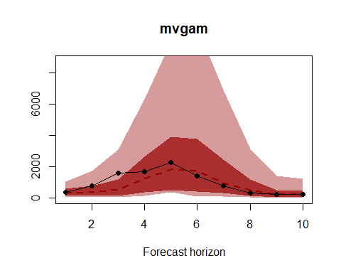
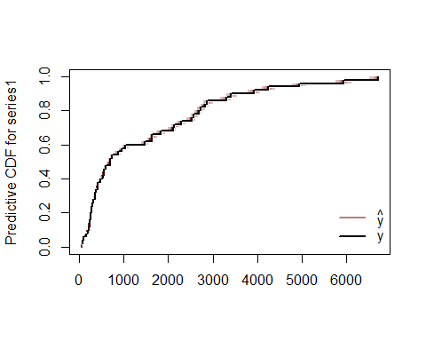
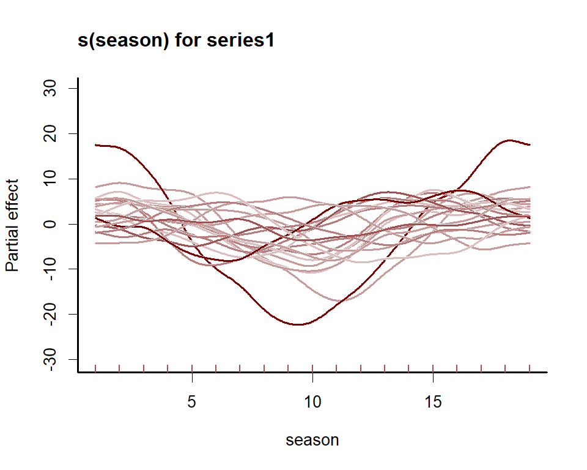
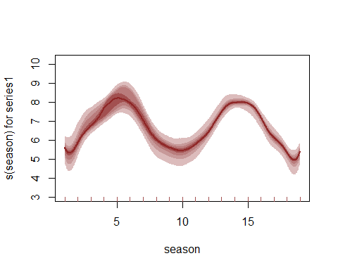
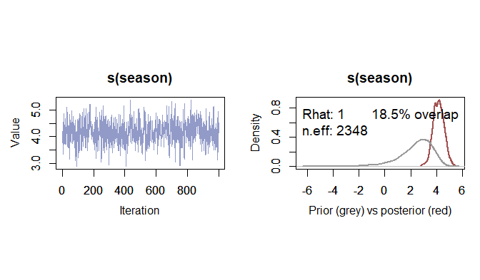
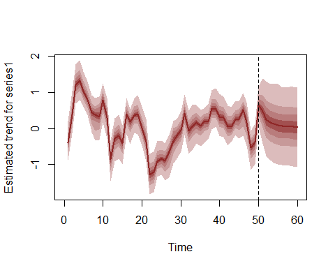
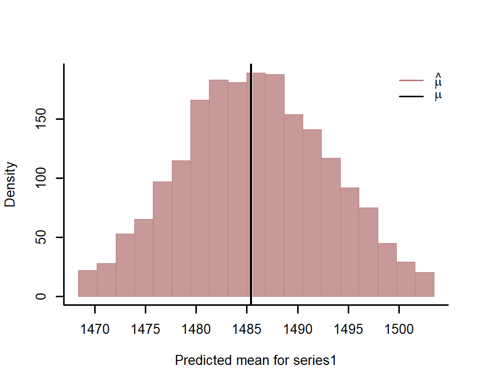

<!-- README.md is generated from README.Rmd. Please edit that file -->
# *mvgam*

The goal of `mvgam` is to use a Bayesian framework to estimate parameters of Generalised Additive Models for discrete time series with dynamic trend components.

## Installation

Install the development version from `GitHub` using: `devtools::install_github("nicholasjclark/mvgam")`

## Brief introduction to the package

We can explore the model’s primary functions using a test dataset that is available with all `R` installations. We introduce dynamic Generalised Additive Models and some of the key utility functions provided in `mvgam`. First, load the `lynx` data and plot the series as well as its estimated autocorrelation function

``` r
library(mvgam)
#> Loading required package: mgcv
#> Loading required package: nlme
#> This is mgcv 1.8-33. For overview type 'help("mgcv-package")'.
#> Loading required package: rjags
#> Loading required package: coda
#> Linked to JAGS 4.3.0
#> Loaded modules: basemod,bugs
#> Loading required package: parallel
#> Loading required package: runjags
#> Warning: package 'runjags' was built under R version 4.0.5
data(lynx)
lynx_full = data.frame(year = 1821:1934, 
                       population = as.numeric(lynx))
plot(lynx_full$population, type = 'l', ylab = 'Lynx trappings',
     xlab = 'Time')
```


``` r
acf(lynx_full$population, main = '')
```


Along with serial autocorrelation, there is a clear ~19-year cyclic pattern to the data. Create a `season` term that can be used to model this effect and give a better representation of the data generating process than we would likely get with a linear model

``` r
plot(stl(ts(lynx_full$population, frequency = 19), s.window = 'periodic'))
```


``` r
lynx_full$season <- (lynx_full$year %%19) + 1
```

For `mvgam` models, the response needs to be labelled `y` and we also need an indicator of the series name as a `factor` variable

``` r
lynx_full$y <- lynx_full$population
lynx_full$series <- factor('series1')
```

Split the data into training (first 50 years) and testing (next 10 years of data) to evaluate multi-step ahead forecasts

``` r
lynx_train = lynx_full[1:50, ]
lynx_test = lynx_full[51:60, ]
```

Now fit an `mvgam` model; it fits a GAM in which a cyclic smooth function for `season` is estimated jointly with a full time series model for the errors (in this case an `AR2` process), rather than relying on smoothing splines that do not incorporate a concept of the future. We assume the outcome follows a Poisson distribution and estimate the model in `JAGS` using MCMC sampling (installation links are found [here](https://sourceforge.net/projects/mcmc-jags/files/))

``` r
lynx_mvgam <- mvjagam(data_train = lynx_train,
               data_test = lynx_test,
               formula = y ~ s(season, bs = 'cc', k = 19),
               knots = list(season = c(0.5, 19.5)),
               family = 'poisson',
               trend_model = 'AR2',
               drift = F,
               burnin = 15000,
               chains = 4)
#> Compiling rjags model...
#> Starting 4 rjags simulations using a PSOCK cluster with 4 nodes on host
#> 'localhost'
#> Simulation complete
#> Note: Summary statistics were not produced as there are >50 monitored
#> variables
#> [To override this behaviour see ?add.summary and ?runjags.options]
#> FALSEFinished running the simulation
#> NOTE: Stopping adaptation
```

Perform a series of posterior predictive checks to see if the model is able to simulate data for the training period that looks realistic and unbiased. First, examine simulated kernel densities for posterior predictions (`yhat`) and compare to the density of the observations (`y`)

``` r
plot_mvgam_ppc(lynx_mvgam, series = 1, type = 'density')
```



Now plot the distribution of predicted means compared to the observed mean

``` r
plot_mvgam_ppc(lynx_mvgam, series = 1, type = 'mean')
```


Next examine simulated empirical Cumulative Distribution Functions (CDF) for posterior predictions (`yhat`) and compare to the CDF of the observations (`y`)

``` r
plot_mvgam_ppc(lynx_mvgam, series = 1, type = 'cdf')
```



Finally look for any biases in predictions by examining a Probability Integral Transform (PIT) histogram. If our predictions are not biased one way or another (i.e. not consistently under- or over-predicting), this histogram should look roughly uniform

``` r
plot_mvgam_ppc(lynx_mvgam, series = 1, type = 'pit')
```



All of these plots indicate the model is well calibrated against the training data, with no apparent pathological behaviors exhibited. Have a look at this model's summary to see what is being estimated (note that longer MCMC runs would probably be needed to increase effective sample sizes)

``` r
summary_mvgam(lynx_mvgam)
#> GAM formula:
#> y ~ s(season, bs = "cc", k = 19)
#> 
#> Family:
#> Poisson
#> 
#> N series:
#> 1
#> 
#> N observations per series:
#> 50
#> 
#> GAM smooth term approximate significances:
#>             edf Ref.df Chi.sq p-value    
#> s(season) 16.19  17.00  696.8  <2e-16 ***
#> ---
#> Signif. codes:  0 '***' 0.001 '**' 0.01 '*' 0.05 '.' 0.1 ' ' 1
#> 
#> GAM coefficient (beta) estimates:
#>                    2.5%        50%       97.5% Rhat n.eff
#> (Intercept)   6.6468611  6.7748372  6.94525261 1.03    71
#> s(season).1  -1.1298871 -0.6555494 -0.05659360 1.23    98
#> s(season).2  -0.1751489  0.3879878  1.16675768 1.52    82
#> s(season).3   0.8095397  1.2870103  2.17354256 1.41    40
#> s(season).4   1.3664280  1.8762071  2.45952191 1.10    49
#> s(season).5   1.3139700  1.9771184  2.40722417 1.38    47
#> s(season).6  -0.0174942  1.0377501  1.56343910 1.69    61
#> s(season).7  -1.0711102 -0.2709102  0.35867670 1.45   114
#> s(season).8  -1.3320074 -0.7685839 -0.17333382 1.07   140
#> s(season).9  -1.4856547 -0.8679460 -0.09709773 1.05   165
#> s(season).10 -1.2420556 -0.5499060  0.31194961 1.09    82
#> s(season).11 -0.7396990  0.1676010  0.99184259 1.19    42
#> s(season).12  0.2700804  1.1519587  1.95430888 1.36    29
#> s(season).13  0.5045643  1.3696671  2.08590815 1.43    32
#> s(season).14  0.2708631  1.1044233  2.00906276 1.19    39
#> s(season).15 -0.6285226 -0.0336396  0.54954624 1.05   105
#> s(season).16 -1.3001986 -0.8152208 -0.28756815 1.02   155
#> s(season).17 -1.6003273 -1.0759127 -0.58132177 1.05   135
#> 
#> GAM smoothing parameter (rho) estimates:
#>               2.5%      50%    97.5% Rhat n.eff
#> s(season) 3.050288 3.889149 4.565194 1.01  1527
#> 
#> Latent trend drift (phi) and AR parameter estimates:
#>           2.5%        50%     97.5% Rhat n.eff
#> phi  0.0000000  0.0000000 0.0000000  NaN     0
#> ar1  0.4181641  0.7400922 1.0888287 1.12   624
#> ar2 -0.4847299 -0.1195360 0.2008643 1.14   768
#> ar3  0.0000000  0.0000000 0.0000000  NaN     0
#> 
```

Inspect the model's estimated smooth for the 19-year cyclic pattern, which is shown as a ribbon plot of posterior empirical quantiles

``` r
plot_mvgam_smooth(lynx_mvgam, 1, 'season')
```



We can also view the mvgam's posterior retrodictions and predictions for the entire series (testing and training)

``` r
plot_mvgam_fc(lynx_mvgam, data_test = lynx_test)
```



And the estimated latent trend component

``` r
plot_mvgam_trend(lynx_mvgam, data_test = lynx_test)
```



We can also re-do the posterior predictive checks, but this time focusing only on the out of sample period. This will give us better insight into how the model is performing and whether it is able to simulate realistic and unbiased future values

``` r
plot_mvgam_ppc(lynx_mvgam, series = 1, type = 'density', data_test = lynx_test)
```


``` r
plot_mvgam_ppc(lynx_mvgam, series = 1, type = 'mean', data_test = lynx_test)
```


``` r
plot_mvgam_ppc(lynx_mvgam, series = 1, type = 'cdf', data_test = lynx_test)
```


``` r
plot_mvgam_ppc(lynx_mvgam, series = 1, type = 'pit', data_test = lynx_test)
```


A key aspect of ecological forecasting is to understand [how different components of a model contribute to forecast uncertainty](https://esajournals.onlinelibrary.wiley.com/doi/full/10.1002/eap.1589). We can estimate relative contributions to forecast uncertainty for the GAM component and the latent trend component using `mvgam`

``` r
plot_mvgam_uncertainty(lynx_mvgam, data_test = lynx_test)
```


Both components contribute to forecast uncertainty, suggesting we would still need some more work to learn about factors driving the dynamics of the system. But we will leave the model as-is for this example. Diagnostics of the model can also be performed using `mvgam`. Have a look at the model's residuals, which are posterior medians of Dunn-Smyth randomised quantile residuals so should follow approximate normality. We are primarily looking for a lack of autocorrelation, which would suggest our AR2 model is appropriate for the latent trend

``` r
plot_mvgam_resids(lynx_mvgam)
```



Another useful utility of `mvgam` is the ability to use rolling window forecasts to evaluate competing models that may represent different hypotheses about the series dynamics. Here we will fit a poorly specified model to showcase how this evaluation works. In this model, we ignore the cyclic pattern of seasonality and force it to be fairly non-wiggly. We also use a random walk process for the trend

``` r
lynx_mvgam_poor <- mvjagam(data_train = lynx_train,
               data_test = lynx_test,
               formula = y ~ s(season, bs = 'gp', k = 3),
               family = 'poisson',
               trend_model = 'RW',
               drift = FALSE,
               burnin = 15000,
               chains = 4)
#> Compiling rjags model...
#> Starting 4 rjags simulations using a PSOCK cluster with 4 nodes on host
#> 'localhost'
#> Simulation complete
#> Note: Summary statistics were not produced as there are >50 monitored
#> variables
#> [To override this behaviour see ?add.summary and ?runjags.options]
#> FALSEFinished running the simulation
#> NOTE: Stopping adaptation
```

We choose a set of timepoints within the training data to forecast from, allowing us to simulate a situation where the model's parameters had already been estimated but we have only observed data up to the evaluation timepoint and would like to generate forecasts from the latent trends. Here we use year 10 as our last observation and forecast ahead for the next 10 years.

``` r
mod1_eval <- eval_mvgam(lynx_mvgam, eval_timepoint = 10, fc_horizon = 10)
mod2_eval <- eval_mvgam(lynx_mvgam_poor, eval_timepoint = 10, fc_horizon = 10)
```

Summary statistics of the two models' out of sample Discrete Rank Probability Score (DRPS) indicate that the well-specified model performs markedly better (far lower DRPS) for this evaluation timepoint

``` r
summary(mod1_eval$series1$drps)
#>    Min. 1st Qu.  Median    Mean 3rd Qu.    Max. 
#>   5.874  26.094  86.247  80.180 112.312 206.018
summary(mod2_eval$series1$drps)
#>    Min. 1st Qu.  Median    Mean 3rd Qu.    Max. 
#>   64.08   81.24  287.87  290.83  414.15  683.66
```

Nominal coverages for both models' 90% prediction intervals

``` r
mean(mod1_eval$series1$in_interval)
#> [1] 1
mean(mod2_eval$series1$in_interval)
#> [1] 1
```

The `compare_mvgams` function automates this process by rolling along a set of timepoints for each model, ensuring a more in-depth evaluation of each competing model at the same set of timepoints. There are many more extended uses for `mvgam` models, including the ability to fit dynamic factor processes for analysing and forecasting sets of multivariate discrete time series
