<!-- README.md is generated from README.Rmd. Please edit that file -->

# *mvgam*

The goal of `mvgam` is to use a Bayesian framework to estimate
parameters of Generalized Additive Models for discrete time series with
dynamic trend components. The motivation for the package and some of its
primary objectives are described in detail by [Clark & Wells
2022](https://besjournals.onlinelibrary.wiley.com/doi/10.1111/2041-210X.13974)
(published in *Methods in Ecology and Evolution*), with additional
inspiration on the use of Bayesian probabilistic modelling to quantify
uncertainty and advise principled decision making coming from [Michael
Betancourt](https://betanalpha.github.io/writing/), [Michael
Dietze](https://www.bu.edu/earth/profiles/michael-dietze/) and [Emily
Fox](https://emilybfox.su.domains/), among many others.

## Disclaimer

Please note that the `mvgam` package is under very active development,
and it is likely that certain functionality will change on a regular
basis. As such, please take caution when implementing the package for
automated routines.

## Resources

A number of case studies have been compiled to highlight how DGAMs can
be estimated using MCMC sampling. These are hosted currently on `RPubs`
at the following links:

- [mvgam case study 1: model comparison and data
  assimilation](https://rpubs.com/NickClark47/mvgam)
- [mvgam case study 2: multivariate
  models](https://rpubs.com/NickClark47/mvgam2)
- [mvgam case study 3: distributed lag
  models](https://rpubs.com/NickClark47/mvgam3)

The package can also be used to generate all necessary data structures,
initial value functions and modelling code necessary to fit DGAMs using
`Stan` or `JAGS`. This can be helpful if users wish to make changes to
the model to better suit their own bespoke research / analysis goals.
The following resources can be helpful to troubleshoot:

- [Stan Discourse](https://discourse.mc-stan.org/)
- [JAGS Discourse](https://sourceforge.net/projects/mcmc-jags/)

## Installation

Install the development version from `GitHub` using:
`devtools::install_github("nicholasjclark/mvgam")`. Note that to
actually condition models with MCMC sampling, either the `JAGS` software
must be installed (along with the `R` packages `rjags` and `runjags`) or
the `Stan` software must be installed (along with the package `rstan`
and, optionally, the `cmdstanr` package). These are not listed as
dependencies of `mvgam` to ensure that installation is less difficult.
If users wish to fit the models using `mvgam`, please refer to
installation links for `JAGS`
[here](https://sourceforge.net/projects/mcmc-jags/files/) or for `Stan`
and `rstan` [here](https://mc-stan.org/users/interfaces/rstan)).

## Citing mvgam and related software

When using open source software (or software in general), please make
sure to appropriately acknowledge the hard work that developers and
maintainers put into making these packages available. Citations are
currently the best way to formally acknowledge this work, so we highly
encourage you to cite any packages that you rely on for your research.

When using `mvgam`, please cite the following publication:

- Clark, N.J. and Wells, K. (2022). Dynamic Generalized Additive Models
  (DGAMs) for forecasting discrete ecological time series. *Methods in
  Ecology and Evolution*. DOI: <https://doi.org/10.1111/2041-210X.13974>

As `mvgam` acts as an interface to `Stan` and `JAGS`, please
additionally cite whichever software you use for parameter estimation:

- Carpenter B., Gelman A., Hoffman M. D., Lee D., Goodrich B.,
  Betancourt M., Brubaker M., Guo J., Li P., and Riddell A. (2017).
  Stan: A probabilistic programming language. *Journal of Statistical
  Software*. 76(1). 10.18637/jss.v076.i01
- Plummer, M. (2013). JAGS: A program for analysis of Bayesian graphical
  models using Gibbs sampling. *Proceedings of the 3rd International
  Workshop on Distributed Statistical Computing*. 124(125.10).

Further, `mvgam` relies on several other `R` packages and, of course, on
`R` itself. To find out how to cite R and its packages, use the
`citation` function. There are some features of `mvgam` which
specifically rely on certain packages. The most important of these is
the generation of data necessary to estimate smoothing splines, which
entirely rely on `mgcv`. The `rstan` and `cmdstanr` packages together
with `Rcpp` makes `Stan` conveniently accessible in `R`, while the
`rjags` and `runjags` packages together with the `coda` package make
`JAGS` accessible in `R`. If you use some of these features, please also
consider citing the related packages.

## A brief introduction to the package

We can explore the model’s primary functions using a test dataset that
is available with all `R` installations. We introduce Dynamic
Generalized Additive Models and some of the key utility functions
provided in `mvgam`. First, load the `lynx` data and plot the series as
well as its estimated autocorrelation function

``` r
library(mvgam)
#> Loading required package: mgcv
#> Warning: package 'mgcv' was built under R version 4.2.2
#> Loading required package: nlme
#> This is mgcv 1.8-41. For overview type 'help("mgcv-package")'.
#> Loading required package: parallel
#> Welcome to mvgam. Please cite as: Clark, NJ, and Wells, K. 2022. Dynamic Generalized Additive Models (DGAMs) for forecasting discrete ecological time series. Methods in Ecology and Evolution, 2022, https://doi.org/10.1111/2041-210X.13974
data(lynx)
lynx_full = data.frame(year = 1821:1934, 
                       population = as.numeric(lynx))
plot(lynx_full$population, type = 'l', ylab = 'Lynx trappings',
     xlab = 'Time', bty = 'l', lwd = 2)
box(bty = 'l', lwd  = 2)
```

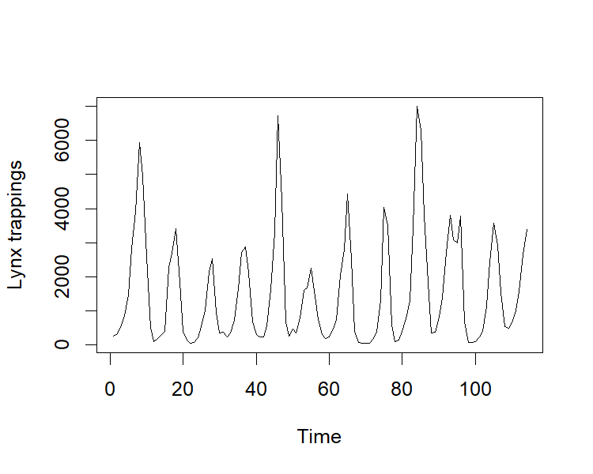

``` r
acf(lynx_full$population, main = '', bty = 'l', lwd = 2)
box(bty = 'l', lwd  = 2)
```

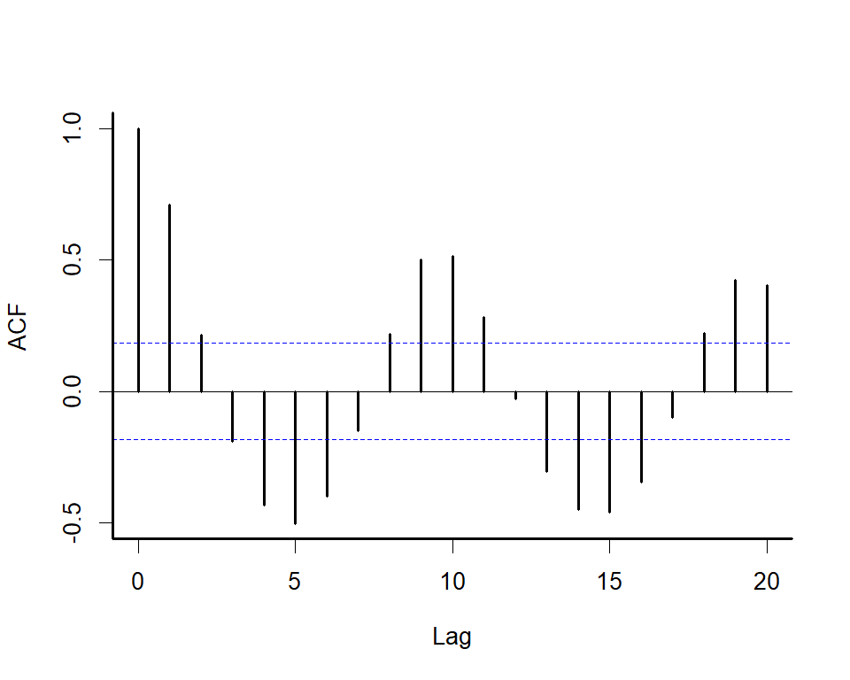

Along with serial autocorrelation, there is a clear \~19-year cyclic
pattern to the data. Create a `season` term that can be used to model
this effect and give a better representation of the data generating
process than we would likely get with a linear model

``` r
plot(stl(ts(lynx_full$population, frequency = 19), s.window = 'periodic'))
```

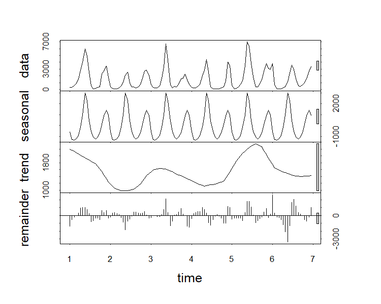

``` r
lynx_full$season <- (lynx_full$year %%19) + 1
```

For `mvgam` models, the response needs to be labelled `y` and we also
need an indicator of the series name as a `factor` variable (if the
column `series` is missing, this will be added automatically by assuming
that all observations are from a single time series). Finally, a `time`
column is needed to index time

``` r
lynx_full$y <- lynx_full$population
lynx_full$time <- 1:NROW(lynx_full)
lynx_full$series <- factor('series1')
```

Split the data into training (first 50 years) and testing (next 10 years
of data) to evaluate multi-step ahead forecasts

``` r
lynx_train = lynx_full[1:50, ]
lynx_test = lynx_full[51:60, ]
```

Inspect the series in a bit more detail using `mvgam`’s plotting utility

``` r
plot_mvgam_series(data = lynx_train)
```

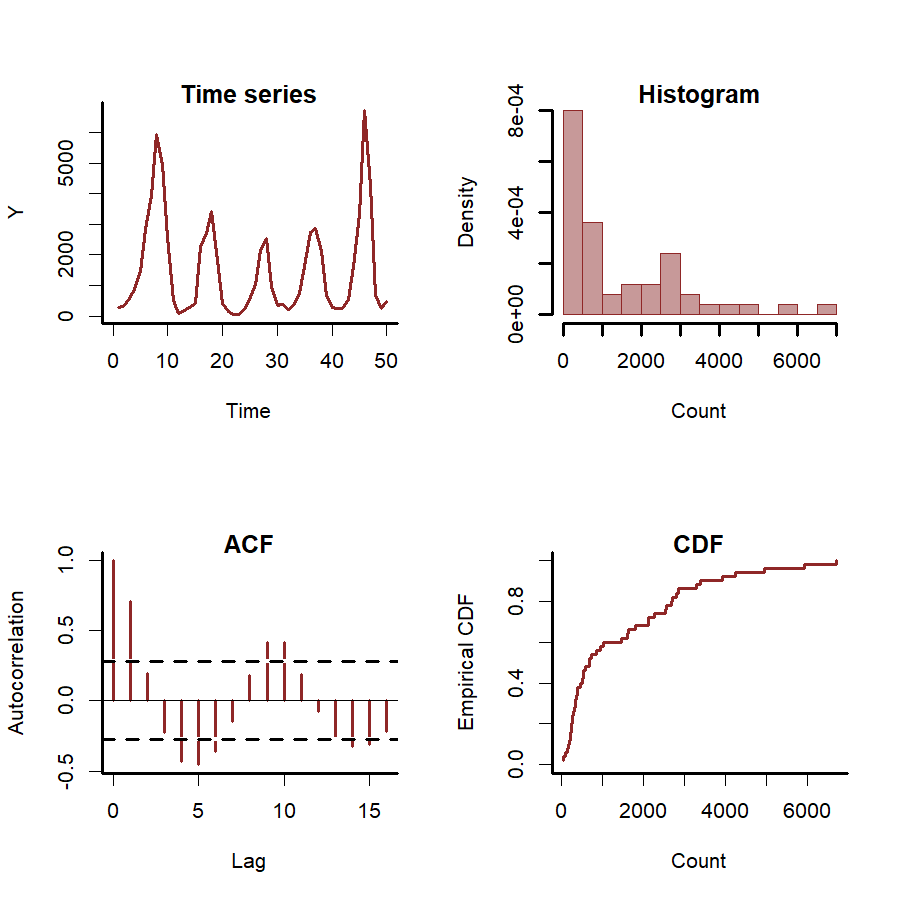

Now we will formulate an `mvgam` model; this model fits a GAM in which a
cyclic smooth function for `season` is estimated jointly with a full
time series model for the temporal process (in this case an `AR3`
process), rather than relying on smoothing splines that do not
incorporate a concept of the future. We assume the outcome follows a
Poisson distribution. But before conditioning the model on observed
data, a check of prior smooth function realisations is useful to ensure
we are allowing enough flexibility to capture the types of functional
behaviours we think are reasonable without allowing outrageous
behaviours. First we follow conventional recommendations to set `k` for
the smooth term to be large, which would allow maximum flexibility in
functional behaviours

``` r
lynx_mvgam_prior <- mvgam(data = lynx_train,
               formula = y ~ s(season, bs = 'cc', k = 19),
               knots = list(season = c(0.5, 19.5)),
               family = 'poisson',
               trend_model = 'AR3',
               chains = 1,
               prior_simulation = TRUE)
```

Plot a set of realisations from the prior seasonal smooth function

``` r
plot(lynx_mvgam_prior, type = 'smooths', realisations = TRUE)
```

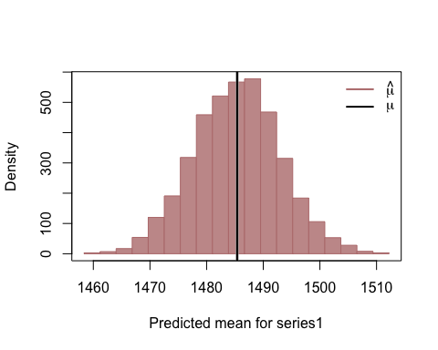
These functions are showing the marginal contribution of the seasonal
smooth function to the linear predictor (on the log scale), and they are
clearly allowed to move into ridiculous spaces that we should give very
little prior plausibility to:

``` r
exp(-25)
#> [1] 1.388794e-11
exp(25)
#> [1] 72004899337
```

Setting `k` to a smaller value results in less flexibility. This is
because number of basis functions that contribute to functional
behaviour is reduced

``` r
lynx_mvgam_prior <- mvgam(data = lynx_train,
               formula = y ~ s(season, bs = 'cc', k = 13),
               knots = list(season = c(0.5, 19.5)),
               family = 'poisson',
               trend_model = 'AR3',
               chains = 1,
               prior_simulation = TRUE)
```

Resulting prior realisations look more reasonable given the range of the
observations, and there is clearly enough flexibility to support a wide
range of functional shapes.

``` r
plot(lynx_mvgam_prior, type = 'smooths', realisations = TRUE)
```

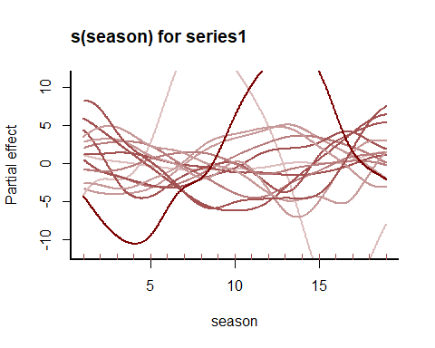

In practice, imparting domain knowledge into prior specifications for
penalised smooth functions is challenging, as these behaviours are often
the cumulative result of multiple penalty matrices that all have their
own separate smoothing parameters. Changing the prior on the smoothing
parameters is another option (`mvgam` uses a half-normal prior by
default, which regularises functions more than the default approach used
in `mgcv::jagam`). But without running through prior visualisations (and
other prior pushforward checks) it will be more difficult to reason
about how to set `k` to respect domain knowledge. In general it is
highly recommended that users view `mvgam` and related interfaces such
as `brms` as tools for building scaffold models that can then be
modified to suit the bespoke needs of each particular analysis.

Users can also check what the default prior distributions are for given
model formulations, which can be helpful to understand how the model can
be modified but also to see any restrictions on what can be changed
within the `mvgam` framework.

``` r
test_priors <- get_mvgam_priors(y ~ s(season, bs = 'cc', k = 13),
                                family = 'poisson',
                                data = lynx_train,
                                trend_model = 'AR3',
                                use_stan = TRUE)
test_priors
#>        param_name param_length                  param_info
#> 1 lambda<lower=0>            1 s(season) smooth parameters
#> 2             ar1            1       trend AR1 coefficient
#> 3             ar2            1       trend AR2 coefficient
#> 4             ar3            1       trend AR3 coefficient
#> 5  sigma<lower=0>            1                    trend sd
#>                      prior              example_change
#> 1 lambda ~ normal(10, 25); lambda ~ exponential(0.31);
#> 2      ar1 ~ std_normal();   ar1 ~ normal(0.08, 0.65);
#> 3      ar2 ~ std_normal();   ar2 ~ normal(-0.21, 0.3);
#> 4      ar3 ~ std_normal();   ar3 ~ normal(0.64, 0.97);
#> 5  sigma ~ exponential(2);  sigma ~ exponential(0.69);
```

Any of the above priors can be changed by modifying the `prior` column
and supplying the resulting `data.frame` to the `priors` argument in
`mvgam()`. But for now, we will proceed with the defaults by
conditioning the model on observed data in `Stan` using MCMC sampling
with the `Cmdstan` interface (installation links for `rstan` and
`cmdstanr` are found [here](https://mc-stan.org/users/interfaces/rstan)
and [here](https://mc-stan.org/cmdstanr/articles/cmdstanr.html)).

``` r
lynx_mvgam <- mvgam(data = lynx_train,
               newdata = lynx_test,
               formula = y ~ s(season, bs = 'cc', k = 13),
               knots = list(season = c(0.5, 19.5)),
               family = 'poisson',
               trend_model = 'AR3',
               use_stan = TRUE)
#> Running MCMC with 4 parallel chains...
#> 
#> Chain 1 Iteration:   1 / 1000 [  0%]  (Warmup) 
#> Chain 2 Iteration:   1 / 1000 [  0%]  (Warmup) 
#> Chain 3 Iteration:   1 / 1000 [  0%]  (Warmup) 
#> Chain 4 Iteration:   1 / 1000 [  0%]  (Warmup) 
#> Chain 3 Iteration: 100 / 1000 [ 10%]  (Warmup) 
#> Chain 1 Iteration: 100 / 1000 [ 10%]  (Warmup) 
#> Chain 2 Iteration: 100 / 1000 [ 10%]  (Warmup) 
#> Chain 4 Iteration: 100 / 1000 [ 10%]  (Warmup) 
#> Chain 3 Iteration: 200 / 1000 [ 20%]  (Warmup) 
#> Chain 4 Iteration: 200 / 1000 [ 20%]  (Warmup) 
#> Chain 2 Iteration: 200 / 1000 [ 20%]  (Warmup) 
#> Chain 1 Iteration: 200 / 1000 [ 20%]  (Warmup) 
#> Chain 3 Iteration: 300 / 1000 [ 30%]  (Warmup) 
#> Chain 4 Iteration: 300 / 1000 [ 30%]  (Warmup) 
#> Chain 2 Iteration: 300 / 1000 [ 30%]  (Warmup) 
#> Chain 1 Iteration: 300 / 1000 [ 30%]  (Warmup) 
#> Chain 3 Iteration: 400 / 1000 [ 40%]  (Warmup) 
#> Chain 4 Iteration: 400 / 1000 [ 40%]  (Warmup) 
#> Chain 1 Iteration: 400 / 1000 [ 40%]  (Warmup) 
#> Chain 2 Iteration: 400 / 1000 [ 40%]  (Warmup) 
#> Chain 3 Iteration: 500 / 1000 [ 50%]  (Warmup) 
#> Chain 3 Iteration: 501 / 1000 [ 50%]  (Sampling) 
#> Chain 4 Iteration: 500 / 1000 [ 50%]  (Warmup) 
#> Chain 4 Iteration: 501 / 1000 [ 50%]  (Sampling) 
#> Chain 1 Iteration: 500 / 1000 [ 50%]  (Warmup) 
#> Chain 1 Iteration: 501 / 1000 [ 50%]  (Sampling) 
#> Chain 2 Iteration: 500 / 1000 [ 50%]  (Warmup) 
#> Chain 2 Iteration: 501 / 1000 [ 50%]  (Sampling) 
#> Chain 3 Iteration: 600 / 1000 [ 60%]  (Sampling) 
#> Chain 4 Iteration: 600 / 1000 [ 60%]  (Sampling) 
#> Chain 1 Iteration: 600 / 1000 [ 60%]  (Sampling) 
#> Chain 2 Iteration: 600 / 1000 [ 60%]  (Sampling) 
#> Chain 3 Iteration: 700 / 1000 [ 70%]  (Sampling) 
#> Chain 1 Iteration: 700 / 1000 [ 70%]  (Sampling) 
#> Chain 4 Iteration: 700 / 1000 [ 70%]  (Sampling) 
#> Chain 2 Iteration: 700 / 1000 [ 70%]  (Sampling) 
#> Chain 1 Iteration: 800 / 1000 [ 80%]  (Sampling) 
#> Chain 3 Iteration: 800 / 1000 [ 80%]  (Sampling) 
#> Chain 2 Iteration: 800 / 1000 [ 80%]  (Sampling) 
#> Chain 4 Iteration: 800 / 1000 [ 80%]  (Sampling) 
#> Chain 1 Iteration: 900 / 1000 [ 90%]  (Sampling) 
#> Chain 3 Iteration: 900 / 1000 [ 90%]  (Sampling) 
#> Chain 2 Iteration: 900 / 1000 [ 90%]  (Sampling) 
#> Chain 4 Iteration: 900 / 1000 [ 90%]  (Sampling) 
#> Chain 1 Iteration: 1000 / 1000 [100%]  (Sampling) 
#> Chain 1 finished in 28.5 seconds.
#> Chain 3 Iteration: 1000 / 1000 [100%]  (Sampling) 
#> Chain 3 finished in 29.4 seconds.
#> Chain 2 Iteration: 1000 / 1000 [100%]  (Sampling) 
#> Chain 2 finished in 29.8 seconds.
#> Chain 4 Iteration: 1000 / 1000 [100%]  (Sampling) 
#> Chain 4 finished in 30.1 seconds.
#> 
#> All 4 chains finished successfully.
#> Mean chain execution time: 29.5 seconds.
#> Total execution time: 30.2 seconds.
```

Inspect the resulting model file, which is written in the `Stan`
probabilistic programming language

``` r
code(lynx_mvgam)
#> // Stan model code generated by package mvgam
#> data {
#>   int<lower=0> total_obs; // total number of observations
#>   int<lower=0> n; // number of timepoints per series
#>   int<lower=0> n_sp; // number of smoothing parameters
#>   int<lower=0> n_series; // number of series
#>   int<lower=0> num_basis; // total number of basis coefficients
#>   vector[num_basis] zero; // prior locations for basis coefficients
#>   real p_taus[1]; // prior precisions for parametric coefficients
#>   real p_coefs[1]; // prior locations for parametric coefficients
#>   matrix[total_obs, num_basis] X; // mgcv GAM design matrix
#>   int<lower=0> ytimes[n, n_series]; // time-ordered matrix (which col in X belongs to each [time, series] observation?)
#>   matrix[11,11] S1; // mgcv smooth penalty matrix S1
#>   int<lower=0> n_nonmissing; // number of nonmissing observations
#>   int<lower=0> flat_ys[n_nonmissing]; // flattened nonmissing observations
#>   matrix[n_nonmissing, num_basis] flat_xs; // X values for nonmissing observations
#>   int<lower=0> obs_ind[n_nonmissing]; // indices of nonmissing observations
#> }
#> parameters {
#>   // raw basis coefficients
#>   vector[num_basis] b_raw;
#>   // latent trend AR1 terms
#>   vector<lower=-1.5,upper=1.5>[n_series] ar1;
#>   // latent trend AR2 terms
#>   vector<lower=-1.5,upper=1.5>[n_series] ar2;
#>   // latent trend AR3 terms
#>   vector<lower=-1.5,upper=1.5>[n_series] ar3;
#>   // latent trend variance parameters
#>   vector<lower=0>[n_series] sigma;
#>   // latent trends
#>   matrix[n, n_series] trend;
#>   // smoothing parameters
#>   vector<lower=0>[n_sp] lambda;
#> }
#> transformed parameters {
#>   // basis coefficients
#>   vector[num_basis] b;
#>   b[1:num_basis] = b_raw[1:num_basis];
#> }
#> model {
#>   // parametric effect priors (regularised for identifiability)
#>   for (i in 1:1) {
#>   b_raw[i] ~ normal(p_coefs[i], 1 / p_taus[i]);
#>   }
#>   // prior for s(season)...
#>   b_raw[2:12] ~ multi_normal_prec(zero[2:12],S1[1:11,1:11] * lambda[1]);
#>   // priors for AR parameters
#>   ar1 ~ std_normal();
#>   ar2 ~ std_normal();
#>   ar3 ~ std_normal();
#>   // priors for smoothing parameters
#>   lambda ~ normal(10, 25);
#>   // priors for latent trend variance parameters
#>   sigma ~ exponential(2);
#>   // trend estimates
#>   trend[1, 1:n_series] ~ normal(0, sigma);
#>   trend[2, 1:n_series] ~ normal(trend[1, 1:n_series] * ar1, sigma);
#>   trend[3, 1:n_series] ~ normal(trend[2, 1:n_series] * ar1 + trend[1, 1:n_series] * ar2, sigma);
#>   for(s in 1:n_series){
#>   trend[4:n, s] ~ normal(ar1[s] * trend[3:(n - 1), s] + ar2[s] * trend[2:(n - 2), s] + ar3[s] * trend[1:(n - 3), s], sigma[s]);
#>   }
#>   // likelihood functions
#>   vector[n_nonmissing] flat_trends;
#>   flat_trends = (to_vector(trend))[obs_ind];
#>   flat_ys ~ poisson_log_glm(append_col(flat_xs, flat_trends),
#>   0.0,append_row(b, 1.0));
#> }
#> generated quantities {
#>   vector[total_obs] eta;
#>   matrix[n, n_series] mus;
#>   vector[n_sp] rho;
#>   vector[n_series] tau;
#>   array[n, n_series] int ypred;
#>   rho = log(lambda);
#>   for (s in 1:n_series) {
#>   tau[s] = pow(sigma[s], -2.0);
#>   }
#>   // posterior predictions
#>   eta = X * b;
#>   for(s in 1:n_series){ 
#>   mus[1:n, s] = eta[ytimes[1:n, s]] + trend[1:n, s];
#>   ypred[1:n, s] = poisson_log_rng(mus[1:n, s]);
#>   }
#> }
```

Perform a series of posterior retrodictive checks to see if the model is
able to simulate data for the training period that looks realistic and
unbiased. First, examine histograms for posterior retrodictions (`yhat`)
and compare to the histogram of the observations (`y`)

``` r
ppc(lynx_mvgam, series = 1, type = 'hist')
```

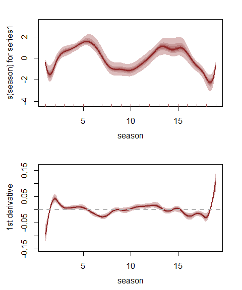

Now plot the distribution of predicted means compared to the observed
mean

``` r
ppc(lynx_mvgam, series = 1, type = 'mean')
```

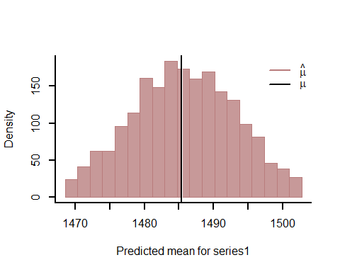

Next examine simulated empirical Cumulative Distribution Functions (CDF)
for posterior retrodictions (`yhat`) and compare to the CDF of the
observations (`y`)

``` r
ppc(lynx_mvgam, series = 1, type = 'cdf')
```

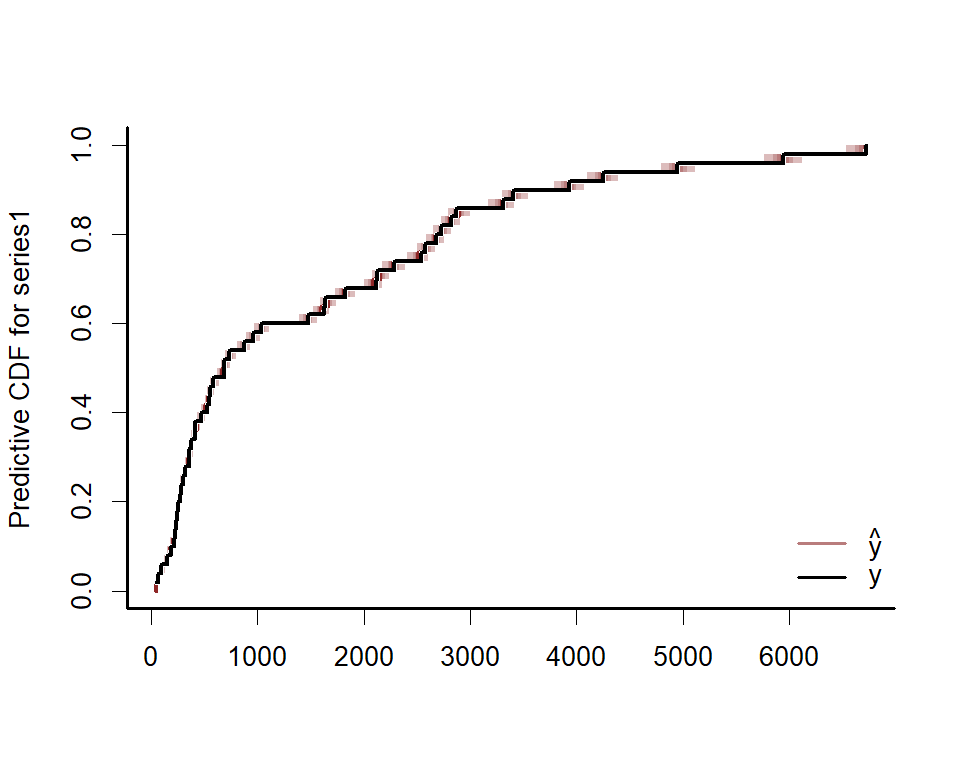

Rootograms are becoming [popular graphical tools for checking a discrete
model’s ability to capture dispersion properties of the response
variable](https://arxiv.org/pdf/1605.01311.pdf). Posterior predictive
hanging rootograms can be displayed using the `ppc()` function in
`mvgam`. In the plot below, we bin the unique observed values into `25`
bins to prevent overplotting and help with interpretation. This plot
compares the frequencies of observed vs predicted values for each bin,
which can help to identify aspects of poor model fit. For example, if
the gray bars (representing observed frequencies) tend to stretch below
zero, this suggests the model’s simulations predict the values in that
particular bin less frequently than they are observed in the data. A
well-fitting model that can generate realistic simulated data will
provide a rootogram in which the lower boundaries of the grey bars are
generally near zero

``` r
ppc(lynx_mvgam, series = 1, type = 'rootogram', n_bins = 25)
```

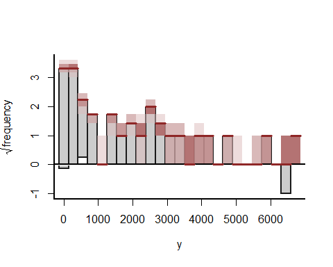

Finally look for any biases in predictions by examining a Probability
Integral Transform (PIT) histogram. If our predictions are not biased
one way or another (i.e. not consistently under- or over-predicting),
this histogram should look roughly uniform

``` r
ppc(lynx_mvgam, series = 1, type = 'pit')
```

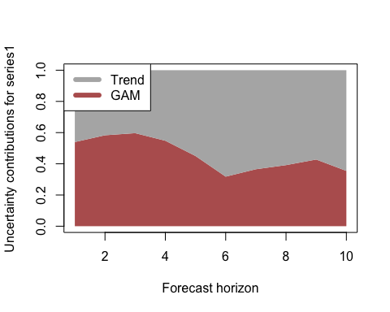

All of these plots indicate the model is well calibrated against the
training data, with no apparent pathological behaviors exhibited. Have a
look at this model’s summary to see what is being estimated. Note that
no pathological behaviours have been detected and we achieve good
effective sample sizes / mixing for all parameters

``` r
summary(lynx_mvgam)
#> GAM formula:
#> y ~ s(season, bs = "cc", k = 13)
#> 
#> Family:
#> Poisson
#> 
#> Link function:
#> log
#> 
#> Trend model:
#> AR3
#> 
#> N series:
#> 1
#> 
#> N observations:
#> 50
#> 
#> Status:
#> Fitted using Stan
#> 
#> GAM coefficient (beta) estimates:
#>                    2.5%         50%      97.5% Rhat n.eff
#> (Intercept)   6.7863390  6.80265000  6.8196625 1.00  3297
#> s(season).1  -0.6955953 -0.09391895  0.6057378 1.01   521
#> s(season).2  -0.1088109  0.91262600  1.7014843 1.01   514
#> s(season).3   0.0945175  1.55126000  2.5304927 1.02   293
#> s(season).4  -0.1198666  0.95484100  1.8568110 1.02   353
#> s(season).5  -1.0766680 -0.19703450  0.8398214 1.00   746
#> s(season).6  -1.2910485 -0.30080100  0.8564001 1.00   422
#> s(season).7  -0.9142373  0.04264125  1.0234562 1.00   834
#> s(season).8  -0.5367914  0.73206850  1.7951740 1.01   431
#> s(season).9  -0.8898386  0.49973650  1.7790540 1.02   276
#> s(season).10 -1.1565135 -0.35714000  0.4050940 1.01   364
#> s(season).11 -1.4427368 -0.80705650 -0.1186247 1.02   512
#> 
#> GAM smoothing parameter (rho) estimates:
#>               2.5%     50%    97.5% Rhat n.eff
#> s(season) 2.219137 3.36821 4.220478 1.01   422
#> 
#> Latent trend parameter estimates:
#>                2.5%        50%      97.5% Rhat n.eff
#> ar1[1]    0.7041408  1.0811200 1.40170950 1.01   492
#> ar2[1]   -0.8056733 -0.4017435 0.06126253 1.00  1571
#> ar3[1]   -0.4369930 -0.0663185 0.37053637 1.01   366
#> sigma[1]  0.3906860  0.4823715 0.60943070 1.00  1123
#> 
#> Stan MCMC diagnostics
#> n_eff / iter looks reasonable for all parameters
#> Rhat looks reasonable for all parameters
#> 0 of 2000 iterations ended with a divergence (0%)
#> 0 of 2000 iterations saturated the maximum tree depth of 12 (0%)
#> E-FMI indicated no pathological behavior
#> 
```

As with any `MCMC` based software, we can inspect traceplots. Here for
the `GAM` component smoothing parameters.

``` r
rstan::stan_trace(lynx_mvgam$model_output, 'rho')
```

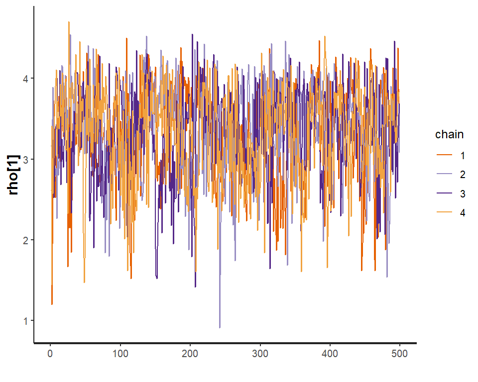

and for the latent trend component parameters

``` r
rstan::stan_trace(lynx_mvgam$model_output, c('ar1', 'ar2', 'ar3', 'sigma'))
```

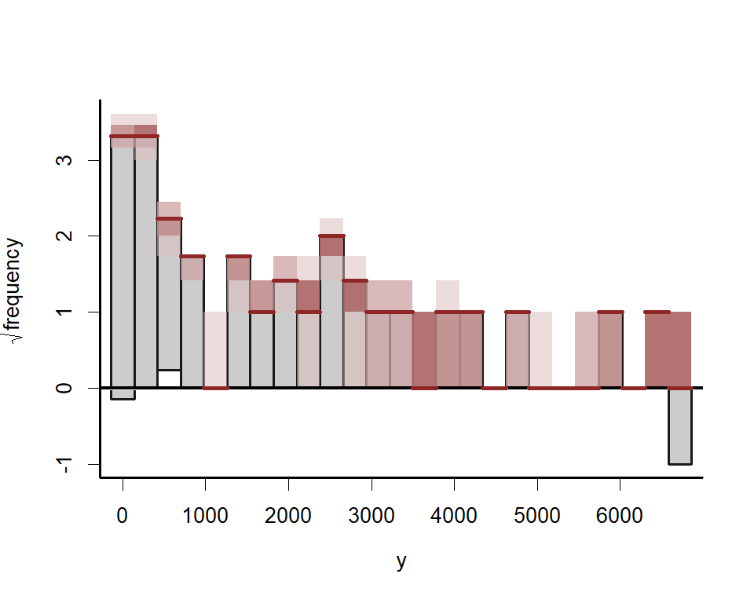

Inspect the model’s estimated smooth for the 19-year cyclic pattern,
which is shown as a ribbon plot of posterior empirical quantiles. We can
also overlay posterior quantiles of partial residuals (shown as ribbon
rectangles in red), which represent the leftover variation that the
model expects would remain if this smooth term was dropped but all other
parameters remained unchanged. Note that these are on a different scale
to those from `mgcv::plot.gam` as these are randomised quantile
residuals that are essentially standard normal in distribution. But
either way, a strong pattern in the partial residuals suggests there
would be strong patterns left unexplained in the model *if* we were to
drop this term, giving us further confidence that this function is
important in the model

``` r
plot(lynx_mvgam, type = 'smooths', residuals = T)
```

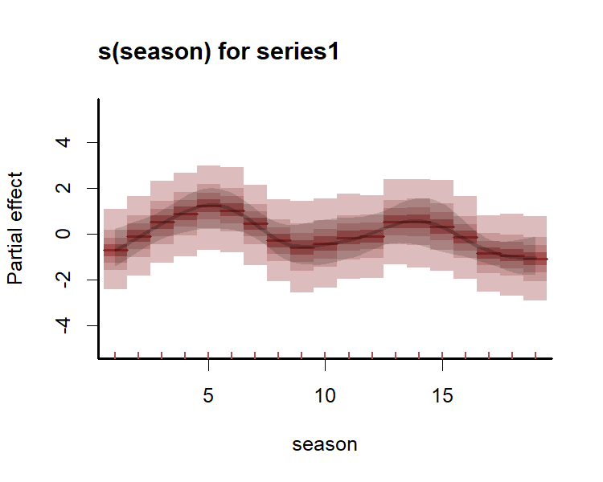

It is often also useful to compare prior to posterior function
realisations to understand how informative the observed data have been
for learning these functional shapes

``` r
layout(matrix(1:2, nrow = 2))
plot(lynx_mvgam_prior, type = 'smooths', realisations = TRUE)
```

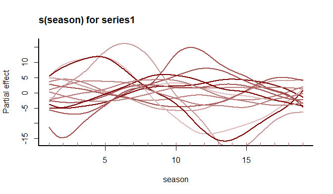

``` r
plot(lynx_mvgam, type = 'smooths', realisations = TRUE)
```

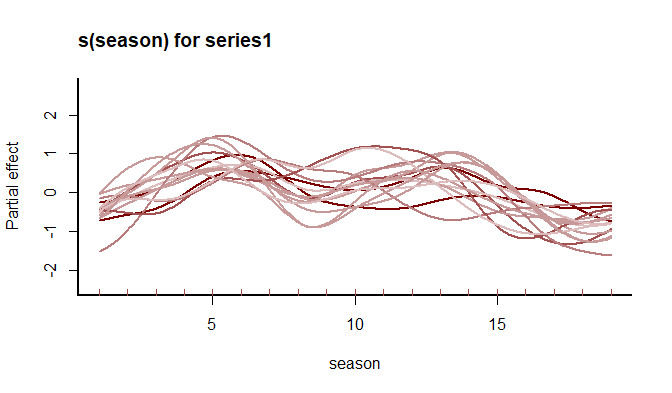

``` r
layout(1)
```

First derivatives of smooth functions can be plotted to inspect how the
slope of the function changes across its length. To plot these we use
the more flexible `plot_mvgam_smooth()` function

``` r
plot_mvgam_smooth(lynx_mvgam, 1, 'season', derivatives = T)
```

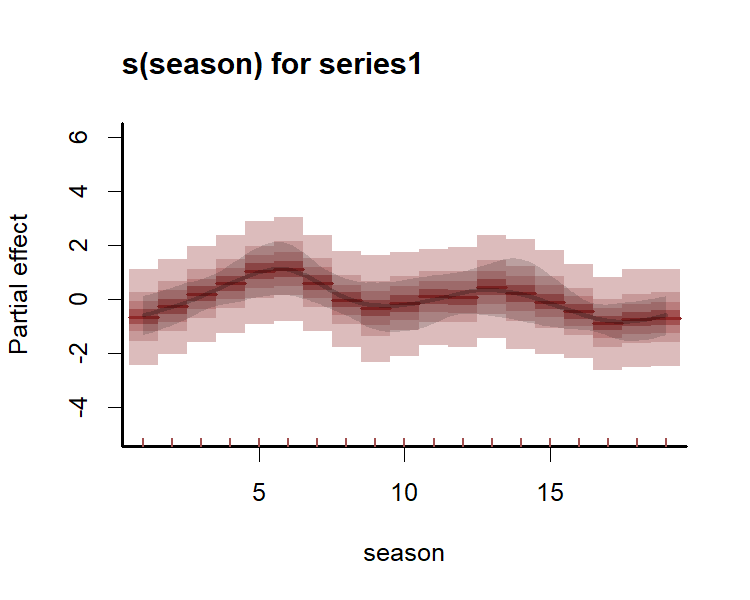

We can also view the mvgam’s posterior retrodictions and predictions for
the entire series (testing and training)

``` r
plot(lynx_mvgam, type = 'forecast', newdata = lynx_test)
#> Out of sample DRPS:
#> [1] 859.703
#> 
```

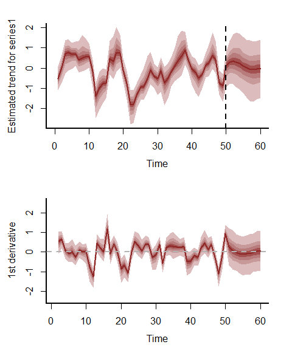

And the estimated latent trend component, again using the more flexible
`plot_mvgam_...()` option to show first derivatives of the estimated
trend

``` r
plot_mvgam_trend(lynx_mvgam, newdata = lynx_test, derivatives = T)
```

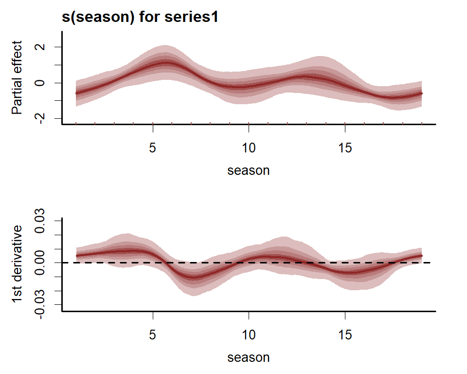

We can also re-do the posterior predictive checks, but this time
focusing only on the out of sample period. This will give us better
insight into how the model is performing and whether it is able to
simulate realistic and unbiased future values

``` r
ppc(lynx_mvgam, series = 1, type = 'rootogram', newdata = lynx_test)
```

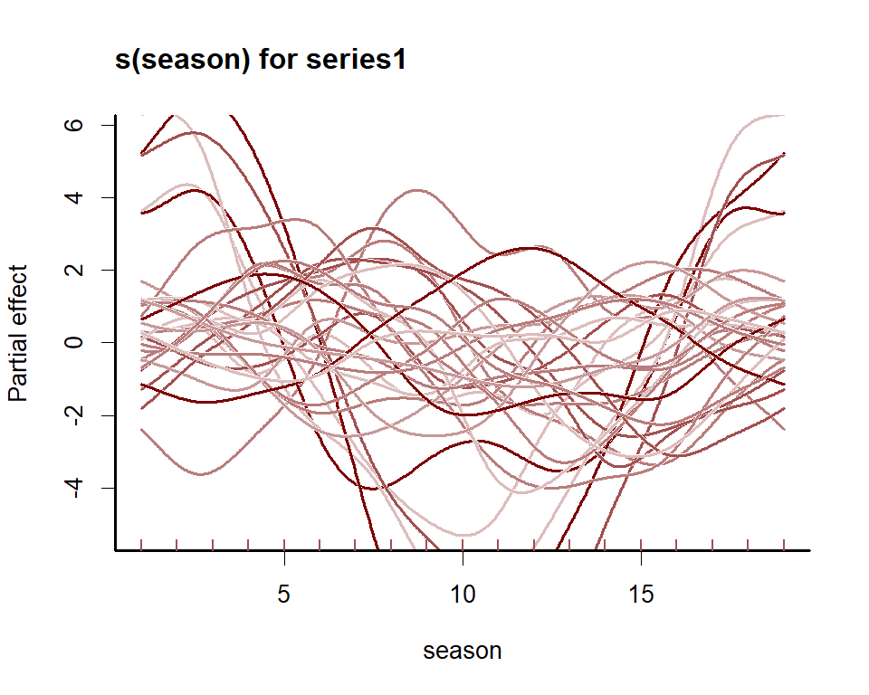

``` r
ppc(lynx_mvgam, series = 1, type = 'mean', newdata = lynx_test)
```

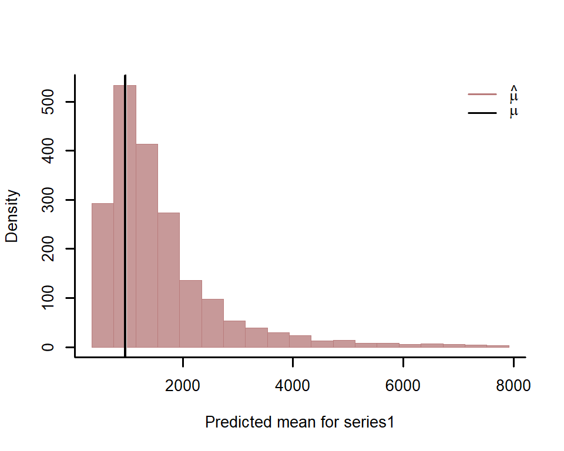

``` r
ppc(lynx_mvgam, series = 1, type = 'cdf', newdata = lynx_test)
```

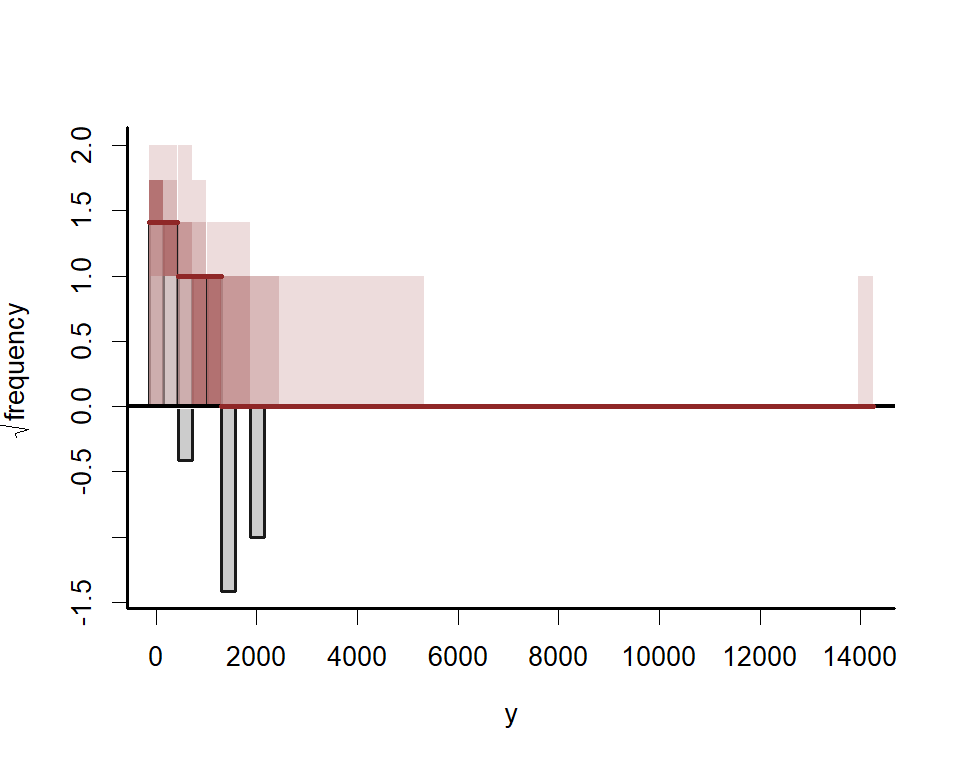

``` r
ppc(lynx_mvgam, series = 1, type = 'pit', newdata = lynx_test)
```

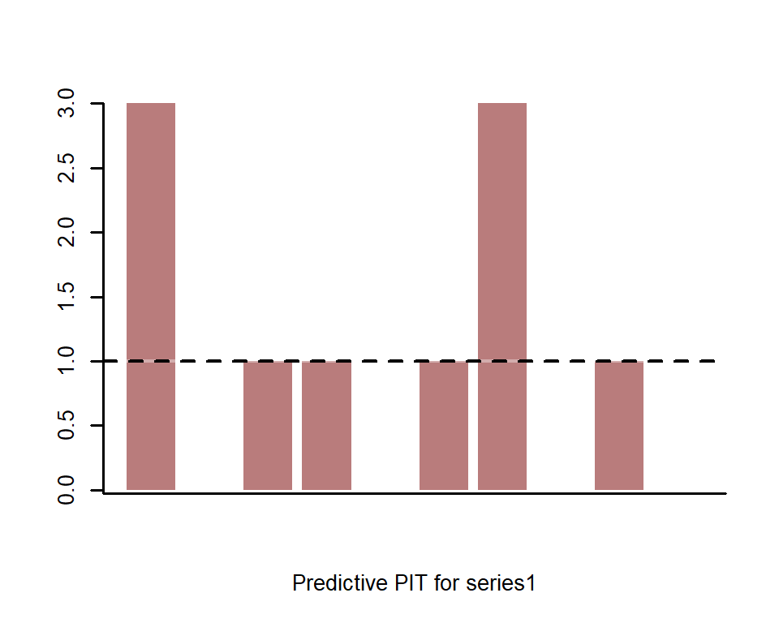

A key aspect of ecological forecasting is to understand [how different
components of a model contribute to forecast
uncertainty](https://esajournals.onlinelibrary.wiley.com/doi/full/10.1002/eap.1589).
We can estimate relative contributions to forecast uncertainty for the
GAM component and the latent trend component using `mvgam`

``` r
plot_mvgam_uncertainty(lynx_mvgam, newdata = lynx_test, legend_position = 'none')
text(1, 0.2, cex = 1.5, label="GAM component", 
     pos = 4, col="white", family = 'serif')
text(1, 0.8, cex = 1.5, label="Trend component", 
     pos = 4, col="#7C0000", family = 'serif')
```

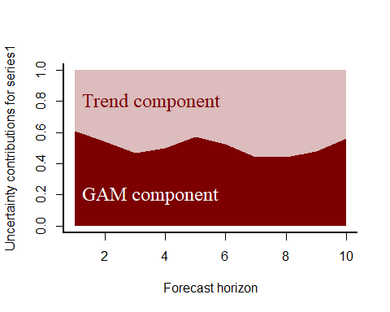

Both components contribute to forecast uncertainty, suggesting we would
still need some more work to learn about factors driving the dynamics of
the system. But we will leave the model as-is for this example.
Diagnostics of the model can also be performed using `mvgam`. Have a
look at the model’s residuals, which are posterior empirical quantiles
of Dunn-Smyth randomised quantile residuals so should follow approximate
normality. We are primarily looking for a lack of autocorrelation, which
would suggest our AR3 model is appropriate for the latent trend

``` r
plot(lynx_mvgam, type = 'residuals')
```

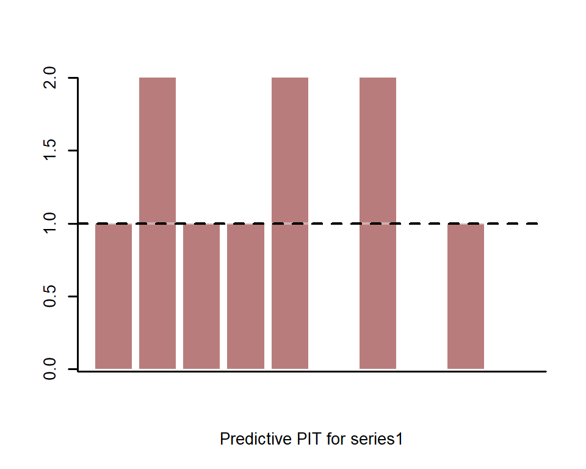

Another useful utility of `mvgam` is the ability to use rolling window
forecasts to evaluate competing models that may represent different
hypotheses about the series dynamics. Here we will fit a poorly
specified model to showcase how this evaluation works. In this model, we
ignore the cyclic pattern of seasonality and force it to be fairly
non-wiggly. We also use a random walk process for the trend

``` r
lynx_mvgam_poor <- mvgam(data = lynx_train,
               newdata = lynx_test,
               formula = y ~ s(season, k = 3),
               family = 'poisson',
               trend_model = 'RW',
               use_stan = TRUE,
               chains = 4)
#> Running MCMC with 4 parallel chains...
#> 
#> Chain 1 Iteration:   1 / 1000 [  0%]  (Warmup) 
#> Chain 2 Iteration:   1 / 1000 [  0%]  (Warmup) 
#> Chain 3 Iteration:   1 / 1000 [  0%]  (Warmup) 
#> Chain 4 Iteration:   1 / 1000 [  0%]  (Warmup) 
#> Chain 1 Iteration: 100 / 1000 [ 10%]  (Warmup) 
#> Chain 1 Iteration: 200 / 1000 [ 20%]  (Warmup) 
#> Chain 3 Iteration: 100 / 1000 [ 10%]  (Warmup) 
#> Chain 4 Iteration: 100 / 1000 [ 10%]  (Warmup) 
#> Chain 2 Iteration: 100 / 1000 [ 10%]  (Warmup) 
#> Chain 4 Iteration: 200 / 1000 [ 20%]  (Warmup) 
#> Chain 1 Iteration: 300 / 1000 [ 30%]  (Warmup) 
#> Chain 3 Iteration: 200 / 1000 [ 20%]  (Warmup) 
#> Chain 2 Iteration: 200 / 1000 [ 20%]  (Warmup) 
#> Chain 4 Iteration: 300 / 1000 [ 30%]  (Warmup) 
#> Chain 3 Iteration: 300 / 1000 [ 30%]  (Warmup) 
#> Chain 4 Iteration: 400 / 1000 [ 40%]  (Warmup) 
#> Chain 1 Iteration: 400 / 1000 [ 40%]  (Warmup) 
#> Chain 2 Iteration: 300 / 1000 [ 30%]  (Warmup) 
#> Chain 3 Iteration: 400 / 1000 [ 40%]  (Warmup) 
#> Chain 4 Iteration: 500 / 1000 [ 50%]  (Warmup) 
#> Chain 1 Iteration: 500 / 1000 [ 50%]  (Warmup) 
#> Chain 2 Iteration: 400 / 1000 [ 40%]  (Warmup) 
#> Chain 4 Iteration: 501 / 1000 [ 50%]  (Sampling) 
#> Chain 1 Iteration: 501 / 1000 [ 50%]  (Sampling) 
#> Chain 3 Iteration: 500 / 1000 [ 50%]  (Warmup) 
#> Chain 4 Iteration: 600 / 1000 [ 60%]  (Sampling) 
#> Chain 2 Iteration: 500 / 1000 [ 50%]  (Warmup) 
#> Chain 3 Iteration: 501 / 1000 [ 50%]  (Sampling) 
#> Chain 1 Iteration: 600 / 1000 [ 60%]  (Sampling) 
#> Chain 2 Iteration: 501 / 1000 [ 50%]  (Sampling) 
#> Chain 4 Iteration: 700 / 1000 [ 70%]  (Sampling) 
#> Chain 2 Iteration: 600 / 1000 [ 60%]  (Sampling) 
#> Chain 3 Iteration: 600 / 1000 [ 60%]  (Sampling) 
#> Chain 1 Iteration: 700 / 1000 [ 70%]  (Sampling) 
#> Chain 4 Iteration: 800 / 1000 [ 80%]  (Sampling) 
#> Chain 2 Iteration: 700 / 1000 [ 70%]  (Sampling) 
#> Chain 3 Iteration: 700 / 1000 [ 70%]  (Sampling) 
#> Chain 1 Iteration: 800 / 1000 [ 80%]  (Sampling) 
#> Chain 4 Iteration: 900 / 1000 [ 90%]  (Sampling) 
#> Chain 2 Iteration: 800 / 1000 [ 80%]  (Sampling) 
#> Chain 3 Iteration: 800 / 1000 [ 80%]  (Sampling) 
#> Chain 4 Iteration: 1000 / 1000 [100%]  (Sampling) 
#> Chain 4 finished in 3.7 seconds.
#> Chain 1 Iteration: 900 / 1000 [ 90%]  (Sampling) 
#> Chain 2 Iteration: 900 / 1000 [ 90%]  (Sampling) 
#> Chain 1 Iteration: 1000 / 1000 [100%]  (Sampling) 
#> Chain 3 Iteration: 900 / 1000 [ 90%]  (Sampling) 
#> Chain 1 finished in 4.1 seconds.
#> Chain 2 Iteration: 1000 / 1000 [100%]  (Sampling) 
#> Chain 2 finished in 4.1 seconds.
#> Chain 3 Iteration: 1000 / 1000 [100%]  (Sampling) 
#> Chain 3 finished in 4.3 seconds.
#> 
#> All 4 chains finished successfully.
#> Mean chain execution time: 4.1 seconds.
#> Total execution time: 4.4 seconds.
```

We choose a set of timepoints within the training data to forecast from,
allowing us to simulate a situation where the model’s parameters had
already been estimated but we have only observed data up to the
evaluation timepoint and would like to generate forecasts from the
latent trends. Here we use year 10 as our last observation and forecast
ahead for the next 10 years.

``` r
mod1_eval <- eval_mvgam(lynx_mvgam, eval_timepoint = 10, fc_horizon = 10)
mod2_eval <- eval_mvgam(lynx_mvgam_poor, eval_timepoint = 10, fc_horizon = 10)
```

Summary statistics of the two models’ out of sample Discrete Rank
Probability Score (DRPS) indicate that the well-specified model performs
markedly better (far lower DRPS) for this evaluation timepoint

``` r
summary(mod1_eval$series1$drps)
#>    Min. 1st Qu.  Median    Mean 3rd Qu.    Max. 
#>   26.85   58.66  138.51  137.66  195.67  291.32
summary(mod2_eval$series1$drps)
#>    Min. 1st Qu.  Median    Mean 3rd Qu.    Max. 
#>   37.17   40.57  304.01  287.25  452.90  672.46
```

Nominal coverages for both models’ 90% prediction intervals

``` r
mean(mod1_eval$series1$in_interval)
#> [1] 0.9
mean(mod2_eval$series1$in_interval)
#> [1] 0.7
```

The `compare_mvgams` function automates this process by rolling along a
set of timepoints for each model, ensuring a more in-depth evaluation of
each competing model at the same set of timepoints. There are many more
extended uses for `mvgam` models, including the ability to fit dynamic
factor processes for analysing and forecasting sets of multivariate
discrete time series

## License

This project is licensed under an `MIT` open source license
