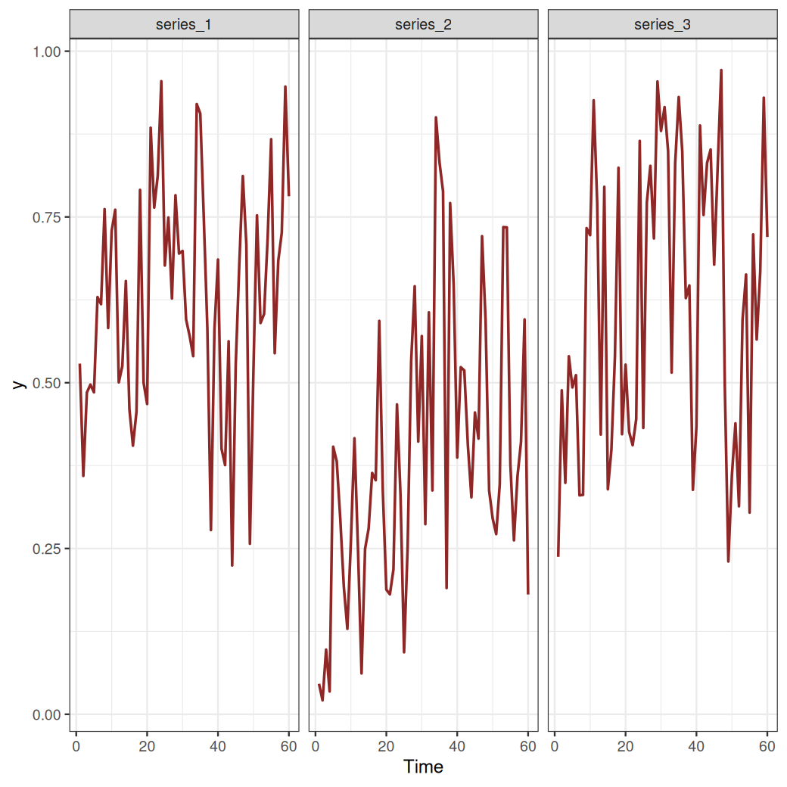
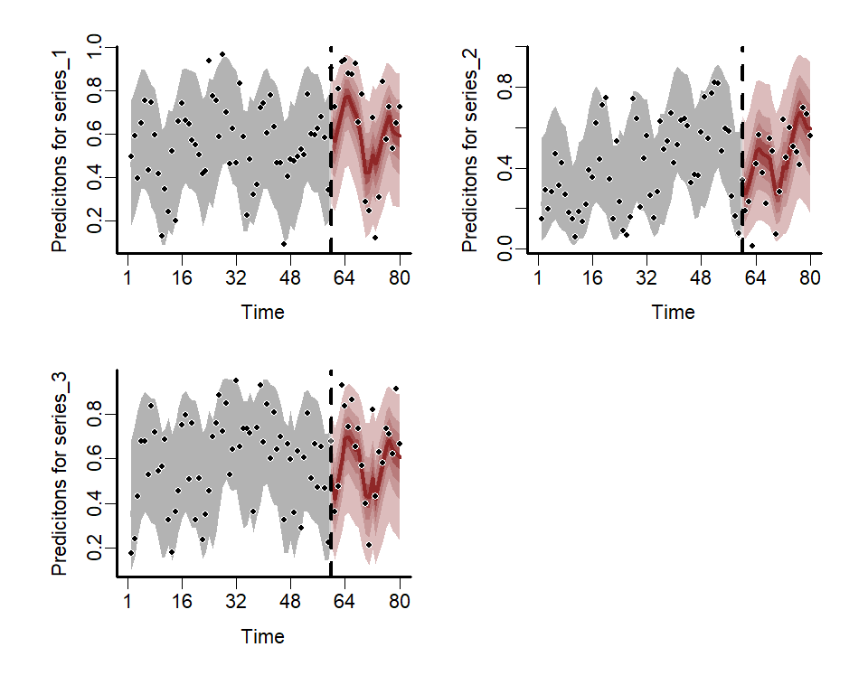

<br>
<br>

[](https://mc-stan.org/)

## mvgam
**M**ulti**V**ariate (Dynamic) **G**eneralized **A**ddivite **M**odels

The goal of `mvgam` is to use a Bayesian framework to estimate parameters of Dynamic Generalized Additive Models (DGAMs) for time series with dynamic trend components. The package provides an interface to fit Bayesian DGAMs using either `JAGS` or `Stan` as the backend, but note that users are strongly encouraged to opt for `Stan` over `JAGS`. The formula syntax is based on that of the package `mgcv` to provide a familiar GAM modelling interface. The motivation for the package and some of its primary objectives are described in detail by [Clark & Wells 2022](https://besjournals.onlinelibrary.wiley.com/doi/10.1111/2041-210X.13974) (published in *Methods in Ecology and Evolution*). An introduction to the package and some worked examples are shown in this seminar: [Ecological Forecasting with Dynamic Generalized Additive Models](https://www.youtube.com/watch?v=0zZopLlomsQ){target="_blank"}.
  
## Installation
Install the development version from `GitHub` using:
`devtools::install_github("nicholasjclark/mvgam")`. Note that to actually condition models with MCMC sampling, either the `JAGS` software must be installed (along with the `R` packages `rjags` and `runjags`) or the `Stan` software must be installed (along with either `rstan` and/or `cmdstanr`). Only `rstan` is listed as a dependency of `mvgam` to ensure that installation is less difficult. If users wish to fit the models using `mvgam`, please refer to installation links for `JAGS` [here](https://sourceforge.net/projects/mcmc-jags/files/), for `Stan` with `rstan` [here](https://mc-stan.org/users/interfaces/rstan), or for `Stan` with `cmdstandr` [here](https://mc-stan.org/cmdstanr/). You will need a fairly recent version of `Stan` to ensure all the model syntax is recognized. If you see warnings such as `variable "array" does not exist`, this is usually a sign that you need to update your version of `Stan`. We highly recommend you use `Cmdstan` through the `cmdstanr` interface as the backend. This is because `Cmdstan` is easier to install, is more up to date with new features, and uses less memory than `Rstan`. See [this documentation from the `Cmdstan` team for more information](http://mc-stan.org/cmdstanr/articles/cmdstanr.html#comparison-with-rstan). 

## Introductory seminar
```{r echo=FALSE}
vembedr::embed_url("https://www.youtube.com/watch?v=0zZopLlomsQ")
```

## Cheatsheet
[](https://github.com/nicholasjclark/mvgam/raw/master/misc/mvgam_cheatsheet.pdf)

## Getting started
`mvgam` was originally designed to analyse and forecast non-negative integer-valued data (counts). These data are traditionally challenging to analyse with existing time-series analysis packages. But further development of `mvgam` has resulted in support for a growing number of observation families that extend to other types of data. Currently, the package can handle data for the following families:  
  
* `gaussian()` for real-valued data 
* `student_t()` for heavy-tailed real-valued data
* `lognormal()` for non-negative real-valued data
* `Gamma()` for non-negative real-valued data
* `betar()` for proportional data on `(0,1)`
* `bernoulli()` for binary data
* `poisson()` for count data
* `nb()` for overdispersed count data
* `binomial()` for count data with known number of trials
* `beta_binomial()` for overdispersed count data with known number of trials
* `nmix()` for count data with imperfect detection (unknown number of trials)
* `tweedie()` for overdispersed count data
  
Note that only `poisson()`, `nb()`, and `tweedie()` are available if using `JAGS`. All families, apart from `tweedie()`, are supported if using `Stan`. See `??mvgam_families` for more information. Below is a simple example for simulating and modelling proportional data with `Beta` observations over a set of seasonal series with independent Gaussian Process dynamic trends:
```{r, include = FALSE}
library(mvgam)
```

```{r, eval = FALSE}
data <- sim_mvgam(family = betar(),
                 T = 80,
                 trend_model = 'GP',
                 trend_rel = 0.5, 
                 seasonality = 'shared')
```

Plot the series to see how they evolve over time
```{r, eval = FALSE}
plot_mvgam_series(data = data$data_train, series = 'all')
```


Fit a DGAM to these series that uses a hierarchical cyclic seasonal smooth term to capture variation in seasonality among series. The model also includes series-specific latent Gaussian Processes with squared exponential covariance functions to capture temporal dynamics
```{r, eval = FALSE}
mod <- mvgam(y ~ s(season, bs = 'cc', k = 7) +
               s(season, by = series, m = 1, k = 5),
             trend_model = 'GP',
             data = data$data_train,
             newdata = data$data_test,
             family = betar())
```

Plot the estimated posterior hindcast and forecast distributions for each series
```{r eval = FALSE}
layout(matrix(1:4, nrow = 2, byrow = TRUE))
for(i in 1:3){
  plot(mod, type = 'forecast', series = i)
}
```



Various `S3` functions can be used to inspect parameter estimates, plot smooth functions and residuals, and evaluate models through posterior predictive checks or forecast comparisons. Please see the package documentation for more detailed examples.

## Vignettes
You can set `build_vignettes = TRUE` when installing with either `devtools::install_github` or `remotes::install_github`, but be aware this will slow down the installation drastically. Instead, you can always access the vignette htmls online at [https://nicholasjclark.github.io/mvgam/articles/](https://nicholasjclark.github.io/mvgam/articles/)

## Other resources
A number of case studies have been compiled to highlight how GAMs and DGAMs can be useful for working with time series data:
  
* [Ecological Forecasting with Dynamic Generalized Additive Models](https://www.youtube.com/watch?v=0zZopLlomsQ){target="_blank"}
* [How to interpret and report nonlinear effects from Generalized Additive Models](https://ecogambler.netlify.app/blog/interpreting-gams/){target="_blank"}
* [Phylogenetic smoothing using mgcv](https://ecogambler.netlify.app/blog/phylogenetic-smooths-mgcv/){target="_blank"}
* [Distributed lags (and hierarchical distributed lags) using mgcv and mvgam](https://ecogambler.netlify.app/blog/distributed-lags-mgcv/){target="_blank"}
  
The package can also be used to generate all necessary data structures, initial value functions and modelling code necessary to fit DGAMs using `Stan` or `JAGS`. This can be helpful if users wish to make changes to the model to better suit their own bespoke research / analysis goals. The following resources can be helpful to troubleshoot:
  
* [Stan Discourse](https://discourse.mc-stan.org/)
* [JAGS Discourse](https://sourceforge.net/projects/mcmc-jags/)

## Interested in contributing?
I'm actively seeking PhD students and other researchers to work in the areas of ecological forecasting, multivariate model evaluation and development of `mvgam`. Please reach out if you are interested (n.clark'at'uq.edu.au)
