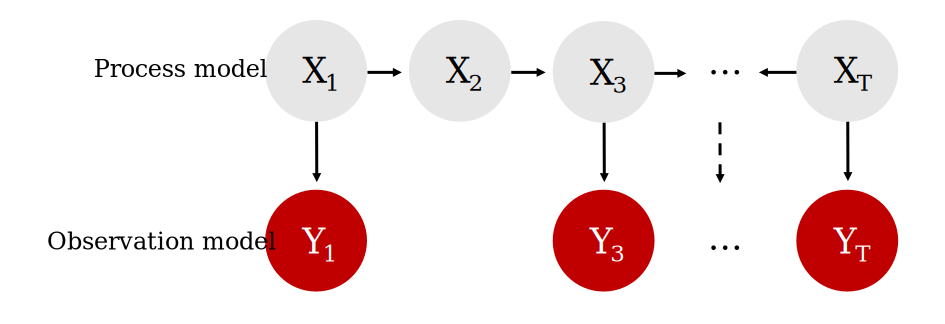

```{r setup, include=FALSE}
knitr::opts_chunk$set(
  echo = TRUE,   
  dpi = 150,
  fig.asp = 0.8,
  fig.width = 6,
  out.width = "60%",
  fig.align = "center")
library(mvgam)
library(ggplot2)
theme_set(theme_bw(base_size = 12, base_family = 'serif'))
```

The purpose of this vignette is to show how the `mvgam` package can be used to fit and interrogate State-Space models with nonlinear effects.

## State-Space Models

{width=85%}

<br>

State-Space models allow us to separately make inferences about the underlying dynamic *process model* that we are interested in (i.e. the evolution of a time series or a collection of time series) and the *observation model* (i.e. the way that we survey / measure this underlying process). This is extremely useful in ecology because our observations are always imperfect / noisy measurements of the thing we are interested in measuring. It is also helpful because we often know that some covariates will impact our ability to measure accurately (i.e. we cannot take accurate counts of rodents if there is a thunderstorm happening) while other covariate impact the underlying process (it is highly unlikely that rodent abundance responds to one storm, but instead probably responds to longer-term weather and climate variation). A State-Space model allows us to model both components in a single unified modelling framework. A major advantage of `mvgam` is that it can include nonlinear effects and random effects in BOTH model components while also capturing dynamic processes.

### Lake Washington plankton data
The data we will use to illustrate how we can fit State-Space models in `mvgam` are from a long-term monitoring study of plankton counts (cells per mL) taken from Lake Washington in Washington, USA. The data are available as part of the `MARSS` package and can be downloaded using the following: 
```{r}
load(url('https://github.com/atsa-es/MARSS/raw/master/data/lakeWAplankton.rda'))
```

We will work with five different groups of plankton:
```{r}
outcomes <- c('Greens', 'Bluegreens', 'Diatoms', 'Unicells', 'Other.algae')
```

As usual, preparing the data into the correct format for `mvgam` modelling takes a little bit of wrangling in `dplyr`:
```{r}
# loop across each plankton group to create the long datframe
plankton_data <- do.call(rbind, lapply(outcomes, function(x){
  
  # create a group-specific dataframe with counts labelled 'y'
  # and the group name in the 'series' variable
  data.frame(year = lakeWAplanktonTrans[, 'Year'],
             month = lakeWAplanktonTrans[, 'Month'],
             y = lakeWAplanktonTrans[, x],
             series = x,
             temp = lakeWAplanktonTrans[, 'Temp'])})) %>%
  
  # change the 'series' label to a factor
  dplyr::mutate(series = factor(series)) %>%
  
  # filter to only include some years in the data
  dplyr::filter(year >= 1965 & year < 1975) %>%
  dplyr::arrange(year, month) %>%
  dplyr::group_by(series) %>%
  
  # z-score the counts so they are approximately standard normal
  dplyr::mutate(y = as.vector(scale(y))) %>%
  
  # add the time indicator
  dplyr::mutate(time = dplyr::row_number()) %>%
  dplyr::ungroup()
```

Inspect the data structure
```{r}
head(plankton_data)
```

```{r}
dplyr::glimpse(plankton_data)
```

Note that we have z-scored the counts in this example as that will make it easier to specify priors (though this is not completely necessary; it is often better to build a model that respects the properties of the actual outcome variables)
```{r}
plot_mvgam_series(data = plankton_data, series = 'all')
```

As usual, check the data for `NA`s:
```{r}
image(is.na(t(plankton_data)), axes = F,
      col = c('grey80', 'darkred'))
axis(3, at = seq(0,1, len = NCOL(plankton_data)), 
     labels = colnames(plankton_data))
```

We have some missing observations, but of course this isn't an issue for modelling in `mvgam`. A useful property to understand about these counts is that they tend to be highly seasonal. Below are some plots of z-scored counts against the z-scored temperature measurements in the lake for each month:
```{r}
plankton_data %>%
  dplyr::filter(series == 'Other.algae') %>%
  ggplot(aes(x = time, y = temp)) +
  geom_line(size = 1.1) +
  geom_line(aes(y = y), col = 'white',
            size = 1.3) +
  geom_line(aes(y = y), col = 'darkred',
            size = 1.1) +
  ylab('z-score') +
  xlab('Time') +
  ggtitle('Temperature (black) vs Other algae (red)')
```


```{r}
plankton_data %>%
  dplyr::filter(series == 'Diatoms') %>%
  ggplot(aes(x = time, y = temp)) +
  geom_line(size = 1.1) +
  geom_line(aes(y = y), col = 'white',
            size = 1.3) +
  geom_line(aes(y = y), col = 'darkred',
            size = 1.1) +
  ylab('z-score') +
  xlab('Time') +
  ggtitle('Temperature (black) vs Diatoms (red)')
```

```{r}
plankton_data %>%
  dplyr::filter(series == 'Greens') %>%
  ggplot(aes(x = time, y = temp)) +
  geom_line(size = 1.1) +
  geom_line(aes(y = y), col = 'white',
            size = 1.3) +
  geom_line(aes(y = y), col = 'darkred',
            size = 1.1) +
  ylab('z-score') +
  xlab('Time') +
  ggtitle('Temperature (black) vs Greens (red)')
```

We will have to try and capture this seasonality in our process model, which should be easy to do given the flexibility of GAMs. Next we will split the data into training and testing splits:
```{r}
plankton_train <- plankton_data %>%
  dplyr::filter(time <= 112)
plankton_test <- plankton_data %>%
  dplyr::filter(time > 112)
```

Now time to fit some models. This requires a bit of thinking about how we can best tackle the seasonal variation and the likely dependence structure in the data. These algae are interacting as part of a complex system within the same lake, so we certainly expect there to be some lagged cross-dependencies underling their dynamics. But if we do not capture the seasonal variation, our multivariate dynamic model will be forced to try and capture it, which could lead to poor convergence and unstable results (we could feasibly capture cyclic dynamics with a more complex multi-species Lotka-Volterra model, but ordinary differential equation approaches are beyond the scope of this workshop). 

### Capturing seasonality

First we will fit a model that does not include a dynamic component, just to see if it can reproduce the seasonal variation in the observations. This model introduces hierarchical multidimensional smooths, where all time series share a "global" tensor product of the `month` and `temp` variables, capturing our expectation that algal seasonality responds to temperature variation. But this response should depend on when in the year these temperatures are recorded (i.e. a response to warm temperatures in Spring should be different to a response to warm temperatures in Autumn). The model also fits series-specific deviation smooths (i.e. one tensor product per series) to capture how each algal group's seasonality differs from the overall "global" seasonality. Note that we do not include series-specific intercepts in this model because each series was z-scored to have a mean of 0.
```{r notrend_mod, include = FALSE, results='hide'}
notrend_mod <- mvgam(y ~ 
                       te(temp, month, k = c(4, 4)) +
                       te(temp, month, k = c(4, 4), by = series),
                     family = gaussian(),
                     data = plankton_train,
                     newdata = plankton_test,
                     trend_model = 'None')
```

```{r eval=FALSE}
notrend_mod <- mvgam(y ~ 
                       # tensor of temp and month to capture
                       # "global" seasonality
                       te(temp, month, k = c(4, 4)) +
                       
                       # series-specific deviation tensor products
                       te(temp, month, k = c(4, 4), by = series),
                     family = gaussian(),
                     data = plankton_train,
                     newdata = plankton_test,
                     trend_model = 'None')

```

The "global" tensor product smooth function can be quickly visualized:
```{r}
plot_mvgam_smooth(notrend_mod, smooth = 1)
```

On this plot, red indicates below-average linear predictors and white indicates above-average. We can then plot the deviation smooths for each algal group to see how they vary from the "global" pattern:
```{r}
plot_mvgam_smooth(notrend_mod, smooth = 2)
```

```{r}
plot_mvgam_smooth(notrend_mod, smooth = 3)
```

```{r}
plot_mvgam_smooth(notrend_mod, smooth = 4)
```

```{r}
plot_mvgam_smooth(notrend_mod, smooth = 5)
```

```{r}
plot_mvgam_smooth(notrend_mod, smooth = 6)
```

These multidimensional smooths have done a good job of capturing the seasonal variation in our observations:
```{r}
plot(notrend_mod, type = 'forecast', series = 1)
```

```{r}
plot(notrend_mod, type = 'forecast', series = 2)
```

```{r}
plot(notrend_mod, type = 'forecast', series = 3)
```

```{r}
plot(notrend_mod, type = 'forecast', series = 4)
```

```{r}
plot(notrend_mod, type = 'forecast', series = 5)
```

### Multiseries dynamics
The basic model gives us confidence that we can capture the seasonal variation in the observations. But the model has not captured the remaining temporal dynamics, which is obvious when we inspect Dunn-Smyth residuals for each series:
```{r}
plot(notrend_mod, type = 'residuals', series = 1)
```

```{r}
plot(notrend_mod, type = 'residuals', series = 2)
```

```{r}
plot(notrend_mod, type = 'residuals', series = 3)
```

```{r}
plot(notrend_mod, type = 'residuals', series = 4)
```

```{r}
plot(notrend_mod, type = 'residuals', series = 5)
```

Now it is time to get into multivariate State-Space models. We will fit two models that can both incorporate lagged cross-dependencies in the latent process models. The first model assumes that the process errors operate independently from one another, while the second assumes that there may be contemporaneous correlations in the process errors. Both models include a Vector Autoregressive component for the process means, and so both can model complex community dynamics. The models can be described mathematically as follows:

\begin{align*}
\boldsymbol{count}_t & \sim \text{Normal}(\mu_{obs[t]}, \sigma_{obs}) \\
\mu_{obs[t]} & = \alpha + process_t \\
\sigma_{obs} & \sim \text{Uniform}(0.1, 1) \\
process_t & \sim \text{MVNormal}(\mu_{process[t]}, \Sigma_{process}) \\
\mu_{process[t]} & = VAR * process_{t-1} + f_{global}(\boldsymbol{month},\boldsymbol{temp})_t + f_{series}(\boldsymbol{month},\boldsymbol{temp})_t \\
f_{global}(\boldsymbol{month},\boldsymbol{temp}) & = \sum_{k=1}^{K}b_{global} * \beta_{global} \\
f_{series}(\boldsymbol{month},\boldsymbol{temp}) & = \sum_{k=1}^{K}b_{series} * \beta_{series} \\
VAR & \sim \text{Normal}(0, 1) \\
\Sigma_{process} & = \text{diag}(\sigma_{process}) * \text{R} * \text{diag}(\sigma_{process}) \\
\text{R} & \sim \text{LKJcorr}(2) \end{align*}

Here you can see that we assume independent observation processes (there is no covariance structure in the observation errors $\sigma_{obs}$) but there is a lot going on in the underlying process model. This component has a Vector Autoregressive part (where the process mean at time $t$ $(\mu_{process[t]})$) is a vector that evolves as a function of where the vector-valued process model was at time $t-1$. The $VAR$ matrix captures these dynamics with self-dependencies on the diagonal and possibly assymetric cross-dependencies on the off-diagonals. The contemporaneous process errors are captured by $\Sigma_{process}$, which can be constrained so that process errors are independent (i.e. setting the off-diagonals to 0) or can be fully parameterized using a Cholesky decomposition (using `Stan`'s $LKJcorr$ distribution to place a prior on the strength of inter-species correlations). 

<br>
Ok that was a lot to take in. Let's fit some models to try and inspect what is going on and what they assume. But first, we need to update `mvgam`'s default priors for the observation errors. By default, `mvgam` uses a fairly wide Student-T prior on this parameter because the package doesn't know what range the observations will be on. But our observations are z-scored and so we do not expect very large observation errors. However, we also do not expect very small observation errors. So let's update the prior for this parameter. In doing so, you will get to see how the formula for the latent process (i.e. trend) model is used in `mvgam`:
```{r}
priors <- get_mvgam_priors(
  # observation formula, which just uses an intercept
  y ~ 1,
  
  # process model formula, which includes the smooth functions
  trend_formula = ~ te(temp, month, k = c(4, 4)) +
    te(temp, month, k = c(4, 4), by = trend),
  
  # VAR1 model with uncorrelated process errors
  trend_model = 'VAR1',
  family = gaussian(),
  data = plankton_train)
```

Get names of all parameters whose priors can be modified:
```{r}
priors[, 3]
```

And their default prior distributions:
```{r}
priors[, 4]
```

Setting priors is easy in `mvgam` as you can use `brms` routines:
```{r}
priors <- prior(uniform(0.1, 1), class = sigma_obs, lb = 0.1, ub = 1)
```

There is one more small catch with this model: the shared intercept parameter can sometimes be unidentifiable with respect to the latent VAR process. We will often get better convergence in these State-Space models if we regularize this parameter toward zero. A tight Normal prior will do this for us:
```{r}
priors <- c(priors,
            prior(normal(0, 0.001), class = Intercept))
```

Now we can fit the first model, which assumes that process errors are contemporaneously uncorrelated
```{r var_mod, include = FALSE, results='hide'}
var_mod <- mvgam(y ~ 1,
                 trend_formula = ~
                   # tensor of temp and month should capture
                   # seasonality
                   te(temp, month, k = c(4, 4)) +
                   # need to use 'trend' rather than series
                   # here
                   te(temp, month, k = c(4, 4), by = trend),
                 family = gaussian(),
                 data = plankton_train,
                 newdata = plankton_test,
                 trend_model = 'VAR1',
                 priors = priors, 
                 burnin = 1000)
```

```{r eval=FALSE}
var_mod <- mvgam(  
  # observation formula, which just uses an intercept
  y ~ 1,
  
  # process model formula, which includes the smooth functions
  trend_formula = ~ te(temp, month, k = c(4, 4)) +
    te(temp, month, k = c(4, 4), by = trend),
  
  # VAR1 model with uncorrelated process errors
  trend_model = 'VAR1',
  family = gaussian(),
  data = plankton_train,
  newdata = plankton_test,
  
  # include the updated priors
  priors = priors)
```

### Inspecting SS models
This model's summary is a bit different to other `mvgam` summaries. It separates parameters based on whether they belong to the observation model or to the latent process model. This is because we may often have covariates that impact the observations but not the latent process, so we can have fairly complex models for each component. You will notice that some parameters have not fully converged, particularly for the VAR coefficients (called `A` in the output) and for the process errors (`Sigma`). Note that we set `include_betas = FALSE` to stop the summary from printing output for all of the spline coefficients, which can be dense and hard to interpret:
```{r}
summary(var_mod, include_betas = FALSE)
```

The convergence of this model isn't fabulous (more on this in a moment). But we can again plot the smooth functions, which this time operate on the process model. We can see the same plot using `trend_effects = TRUE` in the plotting functions:
```{r}
plot(var_mod, 'smooths', trend_effects = TRUE)
```

The VAR matrix is of particular interest here, as it captures lagged dependencies and cross-dependencies in the latent process model:
```{r warning=FALSE, message=FALSE}
mcmc_plot(var_mod, variable = 'A', regex = TRUE, type = 'hist')
```

Unfortunately `bayesplot` doesn't know this is a matrix of parameters so what we see is actually the transpose of the VAR matrix. A little bit of wrangling gives us these histograms in the correct order:
```{r warning=FALSE, message=FALSE}
A_pars <- matrix(NA, nrow = 5, ncol = 5)
for(i in 1:5){
  for(j in 1:5){
    A_pars[i, j] <- paste0('A[', i, ',', j, ']')
  }
}
mcmc_plot(var_mod, 
          variable = as.vector(t(A_pars)), 
          type = 'hist')
```

There is a lot happening in this matrix. Each cell captures the lagged effect of the process in the column on the process in the row in the next timestep. So for example, the effect in cell [3,1], which is quite strongly negative, means that an *increase* in the process for series 3 (Greens) at time $t$ is expected to lead to a subsequent *decrease* in the process for series 1 (Bluegreens) at time $t+1$. The latent process model is now capturing these effects and the smooth seasonal effects, so the trend plot shows our best estimate of what the *true* count should have been at each time point:
```{r}
plot(var_mod, type = 'trend', series = 1)
```

```{r}
plot(var_mod, type = 'trend', series = 3)
```

The process error $(\Sigma)$ captures unmodelled variation in the process models. Again, we fixed the off-diagonals to 0, so the histograms for these will look like flat boxes:
```{r warning=FALSE, message=FALSE}
Sigma_pars <- matrix(NA, nrow = 5, ncol = 5)
for(i in 1:5){
  for(j in 1:5){
    Sigma_pars[i, j] <- paste0('Sigma[', i, ',', j, ']')
  }
}
mcmc_plot(var_mod, 
          variable = as.vector(t(Sigma_pars)), 
          type = 'hist')
```

The observation error estimates $(\sigma_{obs})$ represent how much the model thinks we might miss the true count when we take our imperfect measurements: 
```{r warning=FALSE, message=FALSE}
mcmc_plot(var_mod, variable = 'sigma_obs', regex = TRUE, type = 'hist')
```

These are still a bit hard to identify overall. 

### Correlated process errors

Let's see if the estimates improve when we allow the process errors to be correlated. Once again, we need to first update the priors for the shared intercept and observation errors:
```{r}
priors <- c(prior(uniform(0.1, 1), class = sigma_obs, lb = 0.1, ub = 1),
            prior(normal(0, 0.001), class = Intercept))
```

And now we can fit the correlated process error model
```{r varcor_mod, include = FALSE, results='hide'}
varcor_mod <- mvgam(y ~ 1,
                 trend_formula = ~
                   # tensor of temp and month should capture
                   # seasonality
                   te(temp, month, k = c(4, 4)) +
                   # need to use 'trend' rather than series
                   # here
                   te(temp, month, k = c(4, 4), by = trend),
                 family = gaussian(),
                 data = plankton_train,
                 newdata = plankton_test,
                 trend_model = 'VAR1cor',
                 burnin = 1000,
                 priors = priors)
```

```{r eval=FALSE}
varcor_mod <- mvgam(  
  # observation formula, which just uses an intercept
  y ~ 1,
  
  # process model formula, which includes the smooth functions
  trend_formula = ~ te(temp, month, k = c(4, 4)) +
    te(temp, month, k = c(4, 4), by = trend),
  
  # VAR1 model with correlated process errors
  trend_model = 'VAR1cor',
  family = gaussian(),
  data = plankton_train,
  newdata = plankton_test,
  
  # include the updated priors
  priors = priors)
```

Plot convergence diagnostics for the two models, which shows that the more complex model with correlated errors has better convergence:
```{r warning=FALSE, message=FALSE}
mcmc_plot(varcor_mod, type = 'rhat') +
  labs(title = 'VAR1cor')
mcmc_plot(var_mod, type = 'rhat') +
  labs(title = 'VAR1')
```

We can also check convergence using one of the package's inbuilt utility functions:
```{r}
mvgam:::check_rhat(varcor_mod$model_output)
mvgam:::check_rhat(var_mod$model_output)
```

This model has converged better than the first model (that assumed process errors were independent), possibly telling us that this is a more appropriate model. The $(\Sigma)$ matrix now captures any evidence of contemporaneously correlated process error:
```{r warning=FALSE, message=FALSE}
Sigma_pars <- matrix(NA, nrow = 5, ncol = 5)
for(i in 1:5){
  for(j in 1:5){
    Sigma_pars[i, j] <- paste0('Sigma[', i, ',', j, ']')
  }
}
mcmc_plot(varcor_mod, 
          variable = as.vector(t(Sigma_pars)), 
          type = 'hist')
```

This symmetric matrix tells us there is support for correlated process errors. For example, series 1 and 3 (Bluegreens and Greens) show negatively correlated process errors, while series 1 and 4 (Bluegreens and Other.algae) show positively correlated errors. But it is easier to interpret these estimates if we convert the covariance matrix to a correlation matrix. Here we compute the posterior median process error correlations:
```{r}
Sigma_post <- as.matrix(varcor_mod, variable = 'Sigma', regex = TRUE)
median_correlations <- cov2cor(matrix(apply(Sigma_post, 2, median),
                                      nrow = 5, ncol = 5))
rownames(median_correlations) <- colnames(median_correlations) <- levels(plankton_train$series)

round(median_correlations, 2)
```

Because this model is able to capture correlated errors, the VAR matrix has changed slightly:
```{r warning=FALSE, message=FALSE}
A_pars <- matrix(NA, nrow = 5, ncol = 5)
for(i in 1:5){
  for(j in 1:5){
    A_pars[i, j] <- paste0('A[', i, ',', j, ']')
  }
}
mcmc_plot(varcor_mod, 
          variable = as.vector(t(A_pars)), 
          type = 'hist')
```

We still have some evidence of lagged cross-dependence, but some of these interactions have now been pulled more toward zero. But which model is better? Forecasts don't appear to differ very much, at least qualitatively (here are forecasts for three of the series, for each model):
```{r}
plot(var_mod, type = 'forecast', series = 1, newdata = plankton_test)
```

```{r}
plot(varcor_mod, type = 'forecast', series = 1, newdata = plankton_test)
```

```{r}
plot(var_mod, type = 'forecast', series = 2, newdata = plankton_test)
```

```{r}
plot(varcor_mod, type = 'forecast', series = 2, newdata = plankton_test)
```

```{r}
plot(var_mod, type = 'forecast', series = 3, newdata = plankton_test)
```

```{r}
plot(varcor_mod, type = 'forecast', series = 3, newdata = plankton_test)
```

We can compute the variogram score for out of sample forecasts to get a sense of which model does a better job of capturing the dependence structure in the true evaluation set:
```{r}
# create forecast objects for each model
fcvar <- forecast(var_mod)
fcvarcor <- forecast(varcor_mod)

# plot the difference in variogram scores; a negative value means the VAR1cor model is better, while a positive value means the VAR1 model is better
diff_scores <- score(fcvarcor, score = 'variogram')$all_series$score -
  score(fcvar, score = 'variogram')$all_series$score
plot(diff_scores, pch = 16, cex = 1.25, col = 'darkred', 
     ylim = c(-1*max(abs(diff_scores), na.rm = TRUE),
              max(abs(diff_scores), na.rm = TRUE)),
     bty = 'l',
     xlab = 'Forecast horizon',
     ylab = expression(variogram[VAR1cor]~-~variogram[VAR1]))
abline(h = 0, lty = 'dashed')
```

And we can also compute the energy score for out of sample forecasts to get a sense of which model provides forecasts that are better calibrated:
```{r}
# plot the difference in energy scores; a negative value means the VAR1cor model is better, while a positive value means the VAR1 model is better
diff_scores <- score(fcvarcor, score = 'energy')$all_series$score -
  score(fcvar, score = 'energy')$all_series$score
plot(diff_scores, pch = 16, cex = 1.25, col = 'darkred', 
     ylim = c(-1*max(abs(diff_scores), na.rm = TRUE),
              max(abs(diff_scores), na.rm = TRUE)),
     bty = 'l',
     xlab = 'Forecast horizon',
     ylab = expression(energy[VAR1cor]~-~energy[VAR1]))
abline(h = 0, lty = 'dashed')
```

The models tend to provide similar forecasts, so we would probably need to use a more extensive rolling forecast evaluation exercise if we felt like we needed to only choose one for production. `mvgam` offers some utilities for doing this (i.e. see `?lfo_cv` for guidance).
